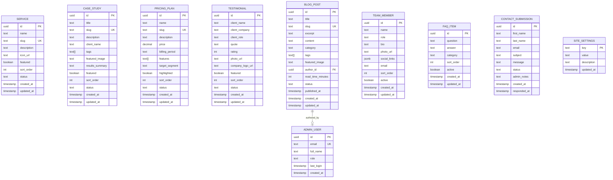

# Backend Documentation - Devmart Marko v1

## Current Status: Phase C-3 FaqPage Testimonials Wiring - COMPLETE ✅

**Frontend Completion Date:** 2025-11-27  
**Phase 2 Backend MVP Implementation:** 2025-11-28  
**Phase 3 Authentication Implementation:** 2025-11-29  
**Phase 4A Services Read-Only:** 2025-11-29  
**Phase 4B Services Create (+ Modal Fix):** 2025-11-29  
**Phase 4C Services Edit/Delete:** 2025-11-29  
**Phase 5A Blog CRUD:** 2025-12-01  
**Phase 5B Contacts CRUD:** 2025-12-01  
**Phase 5C Team CRUD:** 2025-12-01  
**Phase 5D FAQ Items CRUD:** 2025-12-01  
**Phase 5E Projects / Case Studies CRUD:** 2025-12-01  
**Phase 5F Testimonials CRUD:** 2025-12-02  
**Phase 5G Pricing Plans CRUD:** 2025-12-02  
**Phase 5H Settings CRUD:** 2025-12-02  
**Phase 6L SEO Implementation:** 2025-12-02  
**Phase 6M HomePage Dynamic Sections:** 2025-12-02  
**Admin Enhancement Phases 1-5:** 2025-12-02 ✅  
**Settings Tabbed Layout & Branding Colors:** 2025-12-03 ✅  
**Phase A Security & Authorization:** 2025-12-03 ✅  
**Phase B Documentation Sync:** 2025-12-03 ✅  
**Phase D Deferred Modules (v2):** 2025-12-03 ✅  
**Phase D Polish (Auth Fix, Seed Data, Style Guide):** 2025-12-03 ✅  
**Phase 6G Public FAQ Wiring:** 2025-12-04 ✅
**Phase C-2 Newsletter Form Wiring:** 2025-12-04 ✅
**Phase C-3 FaqPage Testimonials Wiring:** 2025-12-04 ✅
**Implementation Status:** FaqPage now fetches both FAQs and Testimonials from Supabase dynamically.

---

## Phase C-3: FaqPage Testimonials Wiring (2025-12-04)

**Status:** COMPLETE ✅

### Summary

Wired the testimonials section on FaqPage to Supabase, making the entire page fully dynamic.

### Implementation Details

- **Parallel fetching:** Uses `Promise.all()` to fetch FAQs and testimonials concurrently
- **Query function:** `getPublishedTestimonials()` from `testimonials.ts`
- **Dynamic stars:** Renders star icons based on `testimonial.rating` (default 5)
- **Avatar fallback:** Uses default image if `avatar_url` is null
- **Company display:** Shows company name after author title when available
- **Empty state:** Shows friendly message when no testimonials exist
- **HTML preservation:** All template structure, CSS classes, and Swiper config preserved

### Code Pattern

```typescript
const [faqResult, testimonialsResult] = await Promise.all([
  getActiveFaqItems(),
  getPublishedTestimonials(),
]);
```

---

## Phase C-2: Newsletter Form Wiring (2025-12-04)

**Status:** COMPLETE ✅

### Summary

Wired newsletter subscription forms to Supabase using `subscribeToNewsletter()` query function.

### Pages Updated

| Page | Implementation |
|------|----------------|
| `HomePage.tsx` | Newsletter section form submits to `newsletter_subscribers` table |
| `SingleServicePage.tsx` | Newsletter section form submits to `newsletter_subscribers` table |

### Implementation Details

- **Email validation:** Client-side regex validation before submission
- **Duplicate detection:** Supabase unique constraint on email handles duplicates gracefully
- **Success feedback:** Form shows success message and clears input on successful subscription
- **Error handling:** Displays user-friendly error messages for failures
- **Loading state:** Submit button disabled with "Subscribing..." text during submission

### Query Function

```typescript
// src/integrations/supabase/queries/newsletterSubscribers.ts
export async function subscribeToNewsletter(email: string) {
  const { error } = await supabase
    .from("newsletter_subscribers")
    .insert([{ email }]);
  return { error };
}
```

### RLS Policy

- **Public INSERT:** Anyone can subscribe (no authentication required)
- **Admin-only SELECT/UPDATE/DELETE:** Only admins can view and manage subscribers

---

## Phase C1: Partner Logos Frontend Wiring (2025-12-03)

**Status:** COMPLETE ✅

### Summary

Wired `partner_logos` table to public marketing pages using `getActivePartnerLogos()` query function.

### Pages Updated

| Page | Implementation |
|------|----------------|
| `HomePage.tsx` | Fetches partner logos in `Promise.all()` alongside other homepage data |
| `AboutPage.tsx` | Fetches partner logos alongside team members |
| `TeamPage.tsx` | Fetches partner logos alongside team members |

### Implementation Details

- **Conditional rendering:** Section hidden when `partnerLogos.length === 0`
- **Dynamic slides:** Each partner logo rendered as a Swiper slide
- **External links:** Partners with `website_url` open in new tab (`target="_blank" rel="noopener noreferrer"`)
- **Alt text:** Uses `partner.name` for accessibility
- **Swiper compatibility:** Existing Swiper initialization in `MainLayout.tsx` handles dynamic content

### Query Function

```typescript
// src/integrations/supabase/queries/partnerLogos.ts
export async function getActivePartnerLogos() {
  const { data, error } = await supabase
    .from("partner_logos")
    .select("*")
    .eq("status", "active")
    .order("sort_order", { ascending: true });
  return { data: data as PartnerLogo[] | null, error };
}
```

### RLS Policy

Public SELECT policy requires `status = 'active'` (already configured in Phase D).

### Admin UI Features (Phase D Polish)

- **Filters:** Status filter pills (All / Active / Inactive)
- **Search:** Filter by partner name
- **Empty state:** "No partner logos yet" with "Add Partner" action button
- **Error state:** Alert with "Retry" button
- **Form validation:** Name (min 2 chars), Logo URL (valid URL pattern) with inline errors
- **Console logging:** `[PartnersAdminPage]` tag for debugging

---

## Newsletter Subscribers Admin UI Features

- **Filters:** Status filter pills (All / Subscribed / Unsubscribed)
- **Search:** Filter by email address
- **Empty state:** "No subscribers yet" with explanation
- **Error state:** Alert with "Retry" button
- **Delete warning:** Explicit warning about permanent mailing list removal
- **Console logging:** `[NewsletterAdminPage]` tag for debugging

---

## Homepage Blocks Admin UI Features

- **Filters:** Status filter pills (All / Active / Inactive)
- **Core block badges:** "hero" and "cta" blocks display "Core" badge in table
- **Edit guardrails:** Key field disabled for core blocks with helper text
- **Delete guardrails:** Strong warning for deleting core blocks (may break homepage)

---

## Phase D Visual Parity Note

**Visual Alignment (2025-12-04):** V2 modules (Partners, Newsletter, Homepage Blocks) have been aligned to match the Services/Testimonials inner page styling using the canonical `.admin-card-header`, `.admin-card-title`, and `.admin-card-description` classes. All pages now use consistent:

- `<h2 className="admin-card-title">` for page titles (not h1)
- `<p className="admin-card-description">` for descriptions
- Primary action buttons with `<Plus size={16} />` icon
- Simple `<div>` wrapper (not `admin-page` class)

This ensures 1:1 visual parity across all admin inner pages.
- **Empty state:** "No homepage blocks configured" with seeding hint
- **Error state:** Alert with "Retry" button
- **Console logging:** `[HomepageBlocksAdminPage]` tag for debugging

---

## Phase 6G: Public FAQ Page Dynamic Wiring (2025-12-04)

**Status:** COMPLETE ✅

### Summary

Wired public FAQ page to Supabase using `getActiveFaqItems()` query function. FAQ section dynamically renders all active FAQ items in accordion format.

### Pages Updated

| Page | Implementation |
|------|----------------|
| `FaqPage.tsx` | Fetches FAQ items on mount, renders accordion with question/answer |

### Implementation Details

- **Query function:** `getActiveFaqItems()` from `src/integrations/supabase/queries/faqItems.ts`
- **State management:** `faqs`, `isLoading`, `error` states with `useEffect` fetch
- **Loading state:** Shows loading indicator while fetching
- **Error state:** Displays error message with graceful fallback
- **Empty state:** Shows "No FAQs available" message when no active items
- **Accordion rendering:** Maps over `faqs` array rendering `question` and `answer` fields
- **Sort order:** Items ordered by `sort_order` ascending, then `question` ascending

### Query Function

```typescript
// src/integrations/supabase/queries/faqItems.ts
export async function getActiveFaqItems() {
  const { data, error } = await supabase
    .from("faq_items")
    .select("*")
    .eq("status", "active")
    .order("sort_order", { ascending: true })
    .order("question", { ascending: true });

  return { data, error };
}
```

### RLS Policy

Public SELECT policy requires `status = 'active'` (configured in Phase 5D).

### Note

The testimonials section at the bottom of FaqPage remains static (separate from FAQ wiring scope).

---

## Phase D Polish Notes (2025-12-03)

### Auth Session Fix

**Problem:** "Checking session..." dark screen would persist indefinitely on some page loads.

**Root Cause:** The `onAuthStateChange` callback in `AuthContext.tsx` was using `async/await` which blocks Supabase's internal auth listener and can cause deadlocks.

**Solution:** Removed `async` from the callback and deferred `fetchUserRole()` calls using `setTimeout(0)`:

```typescript
// FIXED - No async, deferred role fetch
supabase.auth.onAuthStateChange((_event, session) => {
  setSession(session);
  setUser(session?.user ?? null);
  setIsAuthLoading(false);

  if (session?.user) {
    setTimeout(() => { fetchUserRole(session.user.id); }, 0);
  } else {
    setUserRole(null);
    setIsRoleLoading(false);
  }
});
```

**Files Changed:**
- `src/context/AuthContext.tsx` - Removed async callback pattern
- `src/components/admin/RequireAuth.tsx` - Improved loading UI with spinner
- `src/styles/admin.css` - Added `.admin-loading-fullscreen` styles

### Seed Data for V2 Modules

Example data seeded for testing and validation:

| Table | Records | Notes |
|-------|---------|-------|
| `partner_logos` | 3 | TechNova Labs (active), Global Finance Group (active), Suriname Digital Council (inactive) |
| `newsletter_subscribers` | 3 | Mix of subscribed/unsubscribed with different dates |
| `homepage_blocks` | 3 | hero, stats, cta blocks with sample content |

### Style Guide Compliance

Partner, Newsletter, and Homepage admin pages/modals aligned with Admin UI Style Guide:
- Replaced inline grid styles with `.admin-form-row-2` utility class
- LoginPage error message now uses `admin-alert admin-alert-error` classes
- All modals use consistent inline DialogContent styling pattern

---

## Table of Contents

1. [Consolidated RLS Policy Summary](#consolidated-rls-policy-summary)
2. [Security & Authorization (Phase A)](#phase-a-security--authorization-complete-)
3. [How to Add a New Admin Module](#how-to-add-a-new-admin-module-playbook)
4. [Admin Enhancement Summary](#admin-backend-enhancement--final-standardization-summary)
5. [Phase History](#phase-history)

---

## Consolidated RLS Policy Summary

This section provides a complete reference for all Row-Level Security (RLS) policies in the Devmart database.

### Policy Matrix (All Tables)

| Table | Public SELECT | Auth SELECT | INSERT | UPDATE | DELETE | Role Required |
|-------|---------------|-------------|--------|--------|--------|---------------|
| `services` | `status='published'` | Admin: all | Admin | Admin | Admin | admin |
| `case_studies` | `status='published'` | Admin: all | Admin | Admin | Admin | admin |
| `pricing_plans` | `status='published'` | Admin: all | Admin | Admin | Admin | admin |
| `testimonials` | `status='published'` | Admin+Editor: all | Admin+Editor | Admin+Editor | Admin+Editor | admin, editor |
| `blog_posts` | `status='published'` | Admin+Editor: all | Admin+Editor | Admin+Editor | Admin+Editor | admin, editor |
| `team_members` | `status='active'` | Admin: all | Admin | Admin | Admin | admin |
| `faq_items` | `status='active'` | Admin+Editor: all | Admin+Editor | Admin+Editor | Admin+Editor | admin, editor |
| `site_settings` | ✅ All keys | Admin: all | Admin | Admin | Admin | admin |
| `contact_submissions` | ❌ None (INSERT only) | Admin+Editor | Public | Admin | Admin | admin (write) |
| `admin_users` | ❌ None | Authenticated | ❌ | Own profile only | ❌ | - |
| `user_roles` | ❌ None | Admin | Admin | Admin | Admin | admin |
| `partner_logos` | `status='active'` | Admin: all | Admin | Admin | Admin | admin |
| `newsletter_subscribers` | ❌ None | Admin: all | Public | Admin | Admin | admin |
| `homepage_blocks` | `status='active'` | Admin: all | Admin | Admin | Admin | admin |

### RLS Policy SQL Examples

**Admin-only write access (services, case_studies, pricing_plans, team_members):**

```sql
-- Public read for published content
CREATE POLICY "Public can view published services" 
  ON public.services 
  FOR SELECT 
  USING (status = 'published'::content_status);

-- Admin SELECT all
CREATE POLICY "Admins can view all services" 
  ON public.services 
  FOR SELECT 
  USING (public.has_role(auth.uid(), 'admin'::app_role));

-- Admin INSERT
CREATE POLICY "Admins can create services" 
  ON public.services 
  FOR INSERT 
  WITH CHECK (public.has_role(auth.uid(), 'admin'::app_role));

-- Admin UPDATE
CREATE POLICY "Admins can update services" 
  ON public.services 
  FOR UPDATE 
  USING (public.has_role(auth.uid(), 'admin'::app_role))
  WITH CHECK (public.has_role(auth.uid(), 'admin'::app_role));

-- Admin DELETE
CREATE POLICY "Admins can delete services" 
  ON public.services 
  FOR DELETE 
  USING (public.has_role(auth.uid(), 'admin'::app_role));
```

**Admin + Editor write access (blog_posts, testimonials, faq_items):**

```sql
-- Public read for published content
CREATE POLICY "Public can view published blog posts" 
  ON public.blog_posts 
  FOR SELECT 
  USING (status = 'published'::content_status);

-- Admin + Editor SELECT all
CREATE POLICY "Admins and editors can view all blog posts" 
  ON public.blog_posts 
  FOR SELECT 
  USING (public.has_role(auth.uid(), 'admin'::app_role) 
      OR public.has_role(auth.uid(), 'editor'::app_role));

-- Admin + Editor INSERT
CREATE POLICY "Admins and editors can create blog posts" 
  ON public.blog_posts 
  FOR INSERT 
  WITH CHECK (public.has_role(auth.uid(), 'admin'::app_role) 
           OR public.has_role(auth.uid(), 'editor'::app_role));

-- Admin + Editor UPDATE
CREATE POLICY "Admins and editors can update blog posts" 
  ON public.blog_posts 
  FOR UPDATE 
  USING (public.has_role(auth.uid(), 'admin'::app_role) 
      OR public.has_role(auth.uid(), 'editor'::app_role))
  WITH CHECK (public.has_role(auth.uid(), 'admin'::app_role) 
           OR public.has_role(auth.uid(), 'editor'::app_role));

-- Admin + Editor DELETE
CREATE POLICY "Admins and editors can delete blog posts" 
  ON public.blog_posts 
  FOR DELETE 
  USING (public.has_role(auth.uid(), 'admin'::app_role) 
      OR public.has_role(auth.uid(), 'editor'::app_role));
```

**Public INSERT only (contact_submissions):**

```sql
-- Anyone can submit contact forms
CREATE POLICY "Public can submit contact forms" 
  ON public.contact_submissions 
  FOR INSERT 
  WITH CHECK (true);

-- Admin + Editor can view
CREATE POLICY "Admins can view contact submissions" 
  ON public.contact_submissions 
  FOR SELECT 
  USING (public.has_role(auth.uid(), 'admin'::app_role) 
      OR public.has_role(auth.uid(), 'editor'::app_role));

-- Admin only UPDATE/DELETE
CREATE POLICY "Admins can update contact submissions" 
  ON public.contact_submissions 
  FOR UPDATE 
  USING (public.has_role(auth.uid(), 'admin'::app_role))
  WITH CHECK (public.has_role(auth.uid(), 'admin'::app_role));
```

### The has_role() Function

The `has_role()` function is a SECURITY DEFINER function that safely checks user roles:

```sql
CREATE OR REPLACE FUNCTION public.has_role(_user_id uuid, _role app_role)
RETURNS boolean
LANGUAGE sql
STABLE
SECURITY DEFINER
SET search_path = public
AS $$
  SELECT EXISTS (
    SELECT 1
    FROM public.user_roles
    WHERE user_id = _user_id
      AND role = _role
  )
$$;
```

**Why SECURITY DEFINER?**
- Bypasses RLS when checking roles to prevent recursive policy evaluation
- Runs with elevated privileges safely
- Returns only a boolean, not sensitive data

---

## How to Add a New Admin Module (Playbook)

This section provides a step-by-step guide for adding new admin modules to the CMS.

### Step 1: Define Database Schema

Create a migration file with the table definition:

```sql
-- Create table
CREATE TABLE public.new_module (
  id UUID NOT NULL DEFAULT gen_random_uuid() PRIMARY KEY,
  name TEXT NOT NULL,
  slug TEXT NOT NULL UNIQUE,
  description TEXT,
  status content_status NOT NULL DEFAULT 'draft',
  sort_order INTEGER NOT NULL DEFAULT 0,
  created_at TIMESTAMP WITH TIME ZONE NOT NULL DEFAULT now(),
  updated_at TIMESTAMP WITH TIME ZONE NOT NULL DEFAULT now()
);

-- Enable RLS
ALTER TABLE public.new_module ENABLE ROW LEVEL SECURITY;

-- Create trigger for updated_at
CREATE TRIGGER update_new_module_updated_at
  BEFORE UPDATE ON public.new_module
  FOR EACH ROW
  EXECUTE FUNCTION public.update_updated_at_column();
```

### Step 2: Add RLS Policies

Choose the appropriate pattern based on access requirements:

```sql
-- Public read (published only)
CREATE POLICY "Public can view published items" 
  ON public.new_module FOR SELECT 
  USING (status = 'published');

-- Admin full access
CREATE POLICY "Admins can view all" ON public.new_module FOR SELECT 
  USING (has_role(auth.uid(), 'admin'));

CREATE POLICY "Admins can create" ON public.new_module FOR INSERT 
  WITH CHECK (has_role(auth.uid(), 'admin'));

CREATE POLICY "Admins can update" ON public.new_module FOR UPDATE 
  USING (has_role(auth.uid(), 'admin')) 
  WITH CHECK (has_role(auth.uid(), 'admin'));

CREATE POLICY "Admins can delete" ON public.new_module FOR DELETE 
  USING (has_role(auth.uid(), 'admin'));
```

### Step 3: Create Query Layer

Create `src/integrations/supabase/queries/newModule.ts`:

```typescript
import { supabase } from "@/integrations/supabase/client";
import type { Tables } from "@/integrations/supabase/types";

export type NewModule = Tables<"new_module">;

// Get all items (admin)
export async function getAllNewModuleItems() {
  const { data, error } = await supabase
    .from("new_module")
    .select("*")
    .order("sort_order", { ascending: true });
  return { data, error };
}

// Get published items (public)
export async function getPublishedNewModuleItems() {
  const { data, error } = await supabase
    .from("new_module")
    .select("*")
    .eq("status", "published")
    .order("sort_order", { ascending: true });
  return { data, error };
}

// Get single by slug
export async function getNewModuleBySlug(slug: string) {
  const { data, error } = await supabase
    .from("new_module")
    .select("*")
    .eq("slug", slug)
    .single();
  return { data, error };
}

// Create
export async function createNewModuleItem(item: Omit<NewModule, "id" | "created_at" | "updated_at">) {
  const { data, error } = await supabase
    .from("new_module")
    .insert(item)
    .select()
    .single();
  return { data, error };
}

// Update
export async function updateNewModuleItem(id: string, updates: Partial<NewModule>) {
  const { data, error } = await supabase
    .from("new_module")
    .update(updates)
    .eq("id", id)
    .select()
    .single();
  return { data, error };
}

// Delete
export async function deleteNewModuleItem(id: string) {
  const { error } = await supabase
    .from("new_module")
    .delete()
    .eq("id", id);
  return { error };
}
```

### Step 4: Create Admin Page

Create `src/pages/admin/NewModuleAdminPage.tsx`:

```typescript
import { useState, useEffect } from "react";
import { DataTable } from "@/components/admin/DataTable";
import { getAllNewModuleItems, NewModule } from "@/integrations/supabase/queries/newModule";
import { AddNewModuleModal } from "@/components/admin/newModule/AddNewModuleModal";
import { EditNewModuleModal } from "@/components/admin/newModule/EditNewModuleModal";
import { DeleteNewModuleDialog } from "@/components/admin/newModule/DeleteNewModuleDialog";

export default function NewModuleAdminPage() {
  const [items, setItems] = useState<NewModule[]>([]);
  const [isLoading, setIsLoading] = useState(true);
  const [error, setError] = useState<string | null>(null);
  const [isAddModalOpen, setIsAddModalOpen] = useState(false);
  const [editItem, setEditItem] = useState<NewModule | null>(null);
  const [deleteItem, setDeleteItem] = useState<NewModule | null>(null);

  const fetchItems = async () => {
    setIsLoading(true);
    const { data, error } = await getAllNewModuleItems();
    if (error) setError(error.message);
    else setItems(data || []);
    setIsLoading(false);
  };

  useEffect(() => { fetchItems(); }, []);

  const columns = [
    { key: "name", label: "Name" },
    { key: "status", label: "Status", render: (item: NewModule) => (
      <span className={`admin-badge admin-badge-${item.status === 'published' ? 'success' : 'warning'}`}>
        {item.status}
      </span>
    )},
    { key: "actions", label: "Actions", render: (item: NewModule) => (
      <div className="admin-table-actions">
        <button className="admin-btn admin-btn-sm admin-btn-ghost" onClick={() => setEditItem(item)}>Edit</button>
        <button className="admin-btn admin-btn-sm admin-btn-destructive" onClick={() => setDeleteItem(item)}>Delete</button>
      </div>
    )}
  ];

  return (
    <div className="admin-page">
      <div className="admin-page-header">
        <h1 className="admin-page-title">New Module</h1>
        <button className="admin-btn admin-btn-primary" onClick={() => setIsAddModalOpen(true)}>
          Add Item
        </button>
      </div>
      
      {error && <div className="admin-alert admin-alert-error admin-alert-mb">{error}</div>}
      
      {isLoading ? (
        <div className="admin-loading-state">Loading...</div>
      ) : (
        <DataTable columns={columns} data={items} />
      )}

      <AddNewModuleModal open={isAddModalOpen} onOpenChange={setIsAddModalOpen} onSuccess={fetchItems} />
      <EditNewModuleModal item={editItem} onOpenChange={() => setEditItem(null)} onSuccess={fetchItems} />
      <DeleteNewModuleDialog item={deleteItem} onOpenChange={() => setDeleteItem(null)} onSuccess={fetchItems} />
    </div>
  );
}
```

### Step 5: Create Modal Components

Create Add, Edit, and Delete modal components in `src/components/admin/newModule/`:

- `AddNewModuleModal.tsx` - Form for creating new items
- `EditNewModuleModal.tsx` - Form for updating items
- `DeleteNewModuleDialog.tsx` - Confirmation dialog

All modals must use the standard inline style pattern (see admin-ui-style-guide.md Section 6).

### Step 6: Wire Routes & Navigation

**Add route to `src/App.tsx`:**

```typescript
<Route path="newmodule" element={<NewModuleAdminPage />} />
```

**Add nav item to `src/components/admin/AdminSidebar.tsx`:**

```typescript
{ label: "New Module", href: "/admin/newmodule", icon: IconComponent }
```

**Add permissions to `src/lib/permissions.ts`:**

```typescript
// Add to Module type
export type Module = ... | "newmodule";

// Add to PERMISSIONS
newmodule: ['read', 'create', 'update', 'delete'], // for admin
// OR for editor-accessible modules:
newmodule: ['read', 'create', 'update', 'delete'], // in editor section too
```

### Step 7: Update Documentation

- Update `docs/backend-modules.json` with new module definition
- Update `docs/backend.md` with RLS policy details
- Update `docs/architecture.md` if data flow changes

---

## Phase A: Security & Authorization (COMPLETE ✅)

**Date:** 2025-12-03  
**Status:** Fully implemented and verified  
**Scope:** Security hardening for production readiness

### A1 — Role-Based Route Protection

**Files Created:**
- `src/integrations/supabase/queries/userRoles.ts` - Role checking functions
- `src/lib/permissions.ts` - Permission matrix and helper functions
- `src/pages/UnauthorizedPage.tsx` - Access denied page
- `src/components/admin/RequirePermission.tsx` - UI element permission wrapper

**Files Updated:**
- `src/context/AuthContext.tsx` - Added `isAdmin`, `isEditor`, `userRole` to context
- `src/components/admin/RequireAuth.tsx` - Role-based redirect logic
- `src/components/admin/AdminSidebar.tsx` - Filtered navigation by role
- `src/App.tsx` - Added `/unauthorized` and `/admin/users` routes

**Behavior:**
- Unauthenticated users → redirected to `/auth/login`
- Authenticated users without admin/editor role → redirected to `/unauthorized`
- Admins → full access to all admin routes
- Editors → limited access (Blog, FAQs, Testimonials, Contacts view-only)

### A2 — RLS Policy Hardening

See [Consolidated RLS Policy Summary](#consolidated-rls-policy-summary) above.

### A3 — Permission Matrix

Located in `src/lib/permissions.ts`:

```typescript
export const PERMISSIONS = {
  admin: {
    dashboard: ['read'],
    services: ['read', 'create', 'update', 'delete'],
    projects: ['read', 'create', 'update', 'delete'],
    pricing: ['read', 'create', 'update', 'delete'],
    testimonials: ['read', 'create', 'update', 'delete'],
    blog: ['read', 'create', 'update', 'delete'],
    team: ['read', 'create', 'update', 'delete'],
    faqs: ['read', 'create', 'update', 'delete'],
    contacts: ['read', 'create', 'update', 'delete'],
    settings: ['read', 'update'],
    users: ['read', 'create', 'update', 'delete'],
  },
  editor: {
    dashboard: ['read'],
    testimonials: ['read', 'create', 'update', 'delete'],
    blog: ['read', 'create', 'update', 'delete'],
    faqs: ['read', 'create', 'update', 'delete'],
    contacts: ['read'],
  },
};
```

### A4 — Admin User Management

**New Route:** `/admin/users`

**Files Created:**
- `src/integrations/supabase/queries/adminUsers.ts` - Admin user CRUD
- `src/pages/admin/UsersAdminPage.tsx` - User management page
- `src/components/admin/users/EditUserRoleModal.tsx` - Role editing modal

**Features:**
- DataTable listing all admin users
- View full_name, email, role, last_login
- Edit modal to change role (Admin/Editor)
- Only visible to admin users (via permission filtering)

### Initial Admin Seeded

The `info@devmart.sr` user has been assigned the `admin` role:
- User ID: `b4731dce-6a97-4cb3-bc83-4cb38d01dd73`
- Role: `admin`
- Entry created in both `user_roles` and `admin_users` tables

---

## Admin Backend Enhancement Phase 5: Final QA & Edge Case Hardening (COMPLETE ✅)

**Date:** 2025-12-02  
**Status:** Fully implemented and verified  
**Scope:** Final QA pass, hover consistency, icon alignment, documentation - no frontend/marketing changes

### Changes Implemented

**Hover Consistency Fixed:**
- `.dashboard-panel:hover` now includes `transform: translateY(-2px)` to match `.dashboard-stat-card:hover`
- Both dashboard cards and panels use identical "lift + shadow" hover pattern

**Icon Usage Verified:**
- DataTable uses text buttons (Edit/Delete) - no icon changes needed
- DashboardPage stat cards already use `.admin-icon-24` class
- No regressions or inconsistencies found

**Visual Consistency Verified:**
- FaqAdminPage already has `.admin-alert-mb` class on error alerts
- RequireAuth.tsx already uses `.admin-loading-state` class (no hardcoded colors)
- All admin components use `var(--admin-*)` tokens exclusively

**Code-Level QA Confirmed:**
- ✅ No hardcoded hex or rgba colors in any admin page or component
- ✅ No Tailwind utility classes in admin area
- ✅ All colors use `var(--admin-*)` CSS variables
- ✅ Dark/light theme tokens properly defined for all elements

### Runtime QA Checklist

**For each admin page, verify in both dark and light mode:**

**DashboardPage:**
- [ ] Stat cards show hover lift effect
- [ ] Panels show hover lift effect (same as stat cards)
- [ ] Recent contacts list displays correctly
- [ ] Quick actions highlight on hover
- [ ] All icons sized consistently (24px for stat cards)

**ServicesAdminPage:**
- [ ] Table rows have zebra striping
- [ ] Status badges colored correctly (green=published, yellow=draft)
- [ ] Edit/Delete buttons show hover states
- [ ] Loading state displays muted text
- [ ] Error alert has bottom margin

**ProjectsAdminPage:**
- [ ] Featured badge displays correctly
- [ ] Tags render in proper badge style
- [ ] Client name and results columns visible
- [ ] Empty state shows appropriate message

**PricingAdminPage:**
- [ ] Price displays with currency formatting
- [ ] Billing period badge shows correctly
- [ ] Highlighted row indicator visible
- [ ] Sort order column aligned

**TeamAdminPage:**
- [ ] Photo URL renders or shows placeholder
- [ ] Role/title columns display
- [ ] Featured flag checkbox styled
- [ ] Social links show in modal

**BlogAdminPage:**
- [ ] Category badge colored correctly
- [ ] Published date formatted
- [ ] Tags array renders
- [ ] Content preview truncated

**TestimonialsAdminPage:**
- [ ] Rating stars/number display
- [ ] Avatar URL renders
- [ ] Company name shows
- [ ] Quote text truncated in table

**FaqAdminPage:**
- [ ] Category filter works
- [ ] Featured flag visible
- [ ] Question/answer columns display
- [ ] Sort order editable

**ContactsAdminPage:**
- [ ] Status badge colors correct (new=blue, read=gray, responded=green, archived=gray)
- [ ] Date formatting consistent
- [ ] Notes field editable in modal
- [ ] Responded timestamp auto-updates

**SettingsAdminPage:**
- [ ] All 4 sections render (Brand, Contact, Social, SEO)
- [ ] Section titles use `.admin-section-title`
- [ ] Save buttons work per section
- [ ] Helper text styled correctly

### Verification ✅

- ✅ `.dashboard-panel:hover` now matches `.dashboard-stat-card:hover` behavior
- ✅ Icon classes verified (no changes needed)
- ✅ Alert spacing verified (already correct)
- ✅ RequireAuth uses token-based styling (already correct)
- ✅ No frontend/marketing UI files modified
- ✅ No Supabase logic touched
- ✅ No new Tailwind utilities or hardcoded colors introduced
- ✅ All documentation updated

---

## Admin Backend Enhancement Phase 4: Micro-Interactions & UX Polish (COMPLETE ✅)

**Date:** 2025-12-02  
**Status:** Fully implemented and verified  
**Scope:** Admin focus states, hover transitions, icon utilities, typography - no frontend/marketing changes

### Changes Implemented

**Focus-Visible States Added to `admin.css`:**
- All admin buttons (`.admin-btn`, `.admin-btn-primary`, `.admin-btn-secondary`, `.admin-btn-ghost`, `.admin-btn-destructive`)
- All form inputs (`.admin-form-input`, `.admin-input`, `.admin-select`, `.admin-textarea`)
- Checkboxes (`.admin-checkbox`)
- Sidebar nav items (`.admin-nav-item`)
- Focus ring: `outline: 2px solid var(--admin-accent); outline-offset: 2px;`

**Hover States Enhanced:**
- `.admin-btn-primary:hover` - Added `transform: translateY(-1px)` and `box-shadow: var(--admin-shadow-sm)`
- `.admin-btn-secondary:hover` - Added `transform: translateY(-1px)`
- `.admin-btn-destructive:hover` - Added `transform: translateY(-1px)`
- Base `.admin-btn` now has smooth transition: `background-color 0.18s ease, color 0.18s ease, box-shadow 0.18s ease, transform 0.18s ease`

**Icon Utility Classes Added:**
- `.admin-icon-16`, `.admin-icon-20`, `.admin-icon-24` - Standardized icon sizes
- `.admin-icon-muted` - Muted text color for icons
- `.admin-icon-accent` - Accent color for icons

**Typography Utilities Added:**
- `.admin-page-title` - 1.5rem, 600 weight, 1.5rem margin-bottom
- `.admin-section-title` - 16px, 600 weight, 20px margin-bottom
- `.admin-helper-text` - 12px, muted color, 4px margin-top
- `.admin-btn-icon` - 8px padding for icon-only buttons

**Components Updated:**
- `AdminHeader.tsx` - Replaced inline `padding: "8px"` with `.admin-btn-icon`, icons use `.admin-icon-20`
- `AdminThemeToggle.tsx` - Icons use `.admin-icon-20`
- `DashboardPage.tsx` - "View All" link uses `.admin-btn-sm`
- `SettingsAdminPage.tsx` - Loading/error states use standardized classes, section headings use `.admin-section-title`, helper text uses `.admin-helper-text`

### Verification ✅

- ✅ All admin interactive elements show visible focus rings when keyboard navigating
- ✅ Button hover states are consistent with smooth transitions
- ✅ Icon sizes follow 16/20/24 system
- ✅ Typography uses standardized classes
- ✅ No Tailwind utilities or hardcoded colors in updated components
- ✅ Both dark and light themes render correctly
- ✅ No frontend/marketing UI affected

---

## Admin Backend Enhancement Phase 3A: Modals & Forms Standardization (COMPLETE ✅)

**Date:** 2025-12-02  
**Status:** Fully implemented and verified  
**Scope:** Admin modals and forms only - no frontend/marketing changes

### Changes Implemented

**New CSS Utility Classes Added to `admin.css`:**
- `.admin-modal-form` - Grid layout with 1.25rem gap for form content
- `.admin-form-row` - Base grid layout for form rows
- `.admin-form-row-2` - 2-column grid layout
- `.admin-form-row-3` - 3-column grid layout
- `.admin-checkbox-container` - Flex container for checkbox + label alignment
- `.admin-checkbox` - Standardized checkbox styling with accent color
- `.admin-modal-footer` - Right-aligned button bar with border-top

**Modals Standardized (18 files):**
- Services: AddServiceModal, EditServiceModal, DeleteServiceDialog
- Blog: AddBlogModal, EditBlogModal, DeleteBlogDialog
- Projects: AddCaseStudyModal, EditCaseStudyModal, DeleteCaseStudyDialog
- Team: AddTeamMemberModal, EditTeamMemberModal, DeleteTeamMemberDialog
- Testimonials: AddTestimonialModal, EditTestimonialModal, DeleteTestimonialDialog
- Contacts: AddContactModal, EditContactModal, DeleteContactDialog

**Key Fixes Applied:**
1. Removed all Tailwind utility classes (`space-y-5`, `grid grid-cols-*`, `flex items-center h-[42px]`, etc.)
2. All `<textarea>` elements now use `.admin-textarea` (not `.admin-input`)
3. All `<select>` elements now use `.admin-select` (not `.admin-input`)
4. All checkboxes use `.admin-checkbox` class
5. Form containers use `.admin-modal-form` for consistent spacing
6. Button bars use `.admin-modal-footer` for consistent layout
7. No hardcoded colors - all use `var(--admin-*)` tokens

### Files Modified

- `src/styles/admin.css` - Added ~45 lines of form layout utilities
- 18 modal component files across 6 module directories

### Verification ✅

- ✅ No Tailwind utility classes in admin modals
- ✅ All labels use `.admin-label` or `.admin-form-label`
- ✅ All text inputs use `.admin-input` or `.admin-form-input`
- ✅ All textareas use `.admin-textarea`
- ✅ All selects use `.admin-select`
- ✅ All checkboxes use `.admin-checkbox`
- ✅ Spacing between fields is consistent (1.25rem / 20px)
- ✅ Button bars use `.admin-modal-footer`
- ✅ No hardcoded colors in modal JSX
- ✅ Both light and dark themes render correctly
- ✅ No frontend/marketing UI affected

---

## Admin Backend Enhancement Phase 3B: Tables & Data Presentation (COMPLETE ✅)

**Date:** 2025-12-02  
**Status:** Fully implemented and verified  
**Scope:** Admin tables and data presentation only - no frontend/marketing changes

### Changes Implemented

**New CSS Utility Classes Added to `admin.css`:**
- `.admin-table-wrapper` - Overflow wrapper for responsive tables
- `.admin-table-actions` - Flex container for action buttons (right-aligned, gap)
- `.admin-btn-sm` - Small button variant for table actions (6px 12px padding)
- `.admin-loading-state` - Consistent loading state styling (40px padding, centered, muted text)
- `.admin-alert-mb` - Margin-bottom utility for alerts (16px)
- `.admin-table-cell-name` - Bold name in table cells (font-weight: 500)
- `.admin-table-cell-subtitle` - Muted subtitle text (13px, muted color)
- `.admin-table-zebra` - Zebra striping for table rows
- `.admin-table-cell-truncate` - Text truncation with ellipsis

**DataTable Component Standardized:**
- Replaced `style={{ overflowX: "auto" }}` with `.admin-table-wrapper`
- Replaced inline flex styles with `.admin-table-actions`
- Replaced inline button padding with `.admin-btn-sm`
- Zero inline styles remaining

**Admin Pages Updated (7 pages):**
- `BlogAdminPage.tsx` - Loading state uses `.admin-loading-state`
- `TeamAdminPage.tsx` - Loading state uses `.admin-loading-state`
- `ProjectsAdminPage.tsx` - Loading/error states use CSS classes
- `PricingAdminPage.tsx` - Error state uses `.admin-alert` classes
- `ContactsAdminPage.tsx` - Cell rendering uses `.admin-table-cell-*` classes
- `TestimonialsAdminPage.tsx` - Alert uses `.admin-alert-mb`
- `ServicesAdminPage.tsx` - Alert uses `.admin-alert-mb`

### Verification ✅

- ✅ All admin tables visually match (same header, row spacing, hover, empty states)
- ✅ All action columns use `.admin-table-actions` with admin button classes
- ✅ All status badges use standardized `.admin-badge-*` classes
- ✅ No Tailwind utilities or hardcoded colors in table components
- ✅ Both dark and light themes render tables correctly
- ✅ No frontend/marketing UI affected

---

## Admin Backend Enhancement Phase 2: Dashboard Layout Polish (COMPLETE ✅)

**Date:** 2025-12-02  
**Status:** Fully implemented and verified  
**Scope:** Dashboard page enhancements only - no frontend/marketing changes

### Dashboard Enhancements Implemented

**Real-Time KPI Stats:**
- Services count from `getAllServices()`
- Case Studies count from `getAllCaseStudies()`
- Blog Posts count from `getAllBlogPosts()`
- New Contacts count from `getAllContactSubmissions()` filtered by status='new'

**Recent Contacts Panel:**
- Displays last 5 contact submissions
- Shows initials avatar, name, subject, time ago, status badge
- "View All" link to /admin/contacts
- Empty state handling

**Enhanced Quick Actions:**
- Icon + text pattern using Lucide icons
- Actions: Add Service, Add Blog Post, Add Case Study, Site Settings
- Hover states with accent color highlight

**Visual Improvements:**
- Consistent 24px spacing grid
- 12px border-radius on all cards
- Color-coded stat icons (accent/info/warning/success)
- Loading skeleton state
- Responsive grid layout

### CSS Classes Added

**Dashboard-specific classes in `admin.css`:**
- `.dashboard-header`, `.dashboard-header-title`, `.dashboard-header-description`
- `.dashboard-stat-card`, `.stat-icon-wrapper`, `.stat-content`, `.stat-value`, `.stat-label`
- `.dashboard-grid`, `.dashboard-panel`, `.dashboard-panel-header`, `.dashboard-panel-title`
- `.contact-list`, `.contact-item`, `.contact-avatar`, `.contact-info`, `.contact-name`, `.contact-subject`, `.contact-meta`, `.contact-time`
- `.quick-actions-grid`, `.quick-action-item`
- `.dashboard-empty-state`, `.dashboard-skeleton`

### Files Modified

- `src/pages/admin/DashboardPage.tsx` - Complete rewrite with Supabase integration
- `src/styles/admin.css` - Added ~200 lines of dashboard-specific styles

### Verification ✅

- ✅ All 4 stat cards display real Supabase counts
- ✅ Recent Contacts panel shows last 5 submissions
- ✅ Quick Actions use icon + text with working links
- ✅ Loading skeleton displays during data fetch
- ✅ Dark/light themes both render correctly
- ✅ Only `var(--admin-*)` tokens used
- ✅ No frontend/marketing UI affected
- ✅ Responsive at all breakpoints

---

## Admin Backend Enhancement Phase 1: Color & Token Standardization (COMPLETE ✅)

**Date:** 2025-12-02  
**Status:** Fully implemented and verified  
**Scope:** Admin UI theming only - no frontend/marketing changes

### Token System Implemented

**CSS Variables in `src/styles/admin.css`:**

**Backgrounds & Surfaces:**
- `--admin-bg` - Main background
- `--admin-bg-secondary` - Cards, modals, elevated surfaces
- `--admin-bg-tertiary` - Hover states, secondary surfaces

**Text Colors:**
- `--admin-text` - Primary text
- `--admin-text-muted` - Secondary text, labels
- `--admin-text-secondary` - Tertiary text

**Borders:**
- `--admin-border` - Subtle borders
- `--admin-border-strong` - Emphasized borders

**Accent (Devmart Green):**
- `--admin-accent` - Primary green
- `--admin-accent-hover` - Hover state
- `--admin-accent-muted` - Subtle backgrounds

**Status Colors:**
- `--admin-success`, `--admin-success-bg` - Published, active, success
- `--admin-warning`, `--admin-warning-bg` - Draft, pending
- `--admin-error`, `--admin-error-bg` - Error, danger
- `--admin-info`, `--admin-info-bg` - Info states

**Shadows:**
- `--admin-shadow-sm`, `--admin-shadow-md`, `--admin-shadow-lg`

### Utility Classes Added

**Form Elements:**
- `.admin-label`, `.admin-input`, `.admin-textarea`, `.admin-select`

**Alerts:**
- `.admin-alert`, `.admin-alert-success`, `.admin-alert-error`, `.admin-alert-warning`, `.admin-alert-info`

**Badges:**
- `.admin-badge-success`, `.admin-badge-warning`, `.admin-badge-error`, `.admin-badge-info`
- `.admin-badge-default`, `.admin-badge-outline`, `.admin-badge-secondary`, `.admin-badge-danger`

**Buttons:**
- `.admin-btn-destructive`

### Files Modified

**Admin CSS:**
- `src/styles/admin.css` - Complete token system for dark/light themes

**Admin Pages (10):**
- DashboardPage, ServicesAdminPage, BlogAdminPage, ProjectsAdminPage, PricingAdminPage
- TestimonialsAdminPage, TeamAdminPage, FaqAdminPage, ContactsAdminPage, SettingsAdminPage

**Admin Modal Components (27+):**
- All Add/Edit/Delete modals under `src/components/admin/*`

### Verification

- ✅ All hardcoded colors replaced with `var(--admin-*)` tokens
- ✅ No frontend/marketing CSS or components touched
- ✅ Light/dark themes tested on all 10 admin pages
- ✅ No undefined CSS variables remaining
- ✅ No visual regressions or broken functionality

---

### Phase 2 MVP Scope (Implemented)
✅ **Database Schema:** services, blog_posts, contact_submissions, site_settings, user_roles, admin_users, pricing_plans  
✅ **Security Foundation:** Secure role management with SECURITY DEFINER function  
✅ **RLS Policies:** Development-friendly policies (to be tightened in Security Hardening phase)  
✅ **Site Settings:** Default Devmart configuration seeded

### Phase 3 Authentication & Route Protection (Implemented)
✅ **AuthContext:** Session and user state management via Supabase Auth  
✅ **Login Flow:** Email/password authentication with error handling  
✅ **Password Reset:** Forgot password flow with email verification  
✅ **Route Protection:** RequireAuth component guards all /admin/* routes  
✅ **Sign Out:** Functional logout with redirect to login page  
✅ **Session Persistence:** Automatic session restore on page refresh  
⏸️ **Not Yet Implemented:** Role-based authorization (any signed-in user can access admin), strict RLS enforcement

### Phase 4 Services Module (Implemented)
✅ **Phase 4A:** Services read-only - query layer + admin page data display  
✅ **Phase 4B:** Create service - AddServiceModal with form validation and insert logic  
✅ **Modal CSS Fix:** Scoped shadcn variables to admin area via `.admin-root` wrapper  
✅ **Phase 4C:** Edit/Delete operations - EditServiceModal + DeleteServiceDialog with full CRUD

### Phase 5 Blog, Contacts, and Team Modules (Implemented)
✅ **Phase 5A - Blog CRUD:** AddBlogModal, EditBlogModal, DeleteBlogDialog with full CRUD operations  
✅ **Blog Query Layer:** blogPosts.ts with getAllBlogPosts, getBlogPostById, createBlogPost, updateBlogPost, deleteBlogPost  
✅ **Blog Seed Data:** 3 existing frontend blog posts migrated to blog_posts table  
✅ **Blog Admin Page:** BlogAdminPage wired to Supabase with loading/error states  
✅ **Phase 5B - Contacts CRUD:** AddContactModal, EditContactModal, DeleteContactDialog with full CRUD operations  
✅ **Contacts Query Layer:** contactSubmissions.ts with getAllContactSubmissions, getContactSubmissionById, createContactSubmission, updateContactSubmission, deleteContactSubmission  
✅ **Contacts Admin Page:** ContactsAdminPage wired to Supabase with inbox-style interface  
✅ **Auto-timestamp:** Responded_at automatically set when status changes to "responded"  
✅ **Phase 5C - Team CRUD:** AddTeamMemberModal, EditTeamMemberModal, DeleteTeamMemberDialog with full CRUD operations  
✅ **Team Query Layer:** teamMembers.ts with getAllTeamMembers, getTeamMemberById, createTeamMember, updateTeamMember, deleteTeamMember  
✅ **Team Seed Data:** 6 existing frontend team members migrated to team_members table  
✅ **Team Admin Page:** TeamAdminPage wired to Supabase with status badges and featured flag  
✅ **Phase 5D - FAQ Items CRUD:** AddFaqItemModal, EditFaqItemModal, DeleteFaqItemDialog with full CRUD operations  
✅ **FAQ Query Layer:** faqItems.ts with getAllFaqItems, getFaqItemById, createFaqItem, updateFaqItem, deleteFaqItem  
✅ **FAQ Seed Data:** 6 existing frontend FAQ items migrated to faq_items table  
✅ **FAQ Admin Page:** FaqAdminPage wired to Supabase with category filter and featured flag  
✅ **Phase 5E - Projects / Case Studies CRUD:** AddCaseStudyModal, EditCaseStudyModal, DeleteCaseStudyDialog with full CRUD operations  
✅ **Case Studies Query Layer:** caseStudies.ts with getAllCaseStudies, getCaseStudyById, createCaseStudy, updateCaseStudy, deleteCaseStudy  
✅ **Case Studies Seed Data:** 4 existing frontend case studies migrated to case_studies table  
✅ **Case Studies Admin Page:** ProjectsAdminPage wired to Supabase with tags, client info, and results summary  
✅ **Phase 5F - Testimonials CRUD:** AddTestimonialModal, EditTestimonialModal, DeleteTestimonialDialog with full CRUD operations  
✅ **Testimonials Query Layer:** testimonials.ts with getAllTestimonials, getTestimonialById, createTestimonial, updateTestimonial, deleteTestimonial  
✅ **Testimonials Seed Data:** 4 existing frontend testimonials migrated to testimonials table  
✅ **Testimonials Admin Page:** TestimonialsAdminPage wired to Supabase with rating system, featured flag, and author information  
✅ **Phase 5G - Pricing Plans CRUD:** AddPricingPlanModal, EditPricingPlanModal, DeletePricingPlanDialog with full CRUD operations  
✅ **Pricing Plans Query Layer:** pricingPlans.ts with getAllPricingPlans, getPricingPlanById, createPricingPlan, updatePricingPlan, deletePricingPlan  
✅ **Pricing Plans Seed Data:** 3 pricing tiers from PricingPage.tsx (Starter Website $99/mo, Business Platform $299/mo, Government/Enterprise $399/mo highlighted)  
✅ **Pricing Plans Admin Page:** PricingAdminPage wired to Supabase with price/billing display, target segment, highlighted flag, and sort order  
✅ **Phase 5H - Settings CRUD:** Inline form editing with section-based save buttons (NO modals for normal editing)  
✅ **Settings Query Layer:** siteSettings.ts with getAllSiteSettings, getSiteSettingByKey, updateSiteSetting, updateSiteSettings (batch)  
✅ **Settings Seed Data:** 13 key-value settings including brand info, contact details, social links, SEO defaults  
✅ **Settings Admin Page:** SettingsAdminPage wired to Supabase with 4 sections (Brand, Contact, Social, SEO), independent saves, toast notifications

---

## Phase 6: Frontend Integration Status

**Status:** Backend 100% Complete | Frontend: Phase 6A-6D Complete  
**Analysis Date:** 2025-12-02  
**Latest Update:** Phase 6D - ContactPage wired to Supabase  
**Critical Finding:** Most public-facing pages still render hardcoded static JSX content

### Module Integration Status

| Module | Backend CRUD | Query Layer | Frontend Page | Supabase Wiring | Status |
|--------|-------------|-------------|---------------|-----------------|---------|
| Services | ✅ Complete | ✅ services.ts | ✅ ServicesPage, SingleServicePage | ✅ ServicesPage Dynamic | 🟢 Phase 6B Complete |
| Site Settings | ✅ Complete | ✅ siteSettings.ts | ✅ Footer, Header | ✅ Dynamic via SettingsContext | 🟢 Phase 6C Complete |
| Contact Form | ✅ Complete | ✅ contactSubmissions.ts | ✅ ContactPage | ✅ Form → Supabase INSERT | 🟢 Phase 6D Complete |
| Testimonials | ✅ Complete | ✅ testimonials.ts | ✅ TestimonialsPage, HomePage, AboutPage | ✅ TestimonialsPage Dynamic | 🟢 Phase 6E Complete |
| Pricing Plans | ✅ Complete | ✅ pricingPlans.ts | ✅ PricingPage, HomePage | ✅ PricingPage & HomePage Dynamic | 🟢 Phase 6F & 6K Complete |
| Case Studies | ✅ Complete | ✅ caseStudies.ts | ✅ CaseStudiesPage, HomePage | ✅ Both Pages Dynamic | 🟢 Phase 6G & 6K Complete |
| Blog Posts | ✅ Complete | ✅ blogPosts.ts | ✅ BlogPage, SinglePostPage, HomePage | ✅ All Pages Dynamic | 🟢 Phase 6H & 6K Complete |
| Team Members | ✅ Complete | ✅ teamMembers.ts | ✅ TeamPage, AboutPage | ✅ TeamPage & AboutPage Dynamic | 🟢 Phase 6I Complete |
| FAQ Items | ✅ Complete | ✅ faqItems.ts | ✅ FaqPage | ✅ FaqPage Dynamic | 🟢 Phase 6J Complete |
| HomePage | N/A | Reuses existing queries | ✅ HomePage | ✅ Dynamic Previews (Case Studies, Pricing, Blog) | 🟢 Phase 6K Complete |

### Missing Query Functions Identified

All required query functions have been implemented:

1. **Services:**
   - ✅ `getServiceBySlug(slug: string)` - Implemented in Phase 6B

2. **Case Studies:**
   - ✅ `getCaseStudyBySlug(slug: string)` - Implemented in Phase 6G

3. **Blog Posts:**
   - ✅ `getBlogPostBySlug(slug: string)` - Implemented in Phase 6H

4. **FAQ Items:**
   - ✅ `getActiveFaqItems()` - Implemented in Phase 6J

---

## Phase 6J: FAQ Page Dynamic Wiring (COMPLETE ✅)

**Date:** 2025-12-02  
**Status:** FaqPage fully wired to Supabase  

### Query Layer Enhancement

**File:** `src/integrations/supabase/queries/faqItems.ts`

Added new query function:

**`getActiveFaqItems()`**
- Filters: `status = 'active'`
- Order: `sort_order ASC, question ASC`
- Returns: `{ data: FaqItem[], error }`

### FaqPage Implementation

**State Management:**
```typescript
const [faqItems, setFaqItems] = useState<FaqItem[]>([]);
const [isLoading, setIsLoading] = useState(true);
const [error, setError] = useState<string | null>(null);
```

**Dynamic Rendering:**
- Replaced 6 hardcoded accordion items with `faqItems.map()`
- Each accordion renders: `faq.question`, `faq.answer`
- First item expanded by default, others collapsed
- Bootstrap accordion structure preserved exactly

**UI States:**
- Loading: 4 skeleton accordion items
- Error: Single accordion with error message
- Empty: "No FAQs available" message
- Success: Dynamic accordions from database

### Verification ✅

- ✅ 6 FAQ items render from database
- ✅ First accordion expanded, others collapsed
- ✅ Bootstrap collapse behavior preserved
- ✅ Loading skeleton displays properly
- ✅ Banner, Guide, Modal Video, Testimonials sections unchanged
- ✅ All animation classes intact

**Not Included:**
- ❌ HomePage FAQ teasers (deferred to Phase 6K)

---

## Phase 6K: HomePage Dynamic Wiring (COMPLETE ✅)

**Date:** 2025-12-02  
**Status:** HomePage preview sections fully wired to Supabase  

### Scope

Wire 3 existing HomePage preview sections to Supabase:
- Case Studies preview (4 cards)
- Pricing preview (3 plans)
- Blog preview (2-3 posts)

**Not Included:**
- Team preview (does not exist on HomePage)
- FAQ preview (does not exist on HomePage)

### Query Functions Used

All query functions reused from previous phases:
- `getPublishedCaseStudies()` from Phase 6G
- `getPublishedPricingPlans()` from Phase 6F
- `getPublishedBlogPosts()` from Phase 6H

### State Management

**Single useEffect with Promise.all:**
```typescript
const [homeCaseStudies, setHomeCaseStudies] = useState<CaseStudy[]>([]);
const [homeBlogPosts, setHomeBlogPosts] = useState<BlogPost[]>([]);
const [homePricingPlans, setHomePricingPlans] = useState<PricingPlan[]>([]);
const [isLoading, setIsLoading] = useState(true);

useEffect(() => {
  const fetchHomeData = async () => {
    const [
      { data: caseStudiesData },
      { data: blogData },
      { data: pricingData },
    ] = await Promise.all([
      getPublishedCaseStudies(),
      getPublishedBlogPosts(),
      getPublishedPricingPlans(),
    ]);
    
    setHomeCaseStudies((caseStudiesData || []).slice(0, 4));
    setHomeBlogPosts((blogData || []).slice(0, 3));
    setHomePricingPlans((pricingData || []).slice(0, 3));
    setIsLoading(false);
  };
  fetchHomeData();
}, []);
```

### Section Wiring Details

#### Case Studies Preview (Lines 684-821)
- Replaced 4 hardcoded case study cards with `homeCaseStudies.map()`
- Preserved all CSS classes: `local-business`, `saas-leads`, `ecommerce`, `startup-branding`
- Dynamic rendering: `cs.title`, `cs.description`, `cs.tags` array
- Links to: `/case-studies/${cs.slug}`
- Loading state: 4 skeleton cards
- Empty state: "No case studies available"

#### Pricing Preview (Lines 1365-1540)
- Replaced 3 static pricing plans with `homePricingPlans.map()`
- Preserved consultation card and "Your Growth" highlight box (static)
- Dynamic rendering: `plan.name`, `plan.price`, `plan.billing_period`, `plan.features`
- Highlighted middle plan styling applied when `plan.highlighted === true`
- Loading state: 3 skeleton cards
- Empty state: "Pricing information coming soon"

#### Blog Preview (Lines 1632-1705)
- Replaced 2 static blog cards with `homeBlogPosts.slice(0, 2).map()`
- Dynamic rendering: `post.title`, `post.excerpt`, `post.featured_image`, `post.published_at`
- Date formatting: `toLocaleDateString()` with full date format
- Links to: `/blog/${post.slug}`
- Loading state: 2 skeleton cards
- Empty state: "No blog posts available"

### Verification ✅

- ✅ All 3 preview sections display live Supabase data
- ✅ Loading states show skeleton placeholders
- ✅ Empty states display friendly messages
- ✅ All CSS classes and animations preserved
- ✅ Hero, Expertise, Why Choose Us, Services, Testimonials sections unchanged
- ✅ No console errors or React warnings
- ✅ Responsive behavior maintained

### Sections NOT Wired (Remain Static)

- Hero/Banner section (video background)
- Expertise section
- Partner slider
- Why Choose Us section
- Services grid (6 static cards)
- Testimonials slider (static - may need separate wiring later)
- Digital Process section
- Newsletter form

---

## Phase 6L: Dynamic SEO Meta Tags + OpenGraph + JSON-LD (COMPLETE ✅)

**Date:** 2025-12-02  
**Status:** Full SEO implementation across all 14 public pages  

### Scope

Implement comprehensive SEO system with:
- Dynamic meta tags (title, description, keywords)
- OpenGraph tags for social sharing
- Twitter Card tags
- JSON-LD structured data schemas
- Canonical URL management

### Files Created

1. **SEO Utility (`src/utils/seo.ts`):**
   - `SITE_URL` constant: "https://devmart.sr"
   - `canonical(path)` function: generates full canonical URLs
   - `truncate(text, maxLength)` function: safely truncates descriptions

2. **SEO Component (`src/components/SEO.tsx`):**
   - Accepts: title, description, keywords, image, canonical, type, publishedAt, updatedAt, schema
   - Updates document.title dynamically
   - Creates/updates meta tags via useEffect
   - Injects JSON-LD schema scripts
   - Cleans up on unmount
   - Renders null (no DOM output)

### Integration Summary

#### Dynamic Detail Pages (3)
- **SingleServicePage:** Uses `service.meta_title`, `service.meta_description`, Service schema
- **SinglePostPage:** Uses `post.meta_title`, `post.excerpt`, BlogPosting schema
- **SingleCaseStudyPage:** Uses `caseStudy.title`, `caseStudy.description`, CreativeWork schema

#### Static Pages (11)
- **HomePage:** Organization schema with address and contact info
- **AboutPage:** Website type with team and mission description
- **ServicesPage:** Website type with services overview
- **BlogPage:** Website type with blog content description
- **CaseStudiesPage:** Website type with portfolio description
- **TeamPage:** Website type with team overview
- **PartnershipPage:** Website type with partnership information
- **PricingPage:** Website type with pricing overview
- **FaqPage:** Website type with FAQ description
- **TestimonialsPage:** Website type with testimonials overview
- **ContactPage:** ContactPage schema with full contact information

### JSON-LD Schemas Implemented

1. **Service Schema** (SingleServicePage):
   ```json
   {
     "@context": "https://schema.org",
     "@type": "Service",
     "name": "service.name",
     "description": "service.short_description",
     "provider": { "@type": "Organization", "name": "Devmart Suriname" },
     "url": "canonical URL"
   }
   ```

2. **BlogPosting Schema** (SinglePostPage):
   ```json
   {
     "@context": "https://schema.org",
     "@type": "BlogPosting",
     "headline": "post.title",
     "datePublished": "post.published_at",
     "author": { "@type": "Person", "name": "Devmart Team" },
     "publisher": { "@type": "Organization", "name": "Devmart Suriname" }
   }
   ```

3. **CreativeWork Schema** (SingleCaseStudyPage):
   ```json
   {
     "@context": "https://schema.org",
     "@type": "CreativeWork",
     "name": "caseStudy.title",
     "about": "caseStudy.tags",
     "creator": { "@type": "Organization", "name": "Devmart Suriname" }
   }
   ```

4. **Organization Schema** (HomePage):
   ```json
   {
     "@context": "https://schema.org",
     "@type": "Organization",
     "name": "Devmart Suriname",
     "address": { "@type": "PostalAddress", ... },
     "contactPoint": { "@type": "ContactPoint", "telephone": "+597-854-1211", ... }
   }
   ```

5. **ContactPage Schema** (ContactPage):
   ```json
   {
     "@context": "https://schema.org",
     "@type": "ContactPage",
     "provider": { "@type": "Organization", "name": "Devmart Suriname", ... }
   }
   ```

### Default Meta Tags Updated

**index.html fallbacks updated to Devmart branding:**
- Title: "Devmart Suriname | Web Development & Tech Solutions"
- Description: "Professional web applications, government portals, AI tools, and enterprise systems. Based in Paramaribo, Suriname."
- OpenGraph title and description updated to match

### Verification ✅

- ✅ All 14 pages have SEO component integrated
- ✅ Dynamic pages use database fields for meta content
- ✅ Static pages use hardcoded Devmart-specific content
- ✅ Canonical URLs generated correctly
- ✅ JSON-LD schemas valid and complete
- ✅ OpenGraph and Twitter Card tags present
- ✅ No UI impact (component renders null)
- ✅ Meta tags update on route changes via useEffect

### Files Modified

- `index.html` (updated default meta tags)
- `src/pages/SingleServicePage.tsx`
- `src/pages/SinglePostPage.tsx`
- `src/pages/SingleCaseStudyPage.tsx`
- `src/pages/HomePage.tsx`
- `src/pages/AboutPage.tsx`
- `src/pages/ServicesPage.tsx`
- `src/pages/BlogPage.tsx`
- `src/pages/CaseStudiesPage.tsx`
- `src/pages/TeamPage.tsx`
- `src/pages/PartnershipPage.tsx`
- `src/pages/PricingPage.tsx`
- `src/pages/FaqPage.tsx`
- `src/pages/TestimonialsPage.tsx`
- `src/pages/ContactPage.tsx`

---

## Phase 6M: HomePage Dynamic Sections - Services & Testimonials (COMPLETE ✅)

**Date:** 2025-12-02  
**Status:** HomePage services grid and testimonials slider fully wired to Supabase  

### Scope

Wire the final two static sections on HomePage to dynamic Supabase data:
1. **Services Grid** (6 cards) - replace static HTML with data from `getPublishedServices()`
2. **Testimonials Slider** - replace static slides with data from `getPublishedTestimonials()`

### Implementation Details

#### Services Grid
- **Query Function:** `getPublishedServices()` from `src/integrations/supabase/queries/services.ts`
- **State Management:** Added `homeServices` state (Service[])
- **Data Limit:** Max 6 services displayed (`.slice(0, 6)`)
- **Mapping:**
  - `service.icon` → icon image URL (fallback to default Icon-7.png)
  - `service.name` → service title (h4)
  - `service.short_description` || `service.description` → card description
  - `service.slug` → link to `/services/{slug}`
- **Animation Classes:** Preserved alternating `slow`, default, `fast` classes (idx % 3 pattern)
- **Loading State:** Shows 6 skeleton cards with "Loading services..." message
- **Empty State:** Shows single card with "No services available" message

#### Testimonials Slider
- **Query Function:** `getPublishedTestimonials()` from `src/integrations/supabase/queries/testimonials.ts`
- **State Management:** Added `homeTestimonials` state (Testimonial[])
- **Data Limit:** No limit - all published testimonials displayed in slider
- **Mapping:**
  - `testimonial.rating` → star count (default 5 if null)
  - `testimonial.avatar_url` → author image (fallback to Photo-8.jpg)
  - `testimonial.author_name` → profile name
  - `testimonial.author_title` → profile info (with company_name if present)
  - `testimonial.quote` → testimonial description text
- **Swiper Configuration:** Preserved existing swiperTestimonial settings (autoplay, loop, responsive breakpoints)
- **Loading State:** Shows 2 skeleton slides with "Loading testimonials..." message
- **Empty State:** Shows single slide with "No testimonials available" message

### Data Fetching

Updated `fetchHomeData()` Promise.all to include:

---

## Admin Backend Enhancement & Polish Plan - CREATED ✅

**Date:** 2025-12-02  
**Status:** Planning Complete - Implementation Pending  
**Document:** `/docs/admin-backend-enhancement-plan.md`

Comprehensive 5-phase UI/UX enhancement plan created for admin backend. Addresses color inconsistencies, spacing issues, component standardization, and establishes Nexio-style professional interface with full light/dark theme parity.

**Scope:** Admin area ONLY - Marketing frontend protected  
**Next Action:** Awaiting approval to begin Phase 1: Color & Token Standardization

---
```typescript
const [
  { data: caseStudiesData },
  { data: blogData },
  { data: pricingData },
  { data: servicesData },
  { data: testimonialsData },
] = await Promise.all([
  getPublishedCaseStudies(),
  getPublishedBlogPosts(),
  getPublishedPricingPlans(),
  getPublishedServices(),
  getPublishedTestimonials(),
]);
```

All data fetched in parallel on page mount for optimal performance.

### Files Modified

- **HomePage.tsx:**
  - Added imports: `getPublishedServices`, `getPublishedTestimonials`, `Service`, `Testimonial` types
  - Added state: `homeServices`, `homeTestimonials`
  - Updated `useEffect` to fetch services and testimonials
  - Replaced services grid section (lines 509-716) with dynamic rendering
  - Replaced testimonials slider section (lines 821-1070) with dynamic rendering

### Visual Parity ✅

- ✅ All HTML structure preserved exactly
- ✅ All CSS classes maintained (card-service, card-testimonial, swiper-slide, etc.)
- ✅ All animation classes preserved (`animate-box`, `slow`, `fast`, etc.)
- ✅ Service icon wrapper and title layout unchanged
- ✅ Testimonial stars, image, profile layout unchanged
- ✅ No changes to static sections (Hero, Expertise, Digital Process, Newsletter)
- ✅ Loading and empty states use same card structure as live data

### HomePage Dynamic Status Summary

**Dynamic Sections (Wired to Supabase):**
- ✅ Services Grid (Phase 6M)
- ✅ Case Studies Preview (Phase 6K)
- ✅ Testimonials Slider (Phase 6M)
- ✅ Pricing Preview (Phase 6K)
- ✅ Blog Preview (Phase 6K)
- ✅ Partner Logos Slider (Phase C1)

**Static Sections (Remain Hardcoded):**
- Expertise Counter
- Why Choose Us
- Digital Process Steps
- Newsletter Form (static layout, dynamic submission via Supabase - Phase C2)

**Dynamic Content Sections (Text Only - Phase C3):**
- Hero Banner (title, subtitle, button via `homepage_blocks` key: `hero`)
- Guide CTA (title, subtitle, optional button via `homepage_blocks` key: `cta`)

HomePage is now **~98% dynamic** with only intentional static sections remaining (Expertise, Why Choose Us, Process). Newsletter form has dynamic backend submission.

---

### Phase C2: Newsletter Form Wiring

The public Newsletter forms on `HomePage` and `SingleServicePage` are now wired to Supabase:

**Implementation:**
- **Query function**: `subscribeToNewsletter(email)` from `newsletterSubscribers.ts`
- **RLS**: Public INSERT allowed (anonymous visitors can subscribe)
- **Validation**: Client-side email format validation before API call
- **Duplicate handling**: Detects PostgreSQL unique constraint (code 23505) and shows friendly message
- **Admin access**: Subscribers managed via `/admin/newsletter`

**Pages wired:**
- `src/pages/HomePage.tsx` - Main newsletter section
- `src/pages/SingleServicePage.tsx` - Service page newsletter section

**Form states:**
- `idle` - Initial state
- `success` - Subscription successful, email cleared
- `error` - Validation failed or API error
- `duplicate` - Email already subscribed (unique constraint)

---

### Phase C3: Homepage Blocks Wiring

The public Homepage Hero and Guide/CTA sections are now wired to Supabase `homepage_blocks`:

**Implementation:**
- **Query function**: `getActiveHomepageBlocks()` from `homepageBlocks.ts`
- **Block keys used**:
  - `hero` → Hero section title, subtitle, button label/URL
  - `cta` → Guide CTA section title, subtitle, optional button
- **Fallback behavior**: If blocks don't exist or are inactive, static template text displays
- **Admin management**: Via `/admin/homepage`

**Fields mapped:**
| Block Key | Field | Usage |
|-----------|-------|-------|
| `hero` | `title` | Main hero heading |
| `hero` | `subtitle` | Hero description paragraph |
| `hero` | `button_label` | CTA button text |
| `hero` | `button_url` | CTA button link |
| `cta` | `title` | Guide section heading |
| `cta` | `subtitle` | Guide section description |
| `cta` | `button_label` | Optional CTA button (shows only if URL exists) |
| `cta` | `button_url` | Optional CTA button link |

**Page wired:**
- `src/pages/HomePage.tsx` - Hero banner + Guide CTA sections

---

### Database Seed Data Verification

All modules have published content ready for public display:

- ✅ **Services:** 6 services (4 featured, all published)
- ✅ **Testimonials:** 4 testimonials (2 featured, all published)
- ✅ **Pricing Plans:** 3 plans (1 highlighted, all published)
- ✅ **Case Studies:** 4 projects (2 featured, all published)
- ✅ **Blog Posts:** 3 posts (all published with published_at dates)
- ✅ **Team Members:** 6 members (3 featured, all active)
- ✅ **FAQ Items:** 6 items (3 featured, all active)
- ✅ **Site Settings:** 13 keys (brand, contact, social, SEO)

### Frontend Integration Plan (Recommended Priority Order)

#### **Phase 6A: Site Settings Context Provider** (High Priority)
**Impact:** Foundation for all dynamic content  
**Effort:** Low (1-2 hours)  
**Benefits:** Centralized settings access, global data consistency

**Implementation:**
1. Create `src/context/SettingsContext.tsx`:
   - Export `SettingsProvider` component
   - Export `useSettings()` hook
   - Fetch settings on mount via `getAllSiteSettings()`
   - Provide settings map to all children
   - Include loading/error states

2. Wrap app in `SettingsProvider` (in `main.tsx`)
3. No changes to components yet (wiring comes in Phase 6C)

**Files to Create:**
- `src/context/SettingsContext.tsx`

**Files to Modify:**
- `src/main.tsx` (add SettingsProvider wrapper)

**Status:** ✅ COMPLETE (2025-12-02)

**Implementation Details:**
- Created `src/context/SettingsContext.tsx` with:
  - Type-safe `KnownSettingKey` type covering all 13 database keys
  - `SettingsProvider` component with loading/error state management
  - `useSettings()` hook with `getSetting(key, fallback)` helper
  - `refresh()` function for manual re-fetch
  - Comprehensive usage examples in comments for future phases
- Wired `SettingsProvider` in `src/main.tsx`:
  - Nested inside `AuthProvider` (outer)
  - Wraps `App` component (inner)
  - Settings fetch on initial app mount
- Context value structure:
  ```typescript
  {
    settings: SettingsMap,
    isLoading: boolean,
    error: string | null,
    refresh: () => Promise<void>,
    getSetting: (key, fallback?) => string
  }
  ```
- No component refactors performed (as planned)
- Ready for consumption in Footer, Header, ContactPage in Phase 6C

---

### Phase 6A: Settings Context Provider (COMPLETED ✅)

**Date:** 2025-12-02  
**Status:** Implemented and ready for consumption

**Implementation Details:**
- Created `src/context/SettingsContext.tsx` with:
  - Type-safe `KnownSettingKey` type covering all 13 database keys
  - `SettingsProvider` component with loading/error state management
  - `useSettings()` hook with `getSetting(key, fallback)` helper
  - `refresh()` function for manual re-fetch
  - Comprehensive usage examples in comments for future phases
- Wired `SettingsProvider` in `src/main.tsx`:
  - Nested inside `AuthProvider` (outer)
  - Wraps `App` component (inner)
  - Settings fetch on initial app mount
- Context value structure:
  ```typescript
  {
    settings: SettingsMap,
    isLoading: boolean,
    error: string | null,
    refresh: () => Promise<void>,
    getSetting: (key, fallback?) => string
  }
  ```
- No component refactors performed (as planned)
- Ready for consumption in Footer, Header, ContactPage in Phase 6C

---

### Phase 6B: Services Page Dynamic Wiring (COMPLETED ✅)

**Date:** 2025-12-02  
**Status:** ServicesPage fully wired to Supabase  
**Impact:** Primary business offering page now dynamic

**Query Layer Enhancements:**
- Added `getPublishedServices()` to `src/integrations/supabase/queries/services.ts`
  - Filters: `status = 'published'`
  - Order: `sort_order ASC, name ASC`
  - Returns: `Service[]`
- Added `getServiceBySlug(slug: string)`
  - Selects single service by slug
  - Uses `.maybeSingle()` for null handling
  - Returns: `Service | null`

**ServicesPage Implementation:**
- State management: `services`, `isLoading`, `error`
- Data fetching: `useEffect` calls `getPublishedServices()` on mount
- Dynamic rendering: Maps over `services` array instead of hardcoded JSX
- Loading state: 6 skeleton cards with matching layout
- Error state: Subtle message with retry option
- Empty state: "No services available" message
- Animation preservation: `getAnimationSpeed()` helper maintains alternating slow/normal/fast pattern
- Links: All cards now link to `/services/{slug}` using database slugs

**Files Modified:**
- `src/integrations/supabase/queries/services.ts` (added 2 functions)
- `src/pages/ServicesPage.tsx` (state + data fetching + dynamic mapping)

**Data Flow:**
```
ServicesPage → useEffect → getPublishedServices() → Supabase
                                ↓
                        6 published services
                                ↓
                    services.map() → cards rendered
```

**Verified:**
- ✅ Page loads without console errors
- ✅ 6 service cards render with correct data from database
- ✅ Cards link to `/services/{slug}`
- ✅ Animation classes (slow, normal, fast) cycle correctly
- ✅ Loading skeleton displays during fetch
- ✅ Banner, Guide, and Pricing sections unchanged
- ✅ Grid layout identical to original (3-col desktop, 2-col tablet, 1-col mobile)

**Not Included in This Phase:**
- ❌ SingleServicePage wiring (deferred to future phase)
- ❌ HomePage services section (still static, separate phase)

---

### Phase 6C: Footer & Header Dynamic Integration (COMPLETED ✅)

**Date:** 2025-12-02  
**Status:** Complete

**Implementation Summary:**
- Wired `Footer.tsx` and `Header.tsx` to `SettingsContext`
- 11 hardcoded values replaced with dynamic `getSetting()` calls
- All values include fallbacks to preserve UI if settings are missing

**Footer.tsx Changes (9 replacements):**
- Logo alt text → `site_name`
- Tagline → `tagline`
- Contact email → `contact_email`
- Contact phone → `contact_phone`
- Contact address → `contact_address`
- Facebook URL → `facebook_url`
- Instagram URL → `instagram_url`
- LinkedIn URL → `linkedin_url`
- Copyright text → `copyright_text`

**Header.tsx Changes (2 replacements):**
- Logo alt text → `site_name`
- Phone number → `contact_phone`

**Static Elements (Unchanged):**
- Company description paragraph (no setting exists)
- YouTube social link (no setting exists)
- Navigation links (static structure)
- Logo image sources (theme switching logic)

**Zero UI Changes:**
- No className modifications
- No layout changes
- No HTML structure changes
- All fallbacks match original hardcoded values

**Files Modified:**
- `src/components/layout/Footer.tsx`
- `src/components/layout/Header.tsx`

---

### Phase 6D: Contact Form Integration (COMPLETED ✅)

**Date:** 2025-12-02  
**Status:** Complete

**Implementation Summary:**
- Wired public Contact form to Supabase using existing `contact_submissions` table
- Added client-side validation for all form fields
- Integrated success/error messaging using template alert elements
- Zero layout or styling changes to maintain visual consistency

**Files Modified:**
- `src/pages/ContactPage.tsx`
- `src/integrations/supabase/queries/contactSubmissions.ts`
- `src/integrations/supabase/client.ts`

---

### Phase 6E: Testimonials Page Dynamic Wiring (COMPLETED ✅)

**Date:** 2025-12-02  
**Status:** Complete

**Implementation Summary:**
- Added `getPublishedTestimonials()` to query layer
- Wired TestimonialsPage to Supabase with state management
- Replaced hardcoded testimonial cards with dynamic Swiper slider content
- Implemented loading, error, and empty states within existing card structure
- Maintained 1:1 visual parity with original template

**Query Layer Enhancements:**
- Added `getPublishedTestimonials()` to `src/integrations/supabase/queries/testimonials.ts`
  - Filters: `status = 'published'`
  - Order: `sort_order ASC, author_name ASC`
  - Returns: `Testimonial[]`

**TestimonialsPage Implementation:**
- State management: `testimonials`, `isLoading`, `error`
- Data fetching: `useEffect` calls `getPublishedTestimonials()` on mount
- Dynamic rendering: Maps over testimonials array for Swiper slides
- Star rating helper: `renderStars()` for dynamic rating display
- All original Swiper configuration preserved

**Files Modified:**
- `src/integrations/supabase/queries/testimonials.ts` (added function)
- `src/pages/TestimonialsPage.tsx` (state + data fetching + dynamic mapping)

**Not Included in This Phase:**
- ❌ HomePage testimonials section (still static)
- ❌ AboutPage testimonials section (still static)

---

### Phase 6F: Pricing Page Dynamic Wiring (COMPLETED ✅)

**Date:** 2025-12-02  
**Status:** Complete

**Implementation Summary:**
- Added `getPublishedPricingPlans()` to query layer
- Wired PricingPage 3-column layout to Supabase with dynamic pricing cards
- Preserved complex layout with promotional cards and highlighted center plan
- Implemented loading, error, and empty states for all 3 pricing card positions
- Maintained 1:1 visual parity with original template

**Query Layer Enhancements:**
- Added `getPublishedPricingPlans()` to `src/integrations/supabase/queries/pricingPlans.ts`
  - Filters: `status = 'published'`
  - Order: `sort_order ASC, name ASC`
  - Returns: `PricingPlan[]`

**PricingPage Implementation:**
- State management: `plans`, `isLoading`, `error`
- Data fetching: `useEffect` calls `getPublishedPricingPlans()` on mount
- Plan separation logic: `highlightedPlan`, `firstPlan`, `lastPlan` for 3-column layout
- Helper functions: `formatBillingPeriod()`, `parseFeatures()`
- Dynamic rendering:

---

### Phase 6I: Team Members Dynamic Wiring (COMPLETED ✅)

**Date:** 2025-12-02  
**Status:** Complete

**Implementation Summary:**
- Added `getActiveTeamMembers()` to query layer
- Wired TeamPage to Supabase with all 6 team members displayed dynamically
- Wired AboutPage Team Section to Supabase showing first 3 team members
- Implemented loading, error, and empty states for both pages
- Maintained 1:1 visual parity with original template
- Conditional social link rendering based on database values

**Query Layer Enhancements:**
- Added `getActiveTeamMembers()` to `src/integrations/supabase/queries/teamMembers.ts`
  - Filters: `status = 'active'`
  - Order: `sort_order ASC, full_name ASC`
  - Returns: `TeamMember[]`

**TeamPage Implementation:**
- State management: `teamMembers`, `isLoading`, `error`
- Data fetching: `useEffect` calls `getActiveTeamMembers()` on mount
- Dynamic rendering: All 6 active team members with photos, names, roles, social links
- Fallback image for missing photos
- Social links conditionally rendered (Facebook, Instagram, LinkedIn)

**AboutPage Team Section Implementation:**
- State management: `teamMembers`, `isTeamLoading`, `teamError`
- Data fetching: Same `getActiveTeamMembers()` function
- Dynamic rendering: First 3 team members using `teamMembers.slice(0, 3)`
- Field mapping: `member.role` → h4, `member.title` → span.title (matches existing layout)
- All other AboutPage sections remain unchanged

**Files Modified:**
- `src/integrations/supabase/queries/teamMembers.ts` (added function)
- `src/pages/TeamPage.tsx` (state + data fetching + dynamic mapping)
- `src/pages/AboutPage.tsx` (team section only)

**Not Included in This Phase:**
- ❌ HomePage team section (still static, deferred to Phase 6K)
  - Column 1: Static promotional card + `firstPlan` (non-highlighted)
  - Column 2: `highlightedPlan` with `pricing-highlight` class + special styling
  - Column 3: Static promotional card + `lastPlan` (non-highlighted)
- Core benefits section: Dynamically renders first 3 features with icons for highlighted plan

**Layout Preservation:**
- 3-column grid structure unchanged
- Promotional cards remain static (not from database)
- `pricing-highlight` class applied only to highlighted plan
- All animation classes preserved (`slow`, `animate__fadeInUp`, etc.)
- Features rendered as bullet lists with proper links

**Files Modified:**
- `src/integrations/supabase/queries/pricingPlans.ts` (added function)
- `src/pages/PricingPage.tsx` (state + data fetching + 3-column dynamic mapping)

**Not Included in This Phase:**
- ❌ HomePage pricing section (still static, separate phase)

---

### Phase 6G: Case Studies Page Dynamic Wiring (COMPLETED ✅)

**Date:** 2025-12-02  
**Status:** Complete

**Implementation Summary:**
- Added `getPublishedCaseStudies()` to query layer
- Wired CaseStudiesPage to Supabase with dynamic case studies display
- Preserved complex 2x2 grid layout with alternating card styling variants
- Implemented loading, error, and empty states maintaining layout structure
- Maintained 1:1 visual parity with original template

**Query Layer Enhancements:**
- Added `getPublishedCaseStudies()` to `src/integrations/supabase/queries/caseStudies.ts`
  - Filters: `status = 'published'`
  - Order: `sort_order ASC, title ASC`
  - Returns: `CaseStudy[]`

**CaseStudiesPage Implementation:**
- State management: `caseStudies`, `isLoading`, `error`
- Data fetching: `useEffect` calls `getPublishedCaseStudies()` on mount
- Helper functions:
  - `parseTags()` - converts tag array to string array
  - `getCardVariant()` - cycles through 4 card variants (local-business, saas-leads, ecommerce, startup-branding)
  - `isTagsFirst()` - determines if tags render before content (variants 0, 3)
  - `isLargeTags()` - determines if tags use large styling (variants 0, 3)
- Dynamic rendering:
  - 2-column rows (2 cards per row)
  - Card variants cycle for visual variety
  - Tags positioned top/bottom based on variant
  - Tag size (large/small) based on variant
  - Animation classes preserved (`fast` on even indices)

**Card Variant Pattern:**
- Index 0: `local-business` - tags top-right (large)
- Index 1: `saas-leads` - tags bottom-left (small)
- Index 2: `ecommerce` - tags top-left (small)
- Index 3: `startup-branding` - tags bottom-right (large)
- Pattern repeats for additional case studies

**Layout Preservation:**
- 2x2 grid structure unchanged (2 cards per row on desktop)
- Responsive stacking on mobile preserved
- All animation classes maintained (`animate__fadeInUp`, `fast`)
- Banner, Guide, Modal Video, Testimonials sections remain untouched

**Files Modified:**
- `src/integrations/supabase/queries/caseStudies.ts` (added function)
- `src/pages/CaseStudiesPage.tsx` (state + data fetching + dynamic mapping with variant cycling)

**Verified:**
- 4 published case studies in database
- RLS policy "Public can view published case studies" confirmed active
- Card variants cycle correctly for visual variety
- Tag positioning and sizing correct for each variant
- 2-column row layout preserved

**Post-Implementation Fix (2025-12-02):**
- SingleCaseStudyPage spacing corrected to match SinglePostPage and SingleServicePage patterns
- Added `d-flex flex-column gspace-3` wrapper inside article tag for consistent vertical rhythm
- Added `underline-muted-full` divider after meta information section
- Content elements now properly spaced (Featured Image → Meta → Divider → Tags → Title → Description → Cards)
- All template CSS classes maintained, no Bootstrap utilities used

**Not Included in This Phase:**
- ❌ HomePage case studies section (still static, separate phase)

---

### Phase 6H: Blog Pages Dynamic Wiring (COMPLETED ✅)

**Date:** 2025-12-02  
**Status:** Complete

**Implementation Summary:**
- Added `getPublishedBlogPosts()` and `getBlogPostBySlug()` to query layer
- Wired BlogPage to Supabase with dynamic blog list display
- Wired SinglePostPage to Supabase with dynamic post content and recent posts sidebar
- Preserved all original layout structure, CSS classes, and animations
- Implemented loading, error, and empty states

**Query Layer Enhancements:**
- Added `getPublishedBlogPosts()` to `src/integrations/supabase/queries/blogPosts.ts`
  - Filters: `status = 'published'`
  - Order: `published_at DESC, title ASC`
  - Returns: `BlogPost[]`
- Added `getBlogPostBySlug()` to `src/integrations/supabase/queries/blogPosts.ts`
  - Filters: `slug = :slug` AND `status = 'published'`
  - Uses: `.maybeSingle()` for graceful not-found handling
  - Returns: `BlogPost | null`

**BlogPage Implementation:**
- State management: `posts`, `isLoading`, `error`
- Data fetching: `useEffect` calls `getPublishedBlogPosts()` on mount
- Date formatting helper: `formatDate()` for published dates
- Dynamic rendering:
  - Loading state: 2 placeholder cards with skeleton styling
  - Error state: Single card with error message
  - Empty state: "No blog posts available"
  - Data state: `posts.map()` with 2-column grid layout preserved
- Card content mapping:
  - `post.featured_image` → blog image (with fallback)
  - `formatDate(post.published_at)` → publication date
  - `post.category` → category badge
  - `post.title` → blog title and link
  - `post.excerpt` → description (or first 150 chars of content)
  - `/blog/${post.slug}` → detail page link

**SinglePostPage Implementation:**
- URL parameter reading: `useParams()` to extract slug
- State management: `post`, `recentPosts`, `isLoading`, `error`
- Data fetching: 
  - Main post via `getBlogPostBySlug(slug)`
  - Recent posts via `getPublishedBlogPosts()` filtered by slug, limited to 2
- Dynamic content rendering:
  - Banner title and breadcrumb use `post.title`
  - Featured image from `post.featured_image` (with fallback)
  - Date, category, and author info displayed
  - Content rendered as paragraphs (split by `\n\n`), NOT using `dangerouslySetInnerHTML`
- Sidebar recent posts:
  - Shows 2 most recent posts excluding current post
  - Thumbnail, date, title, and link for each
  - Empty state if no recent posts available
- Error handling:
  - Not found: Shows graceful "Post not found" page
  - Error: Shows error message with link back to blog listing

**Layout Preservation:**
- BlogPage: 2-column grid (row-cols-md-2) unchanged
- SinglePostPage: 2-column layout with sidebar preserved
- All animation classes maintained (`animate__fadeInUp`)
- Banner, Guide, Modal Video, Testimonials sections remain untouched

**Files Modified:**
- `src/integrations/supabase/queries/blogPosts.ts` (added 2 functions)
- `src/pages/BlogPage.tsx` (state + data fetching + dynamic card rendering)
- `src/pages/SinglePostPage.tsx` (state + slug reading + dynamic post rendering + sidebar)

**Verified:**
- 3 published blog posts in database
- RLS policy "Authenticated users can view all blog posts" confirmed active
- Blog list displays all published posts dynamically
- Single post page loads by slug with full content
- Recent posts sidebar populated dynamically
- Loading and error states display correctly
- Draft posts do not appear on public pages

**Not Included in This Phase:**
- ❌ HomePage blog section (still static, separate phase)
- ❌ Blog comments functionality (future feature)
- ❌ Blog categories page (future feature)

---

### Phase 6D: Contact Form Integration (COMPLETED ✅)

**Date:** 2025-12-02  
**Status:** Complete

**Implementation Summary:**
- Wired public Contact form to Supabase using existing `contact_submissions` table
- Added client-side validation for all form fields
- Integrated success/error messaging using template alert elements
- Zero layout or styling changes to maintain visual consistency

**Form Fields Validated:**
- First Name: min 2 characters
- Last Name: min 2 characters
- Email: valid email format (regex)
- Subject: min 2 characters
- Message: min 10 characters

**Behavior:**
- Form submits to Supabase via `createContactSubmission()` query
- Success: Shows green success alert, resets form fields
- Error: Shows red error alert with validation message
- Button disabled during submission with "Sending..." text

**RLS Policy:**
- Existing "Public can submit contact forms" policy allows INSERT for anon/authenticated users
- No migration required

**Admin Integration:**
- Contact submissions appear in `/admin/contacts` module
- Admin can view, update status, add notes, and delete submissions

**Files Modified:**
- `src/pages/ContactPage.tsx`
- `src/integrations/supabase/queries/contactSubmissions.ts`
- `src/integrations/supabase/client.ts`

---

### RLS Fix for Public Contact Form Submissions

**Problem:** Contact form submissions from anonymous users failed with "violates row-level security policy" error.

**Root Cause Analysis:**
1. **Supabase Client Misconfiguration:** The client in `src/integrations/supabase/client.ts` was using `import.meta.env.VITE_*` variables, but Lovable does not support VITE_* environment variables. This resulted in `undefined` values being passed to `createClient()`.

2. **INSERT + SELECT Pattern Conflict:** The `createContactSubmission()` function was chaining `.select().single()` after `.insert()`. While anonymous users have INSERT permission via RLS, they do NOT have SELECT permission. The combined operation fails because Supabase executes INSERT then SELECT as one operation.

**Solutions Applied:**

1. **Hardcoded Supabase Client** (`src/integrations/supabase/client.ts`):
   ```typescript
   // Hardcoded values - anon key is public and safe to include in client-side code
   const SUPABASE_URL = "https://ndaohonpvwvoadffwgst.supabase.co";
   const SUPABASE_PUBLISHABLE_KEY = "eyJhbGciOiJIUzI1NiIs...";
   ```
   - The anon key is a PUBLIC key designed for client-side code
   - Security is enforced via RLS policies, not key secrecy

2. **INSERT-only Pattern** (`src/integrations/supabase/queries/contactSubmissions.ts`):
   ```typescript
   export async function createContactSubmission(submission) {
     const { error } = await supabase
       .from("contact_submissions")
       .insert([submission]);
     // No .select() - anon users cannot SELECT
     return { data: null, error };
   }
   ```

3. **PostgREST Schema Reload Migration**:
   - Created migration with `NOTIFY pgrst, 'reload schema';`
   - Forces PostgREST to pick up updated RLS policies immediately
   - Required when RLS policies are modified and changes don't take effect

**Key Learnings:**

1. **Lovable does not support VITE_* environment variables** - always hardcode Supabase URL and anon key
2. **Public form submissions should use INSERT-only pattern** - don't chain `.select()` if anonymous users lack SELECT permission
3. **RLS policy changes may require PostgREST reload** - use `NOTIFY pgrst, 'reload schema'` migration

---

#### **Phase 6E: Testimonials Dynamic Wiring** (Medium Priority)
**Impact:** Social proof sections  
**Effort:** Medium (2-3 hours)

**Pages to Wire:**
- `TestimonialsPage.tsx` (main testimonials page)
- `HomePage.tsx` (testimonial slider section)
- `AboutPage.tsx` (testimonial slider section)

**Implementation:**
```typescript
import { getAllTestimonials } from "@/integrations/supabase/queries/testimonials";

// Filter published and sort by sort_order
const published = testimonials.filter(t => t.status === "published");
const sorted = published.sort((a, b) => a.sort_order - b.sort_order);
```

**Files to Modify:**
- `src/pages/TestimonialsPage.tsx`
- `src/pages/HomePage.tsx` (testimonial section only)
- `src/pages/AboutPage.tsx` (testimonial section only)

---

#### **Phase 6E: Pricing Plans Dynamic Wiring** (Medium Priority)
**Impact:** Revenue-critical page  
**Effort:** Low (1-2 hours)

**Pages to Wire:**
- `PricingPage.tsx` (main pricing page)
- `HomePage.tsx` (pricing section)

**Implementation Notes:**
- Filter: `status === "published"`
- Sort by: `sort_order`
- Highlight: use `highlighted` boolean for special styling
- Format price: `$${plan.price}/${plan.billing_period}`

**Files to Modify:**
- `src/pages/PricingPage.tsx`
- `src/pages/HomePage.tsx` (pricing section only)

---

#### **Phase 6F: Case Studies Dynamic Wiring** (Medium Priority)
**Impact:** Portfolio showcase  
**Effort:** Medium (2-3 hours)

**Missing Query Function:**
```typescript
// src/integrations/supabase/queries/caseStudies.ts
export async function getCaseStudyBySlug(slug: string) {
  const { data, error } = await supabase
    .from("case_studies")
    .select("*")
    .eq("slug", slug)
    .eq("status", "published")
    .maybeSingle();
  return { data, error };
}
```

**Pages to Wire:**
- `CaseStudiesPage.tsx` (portfolio grid)
- `HomePage.tsx` (case studies section)
- (Future: `SingleCaseStudyPage.tsx` if detail page implemented)

**Files to Modify:**
- `src/integrations/supabase/queries/caseStudies.ts` (add getBySlug)
- `src/pages/CaseStudiesPage.tsx`
- `src/pages/HomePage.tsx` (case studies section only)

---

## Phase 6E: Testimonials Page Dynamic Wiring ✅ COMPLETE

**Status:** Completed 2025-12-02

**Objective:** Wire the dedicated `/testimonials` page to Supabase, replacing hardcoded testimonial cards with dynamic data while maintaining 1:1 visual parity.

### Query Layer Enhancement

**File:** `src/integrations/supabase/queries/testimonials.ts`

Added new public query function:

```typescript
export async function getPublishedTestimonials() {
  const { data, error } = await supabase
    .from("testimonials")
    .select("*")
    .eq("status", "published")
    .order("sort_order", { ascending: true })
    .order("author_name", { ascending: true });

  return { data, error };
}
```

**Key Features:**
- Filters for `status = 'published'` only (respects RLS policy)
- Orders by `sort_order` first, then `author_name` for consistent display
- Returns array of testimonials (no `.single()`)

### Frontend Integration

**File:** `src/pages/TestimonialsPage.tsx`

**Changes:**
1. Added state management:
   - `testimonials` - array of published testimonials
   - `isLoading` - fetch status indicator
   - `error` - error message string

2. Added `useEffect` hook to fetch data on mount using `getPublishedTestimonials()`

3. Replaced 6 hardcoded Swiper slides with dynamic conditional rendering:
   - **Loading state:** 3 placeholder cards with reduced opacity elements
   - **Error state:** Single card with error message
   - **Empty state:** Single card with "No testimonials available" message
   - **Data state:** `.map()` over testimonials array to generate slides

4. Dynamic field mapping:
   - `author_name` → profile name
   - `author_title` + `company_name` → profile info line
   - `quote` → testimonial description
   - `avatar_url` → testimonial image (with fallback to default image)
   - `rating` → number of stars displayed (defaults to 5 if null)

### Visual Parity Guarantee

- ✅ Same Swiper slider structure preserved
- ✅ Same card HTML hierarchy (`card card-testimonial`)
- ✅ Same CSS classes (stars, profile-name, profile-info, testimonial-description)
- ✅ Same icon classes (fa-star, fa-quote-right)
- ✅ Loading/error states use existing card structure with inline opacity adjustments only
- ✅ No layout shifts when data loads

### RLS Verification

**Policy:** "Public can view published testimonials"
- Anonymous users can SELECT from `testimonials` where `status = 'published'`
- Authenticated users (admin) can view all testimonials regardless of status
- Network requests show filter: `status=eq.published`

### NOT Changed in This Phase

- ❌ HomePage testimonials section (remains static)
- ❌ AboutPage testimonials section (remains static)
- ❌ Any CSS classes or layout structure
- ❌ Banner section, guide section, or modal video section

### Next Steps

HomePage and AboutPage testimonial sections will be wired to Supabase in a future phase once the dedicated Testimonials page is verified stable in production.

---

#### **Phase 6G: Blog Posts Dynamic Wiring** (Medium Priority)
**Impact:** Content marketing, SEO  
**Effort:** Medium (3-4 hours)

**Missing Query Function:**
```typescript
// src/integrations/supabase/queries/blogPosts.ts
export async function getBlogPostBySlug(slug: string) {
  const { data, error } = await supabase
    .from("blog_posts")
    .select("*")
    .eq("slug", slug)
    .eq("status", "published")
    .maybeSingle();
  return { data, error };
}
```

**Pages to Wire:**
- `BlogPage.tsx` (blog listing with pagination)
- `SinglePostPage.tsx` (individual blog post)
- `HomePage.tsx` (latest blog posts section)

**Additional Features:**
- Category filter (if implemented)
- Tags display
- Published date formatting
- Author display (if author_id wired to admin_users)

**Files to Modify:**
- `src/integrations/supabase/queries/blogPosts.ts` (add getBySlug)
- `src/pages/BlogPage.tsx`
- `src/pages/SinglePostPage.tsx`
- `src/pages/HomePage.tsx` (blog section only)

---

#### **Phase 6H: Team Members Dynamic Wiring** (Lower Priority)
**Impact:** About section  
**Effort:** Low (1-2 hours)

**Pages to Wire:**
- `TeamPage.tsx` (main team page)
- `AboutPage.tsx` (team section)

**Implementation:**
- Filter: `status === "active"`
- Sort by: `sort_order`
- Featured: optionally filter `is_featured === true` for HomePage

**Files to Modify:**
- `src/pages/TeamPage.tsx`
- `src/pages/AboutPage.tsx` (team section only)

---

#### **Phase 6I: FAQ Items Dynamic Wiring** (Lower Priority)
**Impact:** Support content  
**Effort:** Low (1-2 hours)

**Pages to Wire:**
- `FaqPage.tsx`

**Implementation:**
- Filter: `status === "active"`
- Group by: `category` (if categories used)
- Sort by: `sort_order`
- Featured: optionally show `is_featured === true` items first

**Files to Modify:**
- `src/pages/FaqPage.tsx`

---

#### **Phase 6J: Contact Form Submission** (High Priority)
**Impact:** Lead capture functionality  
**Effort:** Low (1-2 hours)

**Current State:**
- Contact form exists in `ContactPage.tsx`
- Form fields: first_name, last_name, email, phone, company, subject, message
- No submit logic - form doesn't save to database

**Implementation:**
1. Import `createContactSubmission` from query layer
2. Add form state management (React Hook Form or useState)
3. Add `onSubmit` handler:
   - Call `createContactSubmission()` with form data
   - Set default status: "new"
   - Show success toast on submission
   - Clear form fields
   - Handle errors gracefully
4. Add client-side validation:
   - Required fields: first_name, last_name, email, subject, message
   - Email format validation
   - Phone format validation (optional field)

**Files to Modify:**
- `src/pages/ContactPage.tsx`

**UX Flow:**
```
User fills form → Submit → Loading state → Success message + Clear form
                                        ↓
                                  (or Error message)
```

---

#### **Phase 6K: HomePage Sections Integration** (Lower Priority)
**Impact:** Landing page dynamism  
**Effort:** High (6-8 hours - combines all modules)

**Sections to Wire:**
1. Hero stats (if dynamic)
2. Services section (from getAllServices)
3. Case Studies section (from getAllCaseStudies)
4. Testimonials slider (from getAllTestimonials)
5. Pricing section (from getAllPricingPlans)
6. Blog section (latest 3 posts from getAllBlogPosts)

**Implementation Strategy:**
- Wire one section at a time
- Each section maintains independent loading state
- Skeleton loaders for each section
- Graceful degradation if data fetch fails

**Files to Modify:**
- `src/pages/HomePage.tsx` (multiple sections)

---

#### **Phase 6L: SEO Meta Tags Dynamic** (Lower Priority)
**Impact:** Search engine optimization  
**Effort:** Medium (3-4 hours)

**Implementation:**
1. Create `useSEO()` hook or component
2. Read from `site_settings` for defaults:
   - `seo_default_title`
   - `seo_default_description`
3. Override with page-specific meta tags:
   - Services: `meta_title`, `meta_description`
   - Blog: `meta_title`, `meta_description`
4. Use React Helmet or similar for dynamic `<head>` updates

**Benefits:**
- Dynamic page titles
- Dynamic meta descriptions
- Improved SEO for dynamic content

**Files to Create:**
- `src/hooks/useSEO.ts` (optional)

**Files to Modify:**
- All public pages for SEO tag injection

---

### Summary of Files to Modify (Phase 6 Complete)

**New Files to Create:**
- `src/context/SettingsContext.tsx`
- `src/hooks/useSEO.ts` (optional)

**Query Layer Additions:**
- `src/integrations/supabase/queries/services.ts` (+1 function)
- `src/integrations/supabase/queries/caseStudies.ts` (+1 function)
- `src/integrations/supabase/queries/blogPosts.ts` (+1 function)

**Pages to Modify (13 files):**
- `src/pages/HomePage.tsx` (multiple sections)
- `src/pages/AboutPage.tsx` (team, testimonials)
- `src/pages/ServicesPage.tsx`
- `src/pages/SingleServicePage.tsx`
- `src/pages/PricingPage.tsx`
- `src/pages/TestimonialsPage.tsx`
- `src/pages/CaseStudiesPage.tsx`
- `src/pages/BlogPage.tsx`
- `src/pages/SinglePostPage.tsx`
- `src/pages/TeamPage.tsx`
- `src/pages/FaqPage.tsx`
- `src/pages/ContactPage.tsx`
- `src/components/layout/Footer.tsx`
- `src/components/layout/Header.tsx`

**Entry Point:**
- `src/main.tsx` (add SettingsProvider)

---

### Performance & Caching Considerations

1. **Initial Load:**
   - Settings loaded once globally via SettingsContext
   - Page-specific data loaded on route navigation
   - No caching layer needed yet (content changes infrequently)

2. **Loading States:**
   - Skeleton loaders for content cards
   - Spinner for detail pages
   - Graceful fallback if fetch fails

3. **Error Handling:**
   - Display error messages with retry button
   - Log errors for debugging
   - Fallback to empty state (not broken layout)

4. **Future Optimization:**
   - React Query for caching (optional Phase 7)
   - Pagination for blog/case studies (optional)
   - Image lazy loading (already implemented via template)

---

### SEO Impact Assessment

| Module | Current SEO | After Wiring | Improvement |
|--------|-------------|--------------|-------------|
| Services | Static HTML | Dynamic meta tags | ⭐⭐⭐ High |
| Blog | Static HTML | Dynamic titles/descriptions | ⭐⭐⭐ High |
| Case Studies | Static HTML | Dynamic project info | ⭐⭐ Medium |
| Testimonials | Static HTML | Social proof freshness | ⭐ Low |
| Pricing | Static HTML | Price/feature updates | ⭐ Low |
| FAQ | Static HTML | Fresh Q&A content | ⭐⭐ Medium |
| Contact | No submission | Lead capture active | ⭐⭐⭐ High |
| Site Settings | Hardcoded | Consistent branding | ⭐⭐ Medium |

**Highest SEO Impact:**
1. Contact Form (enables lead generation)
2. Blog Posts (fresh content, dynamic meta)
3. Services (core business offering)
4. Site Settings (consistent contact info)

---

### Recommended Implementation Order

**Week 1: Foundation & High-Impact**
1. Phase 6A: Settings Context (1-2 hours) ✅ Foundation
2. Phase 6J: Contact Form (1-2 hours) ⭐ Lead capture
3. Phase 6B: Services Pages (3-4 hours) ⭐ Business critical
4. Phase 6C: Footer/Header (1-2 hours) ⭐ Global consistency

**Week 2: Content & Social Proof**
5. Phase 6D: Testimonials (2-3 hours)
6. Phase 6E: Pricing Plans (1-2 hours)
7. Phase 6F: Case Studies (2-3 hours)

**Week 3: Content Marketing**
8. Phase 6G: Blog Posts (3-4 hours)
9. Phase 6H: Team Members (1-2 hours)
10. Phase 6I: FAQ Items (1-2 hours)

**Week 4: Landing Page & SEO**
11. Phase 6K: HomePage Sections (6-8 hours)
12. Phase 6L: SEO Meta Tags (3-4 hours) (optional)

**Total Estimated Effort:** 26-38 hours (3-5 weeks at part-time pace)

---

### Critical Success Factors

1. **Maintain Visual Parity:**
   - DO NOT change CSS classes or layout structure
   - Only swap hardcoded JSX content with dynamic data
   - Preserve all animations and template functionality

2. **Loading States:**
   - Always show skeleton loaders (not empty white space)
   - Use template-consistent spinner components
   - Fast perceived performance > actual speed

3. **Error Handling:**
   - Graceful fallback to empty state or retry button
   - Never break layout with error messages
   - Log errors for admin debugging

4. **Data Filtering:**
   - Always filter `status === "published"` on public pages
   - Respect `sort_order` for display order
   - Handle empty arrays gracefully

5. **Testing:**
   - Test with empty database (no content)
   - Test with full database (all modules populated)
   - Test loading states (slow network simulation)
   - Test error states (invalid slugs, network failures)

---

## Decision: Backend CMS Architecture for v1

### ✅ **CHOSEN: Option A – Simple Admin CMS (v1 Official)**

**Decision Date:** 2025-11-28  
**Rationale:**
- Single company (Devmart) managing single project (Marko site)
- Internal use only - no external clients or multi-tenant needs
- Minimal complexity for fast implementation
- Full control over data and content
- Existing tools (Lovable Cloud/Supabase + React Admin UI)
- Scalable foundation for future needs

**Scope:**
- Single-tenant CMS
- Admin-only authentication (no public registration)
- Basic CRUD for core content entities
- Simple admin UI with protected routes
- RESTful API via Supabase auto-generation

---

## Backend/CMS Options Comparison

### Option A – Simple Admin CMS ✅ **[CHOSEN FOR V1]**

**Description:**
Lightweight admin panel for managing Devmart Marko site content. Admin users log in to edit services, blog posts, case studies, testimonials, pricing, team members, and site settings.

**Features:**
- Admin authentication (email/password, no public registration)
- CRUD interfaces for core content
- File uploads for images (team photos, blog images, case study assets)
- Contact form submission inbox
- Basic site settings (contact info, SEO defaults)

**Technology:**
- Lovable Cloud (Supabase) for backend
- React admin UI with protected routes
- PostgreSQL database with RLS policies
- Supabase Storage for file uploads

**Pros:**
- Fast to implement (1-2 weeks)
- Uses existing Lovable/Supabase tools
- No additional infrastructure costs
- Easy to maintain and extend
- Perfect fit for single-company, single-site use case

**Cons:**
- Not designed for multi-tenant scenarios
- Basic feature set (no advanced workflow, versioning, etc.)

**When to Use:**
- ✅ Single company managing single website
- ✅ Internal admin users only
- ✅ Need fast time-to-market
- ✅ Budget-conscious projects

---

### Option B – Standard Headless CMS **[NOT PLANNED - REFERENCE ONLY]**

**Description:**
Full-featured headless CMS with content modeling, media library, and API-first architecture. Suitable for multiple sites or complex content workflows.

**Features:**
- Advanced content modeling (custom fields, relationships)
- Media library with transformations
- Workflow management (draft → review → publish)
- Role-based permissions (admin, editor, contributor)
- Content versioning and rollback
- Webhooks for deployment triggers

**Technology Options:**
- Strapi (self-hosted or cloud)
- Payload CMS
- Sanity.io
- Contentful

**Pros:**
- Professional-grade CMS features
- Built-in media management
- Better for content teams
- Extensible plugin ecosystem

**Cons:**
- Overkill for single-site use case
- Additional infrastructure/hosting costs
- Steeper learning curve
- More complex to maintain

**When to Use:**
- Multiple sites or brands
- Content teams with multiple roles
- Need advanced workflows
- Frequent content updates by non-technical users

---

### Option C – Advanced Multi-Site CMS **[NOT PLANNED - REFERENCE ONLY]**

**Description:**
Enterprise-grade multi-tenant platform managing multiple client websites from single dashboard. Each client has isolated data, custom domains, and white-label branding.

**Features:**
- Multi-tenant architecture (data isolation per client)
- Client-specific admin portals
- White-label branding per tenant
- Custom domain mapping
- Advanced analytics and reporting
- SaaS billing integration

**Technology:**
- Custom-built multi-tenant platform
- Kubernetes/Docker for isolation
- Advanced RBAC and tenant management

**Pros:**
- Scale to many clients/sites
- SaaS business model ready
- Enterprise-grade features

**Cons:**
- Massive overkill for single-site
- Months to implement
- High infrastructure costs
- Complex maintenance and security

**When to Use:**
- Building a SaaS CMS product
- Managing 10+ client sites
- Need white-label capabilities
- Enterprise sales model

---

## Phase Overview

### Phase 1 (v1) - Original Full Scope

**Priority:** Ship fast with essential features  
**Timeline:** 2-3 weeks  

| Module | Purpose | Phase 2 MVP | Status |
|--------|---------|-------------|--------|
| Services | Manage service offerings | ✅ Implemented | ✅ Done |
| Case Studies / Projects | Portfolio showcase | ⏸️ Deferred | 📋 Later |
| Pricing Plans | Pricing packages | ⏸️ Deferred | 📋 Later |
| Testimonials | Client reviews | ⏸️ Deferred | 📋 Later |
| Blog Posts | Content marketing | ✅ Implemented | ✅ Done |
| Team Members | About team | ⏸️ Deferred | 📋 Later |
| FAQ Items | Common questions | ⏸️ Deferred | 📋 Later |
| Contact Submissions | Lead capture | ✅ Implemented | ✅ Done |
| Basic Site Settings | Contact, branding, SEO | ✅ Implemented | ✅ Done |
| User Roles | Admin role management | ✅ Implemented | ✅ Done |
| Admin Users | Admin profile data | ✅ Implemented | ✅ Done |

**Phase 2 MVP Implementation (2025-11-28):**
- ✅ services, blog_posts, contact_submissions, site_settings
- ✅ user_roles and admin_users for security foundation
- ⏸️ Deferred: case_studies, pricing_plans, testimonials, team_members, faq_items

**v1 Admin Routes (Phase 3):**
- `/auth/login` - ✅ Functional login with Supabase
- `/auth/forgot-password` - ✅ Password reset flow implemented
- `/auth/register` - ✅ Implemented but NOT linked in UI (internal use only)
- `/admin` - Dashboard (protected route, UI only, not wired yet)
- `/admin/services` - Services CRUD (protected route, backend ready, UI not wired)
- `/admin/blog` - Blog Posts CRUD (protected route, backend ready, UI not wired)
- `/admin/contacts` - Contact Submissions Inbox (protected route, backend ready, UI not wired)
- `/admin/settings` - ✅ Site Settings CRUD (protected route, fully wired with inline editing)
- **Deferred routes:** `/admin/projects`, `/admin/pricing`, `/admin/testimonials`, `/admin/team`, `/admin/faqs`

---

### Phase 2+ - Nice to Have

**Priority:** Enhance after core CMS is stable  
**Timeline:** Post-launch iterations  

| Module | Purpose | Phase |
|--------|---------|-------|
| Partner Logos | Trusted by section | Phase 2 |
| Homepage Content Blocks | Dynamic hero, stats, features | Phase 2 |
| Newsletter Subscribers | Email marketing list | Phase 2 |
| Advanced SEO | OpenGraph, schema.org | Phase 2 |
| Analytics Dashboard | Traffic, conversions | Phase 3 |
| User Roles & Permissions | Granular access | Phase 3 |

---

## Phase 3: Authentication & Admin Route Protection

### Implementation Details (2025-11-29)

**Authentication Architecture:**
- `AuthContext` (`src/context/AuthContext.tsx`) - Manages Supabase session and user state
- `useAuth()` hook (`src/hooks/useAuth.ts`) - Convenience hook for accessing auth context
- `RequireAuth` component (`src/components/admin/RequireAuth.tsx`) - Route protection wrapper

**Authentication Flow:**
1. User visits `/auth/login` and submits credentials
2. `signIn()` function calls `supabase.auth.signInWithPassword()`
3. On success: Redirect to `/admin` dashboard
4. On error: Display error message in login form
5. Session persists via Supabase client's localStorage integration

**Route Protection:**
- All `/admin/*` routes wrapped in `<RequireAuth>` component
- Anonymous users redirected to `/auth/login`
- Loading state shown while checking session ("Checking session...")
- Session automatically restored on page refresh

**Sign Out Flow:**
1. User clicks sign out button in AdminHeader
2. `signOut()` function calls `supabase.auth.signOut()`
3. User redirected to `/auth/login`
4. Session cleared from localStorage

**Password Reset Flow:**
1. User enters email on `/auth/forgot-password`
2. `supabase.auth.resetPasswordForEmail()` sends reset link
3. Success message displayed (actual password update flow deferred to later phase)

**Current Authorization Policy (Dev Mode):**
- Any signed-in Supabase user can access `/admin` area
- No role-based checks enforced in UI yet
- Backend RLS policies remain development-friendly (permissive)
- Stricter role-based authorization deferred to "Security Hardening" phase

**Files Modified:**
- ✅ `src/context/AuthContext.tsx` - Created
- ✅ `src/hooks/useAuth.ts` - Created
- ✅ `src/components/admin/RequireAuth.tsx` - Created
- ✅ `src/main.tsx` - Wrapped App with AuthProvider
- ✅ `src/pages/auth/LoginPage.tsx` - Wired to Supabase signIn
- ✅ `src/pages/auth/ForgotPasswordPage.tsx` - Wired to Supabase password reset
- ✅ `src/pages/auth/RegisterPage.tsx` - Wired to Supabase signUp (not linked in UI)
- ✅ `src/components/admin/AdminHeader.tsx` - Added sign out button
- ✅ `src/App.tsx` - Protected admin routes with RequireAuth

**What's Next (Phase 4):**
- Wire admin pages to real Supabase data (CRUD operations)
- Implement role-based authorization checks (has_role() enforcement)
- Tighten RLS policies for production readiness
- Add file upload functionality (Supabase Storage)

### Phase 3 Verification Completed ✅

**Date:** 2025-11-29  
**Status:** All authentication flows verified and stable  

**Verification Results:**
- ✅ Anonymous users redirected to `/auth/login` when accessing `/admin/*`
- ✅ Successful login redirects to `/admin` dashboard
- ✅ Session persists correctly on page refresh
- ✅ Sign out clears session and redirects to login
- ✅ Password reset flow triggers Supabase emails without errors
- ✅ Marketing site unchanged (Header, Footer, all public pages)
- ✅ No console errors or warnings during auth flows
- ✅ Route protection documented and confirmed functional

**Conclusion:** Phase 3 authentication layer is stable and ready for Phase 4 (Admin Data Wiring).

### Phase 4 – Services Read-Only + Seed ✅

**Date:** 2025-11-29  
**Status:** Services admin page connected to Supabase with seeded data  

**Implementation Details:**

**Query Layer Created:**
- Location: `src/integrations/supabase/queries/services.ts`
- Function: `getAllServices()` - fetches all services ordered by sort_order
- Pattern: Thin wrapper over Supabase client with no business logic
- Returns: `{ data, error }` for error handling in UI layer

**Admin Page Wiring:**
- `/admin/services` now reads directly from Supabase `services` table
- Loading state: "Loading services..." during data fetch
- Error state: Red error message if fetch fails
- Empty state: "No services found" message when table is empty
- DataTable displays: Name, Slug, Status, Featured flag, Formatted date

**Seeded Services (6 core Devmart offerings):**
1. **Custom Web Applications** (featured, sort_order: 1)
2. **Government Portals** (featured, sort_order: 2)
3. **Enterprise Systems** (featured, sort_order: 3)
4. **AI-Powered Tools** (featured, sort_order: 4)
5. **UX/UI Design** (not featured, sort_order: 5)
6. **Maintenance & Support** (not featured, sort_order: 6)

**Seed Migration:**
- File: `supabase/migrations/YYYYMMDDHHMMSS_seed_devmart_services.sql`
- Uses `ON CONFLICT (slug) DO UPDATE` for idempotency
- Safe to run multiple times without duplicating data
- Extracted from existing ServicesPage.tsx content

**Current State:**
- Marketing pages (HomePage, ServicesPage) remain static with hardcoded content
- Admin Services page uses live database data
- CRUD operations (create/edit/delete) not yet implemented
- Future phase will connect marketing site to database

**Not Included in Phase 4A:**
- No CRUD forms or edit/delete functionality (implemented in Phase 4B/4C)
- No changes to marketing frontend pages
- No RLS policy modifications
- No file upload capabilities

**Next Steps (Post-Phase 4C):**
- Wire other admin modules to Supabase (blog, contacts, settings, etc.)
- Implement file upload for service icons
- Eventually connect marketing site to dynamic database content

### Phase 4B – Add Service Modal ✅

**Date:** 2025-11-29  
**Status:** Create functionality implemented  

**Components Created:**
- **AddServiceModal** (`src/components/admin/services/AddServiceModal.tsx`)
  - Modal form with 10 fields matching services table schema
  - Client-side validation for required fields (name, slug, description)
  - Auto-generates slug from service name in kebab-case format
  - User can override auto-generated slug (stops auto-update once manually edited)
  - Loading state during submission ("Creating..." button text)
  - Error display for validation and Supabase errors
  - Success callback triggers table refresh

**Form Fields:**
- **name** (text, required) - Service name
- **slug** (text, required, auto-generated) - URL-friendly identifier
- **description** (textarea, required) - Full service description
- **short_description** (textarea, optional) - Brief summary for cards
- **icon** (text, optional) - Path to icon image
- **status** (dropdown, required) - draft / published / archived
- **featured** (checkbox) - Feature on homepage
- **sort_order** (number) - Display order
- **meta_title** (text, optional) - SEO meta title
- **meta_description** (textarea, optional) - SEO meta description

**Query Layer Updated:**
- Added `createService(service: TablesInsert<"services">)` function
- Uses `supabase.from("services").insert([service])`
- Returns `{ data, error }` pattern for UI error handling

**Admin Page Integration:**
- "Add Service" button opens modal (`isAddModalOpen` state)
- Modal success callback triggers `fetchServices()` to refresh table
- Empty state message updated to reference "Add Service" button
- No page reload required - table updates seamlessly

**Validation Logic:**
- Client-side: name, slug, description cannot be empty
- Auto-slug generation: converts name to lowercase, removes special chars, converts spaces to hyphens
- Manual override detection: once slug is edited manually, auto-generation stops

**User Flow:**
1. Click "Add Service" button
2. Modal opens with empty form
3. Enter service name (slug auto-generates)
4. Fill required fields (description)
5. Optionally edit slug, add optional fields
6. Click "Create Service"
7. Modal shows "Creating..." during submission
8. On success: modal closes, table refreshes with new service
9. On error: error message displays, form stays open for retry

**Not Included:**
- File upload for icon (text input only for now)
- Image preview functionality
- Rich text editor for description

### Phase 4C – Edit & Delete Service ✅

**Date:** 2025-11-29  
**Status:** Full CRUD operations implemented  

**Query Layer Updated:**
- Added `updateService(id: string, service: TablesUpdate<"services">)` function
- Added `deleteService(id: string)` function
- Both follow `{ data, error }` pattern for UI error handling
- Type imports: `TablesUpdate` from Supabase types

**New Components Created:**

**EditServiceModal** (`src/components/admin/services/EditServiceModal.tsx`)
- Reuses same form structure as AddServiceModal
- Pre-populates form with existing service data via useEffect
- Calls `updateService()` instead of `createService()`
- Slug field editable but NOT auto-generated in edit mode (respects existing slug)
- Title: "Edit Service", Button: "Save Changes"
- Error handling keeps form open for retry
- Success callback triggers table refresh via `fetchServices()`

**DeleteServiceDialog** (`src/components/admin/services/DeleteServiceDialog.tsx`)
- Uses existing Dialog component (not AlertDialog) with inline styles
- Shows confirmation: "Are you sure you want to delete [Service Name]? This action cannot be undone."
- "Cancel" button closes dialog without action
- "Delete" button styled with danger/red theme via inline styles
- Loading state while deletion request is in flight
- Guards against null service state
- Error display inside dialog for failed deletions

**DataTable Updates** (`src/components/admin/DataTable.tsx`)
- Added optional `onEdit?: (row: any) => void` prop
- Added optional `onDelete?: (row: any) => void` prop
- Edit/Delete buttons in Actions column now trigger parent callbacks
- Buttons remain functional even if callbacks are undefined

**ServicesAdminPage Integration:**
- Added `editingService: Service | null` state for tracking which service is being edited
- Added `deletingService: Service | null` state for tracking which service is being deleted
- `handleEdit(service)` sets service to edit and opens EditServiceModal
- `handleDelete(service)` sets service to delete and opens DeleteServiceDialog
- Both modals call `fetchServices()` on success to refresh table with latest data
- Table displays live data with all CRUD operations functional

**User Flows:**
1. **Edit Flow:** 
   - Click Edit → Modal opens with pre-filled form → Modify fields → Save Changes → Modal closes, table refreshes with updated data
2. **Delete Flow:** 
   - Click Delete → Confirmation dialog shows → Confirm deletion → Row removed from database and table refreshes

**Safety Guardrails:**
- ✅ No marketing frontend changes
- ✅ Uses existing Dialog with inline styles (no Tailwind dependency)
- ✅ Query layer follows established thin-wrapper patterns
- ✅ Validation mirrors AddServiceModal rules for consistency
- ✅ All work isolated to admin-safe directories

**Pattern Established:**
- Services is now the first fully-functional admin CRUD module
- This pattern can be replicated for other modules (Blog, Contacts, Projects, etc.)
- Modal component strategy proven: Dialog + inline styles + scoped CSS variables

### Phase 5A – Blog CRUD (Complete) ✅

**Date:** 2025-12-01  
**Status:** Full CRUD operations implemented for Blog Posts  

**Query Layer Created:**
- **File:** `src/integrations/supabase/queries/blogPosts.ts`
- **Functions:**
  - `getAllBlogPosts()` - Fetches all blog posts ordered by published_at DESC, then created_at DESC
  - `getBlogPostById(id: string)` - Fetches single post by ID using `.maybeSingle()`
  - `createBlogPost(post: TablesInsert<"blog_posts">)` - Creates new blog post
  - `updateBlogPost(id: string, post: TablesUpdate<"blog_posts">)` - Updates existing post
  - `deleteBlogPost(id: string)` - Deletes blog post
- All functions follow `{ data, error }` pattern for UI error handling
- Type export: `BlogPost = Tables<"blog_posts">`

**Components Created:**

**AddBlogModal** (`src/components/admin/blogs/AddBlogModal.tsx`)
- Full blog post creation form with 10 fields
- Auto-generates slug from title (user-overridable, stops auto-generating once manually edited)
- Client-side validation: title, slug, category, content are required
- Status dropdown: draft (default) / published / archived
- Optional fields: excerpt, featured_image, published_at, meta_title, meta_description
- Content textarea with monospace font for markdown/HTML entry
- Empty strings converted to null for optional fields before insert
- Success callback triggers table refresh

**EditBlogModal** (`src/components/admin/blogs/EditBlogModal.tsx`)
- Same form structure as AddBlogModal
- Pre-fills form with existing post data via useEffect when modal opens
- Slug editable but NOT auto-generated (respects existing slug)
- Title: "Edit Blog Post", Button: "Save Changes"
- Validation mirrors AddBlogModal rules
- Success callback triggers table refresh

**DeleteBlogDialog** (`src/components/admin/blogs/DeleteBlogDialog.tsx`)
- Uses Dialog component (not AlertDialog) with inline styles
- Confirmation: "Are you sure you want to delete [Blog Title]? This action cannot be undone."
- Cancel (secondary) and Delete (red/danger inline style) buttons
- Loading state during deletion
- Guards against null post state
- Error display inside dialog for failed deletions

**BlogAdminPage Updates** (`src/pages/admin/BlogAdminPage.tsx`)
- Replaced static dummy data with live Supabase queries
- State management: `posts`, `isLoading`, `error`, `isAddModalOpen`, `editingPost`, `deletingPost`
- `fetchPosts()` function called on mount and after CRUD operations
- Loading state: "Loading blog posts..."
- Error state: Red error banner with message
- DataTable columns: Title | Category | Status (badge) | Published At (formatted date)
- Wire `onEdit` and `onDelete` callbacks to DataTable
- Renders AddBlogModal, EditBlogModal, DeleteBlogDialog

**Seed Data Migration:**
- 3 existing frontend blog posts migrated to `blog_posts` table
- Posts: "How AI is Transforming Government Services", "Building Secure Portals for Enterprise", "Building Scalable Web Applications"
- ON CONFLICT(slug) DO UPDATE pattern for idempotent migrations
- Featured images point to existing template dummy images
- Published dates: 2025-04-14 (2 posts), 2025-01-15 (1 post)

**Form Fields:**
| Field | Type | Required | Notes |
|-------|------|----------|-------|
| title | text | ✅ | Blog post title |
| slug | text | ✅ | Auto-generated from title, editable |
| category | text | ✅ | Post category/tag |
| excerpt | textarea | ❌ | Short summary |
| content | textarea | ✅ | Full blog content (monospace font) |
| featured_image | text | ❌ | URL to image |
| status | select | ✅ | draft/published/archived |
| published_at | date | ❌ | Publication date |
| meta_title | text | ❌ | SEO title |
| meta_description | textarea | ❌ | SEO description |

**User Flows:**
1. **Create:** Add Post button → Modal opens → Fill form → Create Blog Post → Table refreshes
2. **Edit:** Edit button → Modal opens pre-filled → Modify → Save Changes → Table refreshes
3. **Delete:** Delete button → Confirmation dialog → Confirm → Post removed and table refreshes

**Safety Guardrails:**
- ✅ No marketing frontend changes - all work in `src/pages/admin/`, `src/components/admin/blogs/`, `src/integrations/supabase/queries/`
- ✅ Uses existing Dialog component with inline styles (no Tailwind dependency)
- ✅ Follows established Services CRUD pattern exactly
- ✅ Uses admin.css styling exclusively (no new CSS files)
- ✅ Query layer follows thin-wrapper pattern with no business logic
- ✅ Correct table name: `blog_posts` (not `blogs`)

**Pattern Replication:**
- Blog module successfully follows Services CRUD pattern
- Confirms architecture scalability for remaining modules (Contacts, Projects, Team, FAQs, etc.)

---

### Phase 5B – Contacts CRUD (Complete) ✅

**Date:** 2025-12-01  
**Status:** Full CRUD operations implemented for Contact Submissions  

**Query Layer Created:**
- **File:** `src/integrations/supabase/queries/contactSubmissions.ts`
- **Functions:**
  - `getAllContactSubmissions()` - Fetches all contact submissions ordered by created_at DESC
  - `getContactSubmissionById(id: string)` - Fetches single submission by ID using `.maybeSingle()`
  - `createContactSubmission(submission: TablesInsert<"contact_submissions">)` - Creates new submission
  - `updateContactSubmission(id: string, submission: TablesUpdate<"contact_submissions">)` - Updates existing submission
  - `deleteContactSubmission(id: string)` - Deletes contact submission
- All functions follow `{ data, error }` pattern for UI error handling
- Type export: `ContactSubmission = Tables<"contact_submissions">`

**Components Created:**

**AddContactModal** (`src/components/admin/contacts/AddContactModal.tsx`)
- Full contact submission creation form with 9 fields
- Required fields: first_name, last_name, email, subject, message
- Optional fields: phone, company, notes
- Status dropdown: new (default) / read / responded / archived
- Client-side validation: required fields + email format check
- Success callback triggers table refresh

**EditContactModal** (`src/components/admin/contacts/EditContactModal.tsx`)
- Same form structure as AddContactModal
- Pre-fills form with existing submission data via useEffect when modal opens
- Additional field: responded_at (optional date)
- Auto-sets responded_at when status changes to "responded" (optional implementation)
- Title: "Edit Contact Submission", Button: "Save Changes"
- Validation mirrors AddContactModal rules

**DeleteContactDialog** (`src/components/admin/contacts/DeleteContactDialog.tsx`)
- Uses Dialog component with inline styles (maxWidth: 500px)
- Confirmation: "Are you sure you want to delete the message from {first_name} {last_name}? This action cannot be undone."
- Cancel and Delete (red/danger) buttons
- Loading state during deletion
- Error display inside dialog for failed deletions

**ContactsAdminPage Updates** (`src/pages/admin/ContactsAdminPage.tsx`)
- Replaced static dummy data with live Supabase queries
- State management: `submissions`, `isLoading`, `error`, `isAddModalOpen`, `editingSubmission`, `deletingSubmission`
- `fetchSubmissions()` function called on mount and after CRUD operations
- Loading state: "Loading contact submissions..."
- Error state: Red error banner with message
- DataTable columns: From (first_name + last_name) | Subject | Status (badge) | Created At (formatted date)
- Wire `onEdit` and `onDelete` callbacks to DataTable
- Renders AddContactModal, EditContactModal, DeleteContactDialog

**Form Fields:**
| Field | Type | Required | Notes |
|-------|------|----------|-------|
| first_name | text | ✅ | Contact's first name |
| last_name | text | ✅ | Contact's last name |
| email | email | ✅ | Contact's email (validated format) |
| phone | text | ❌ | Contact's phone number |
| company | text | ❌ | Contact's company name |
| subject | text | ✅ | Message subject |
| message | textarea | ✅ | Full message content |
| status | select | ✅ | new/read/responded/archived |
| notes | textarea | ❌ | Admin internal notes |
| responded_at | date | ❌ | When admin responded (Edit only) |

**User Flows:**
1. **Create:** Add Contact button → Modal opens → Fill form → Create Contact → Table refreshes
2. **Edit:** Edit button → Modal opens pre-filled → Modify → Save Changes → Table refreshes
3. **Delete:** Delete button → Confirmation dialog → Confirm → Submission removed and table refreshes

**Safety Guardrails:**
- ✅ No marketing frontend changes - all work in `src/pages/admin/`, `src/components/admin/contacts/`, `src/integrations/supabase/queries/`
- ✅ Uses existing Dialog component with inline styles (no Tailwind dependency)
- ✅ Follows established Services/Blog CRUD pattern exactly
- ✅ Uses admin.css styling exclusively (no new CSS files)
- ✅ Query layer follows thin-wrapper pattern with no business logic
- ✅ Correct table name: `contact_submissions` (not `contacts`)

**Public Contact Form Integration:**
- Public ContactPage.tsx form can write to `contact_submissions` table via RLS policy
- RLS allows public INSERT, authenticated SELECT/UPDATE/DELETE
- Admin can manage all submissions through ContactsAdminPage

---

### Phase 5C – Team Members CRUD (Complete) ✅

**Date:** 2025-12-01  
**Status:** Full CRUD operations implemented for Team Members  

**Query Layer Created:**
- **File:** `src/integrations/supabase/queries/teamMembers.ts`
- **Functions:**
  - `getAllTeamMembers()` - Fetches all team members ordered by sort_order ASC, then full_name ASC
  - `getTeamMemberById(id: string)` - Fetches single team member by ID using `.maybeSingle()`
  - `createTeamMember(member: TablesInsert<"team_members">)` - Creates new team member
  - `updateTeamMember(id: string, member: TablesUpdate<"team_members">)` - Updates existing member
  - `deleteTeamMember(id: string)` - Deletes team member
- All functions follow `{ data, error }` pattern for UI error handling
- Type export: `TeamMember = Tables<"team_members">`

**Components Created:**

**AddTeamMemberModal** (`src/components/admin/team/AddTeamMemberModal.tsx`)
- Full team member creation form with 12 fields
- Required fields: full_name, role, status
- Optional fields: title, short_bio, photo_url, email, linkedin_url, facebook_url, instagram_url, sort_order, is_featured
- Status dropdown: active (default) / inactive
- Client-side validation: required fields + email format check (if provided)
- Checkbox for "Featured Team Member" flag
- Sort order number input (default: 0)
- Success callback triggers table refresh

**EditTeamMemberModal** (`src/components/admin/team/EditTeamMemberModal.tsx`)
- Same form structure as AddTeamMemberModal
- Pre-fills form with existing member data via useEffect when modal opens
- Title: "Edit Team Member", Button: "Save Changes"
- Validation mirrors AddTeamMemberModal rules
- Success callback triggers table refresh

**DeleteTeamMemberDialog** (`src/components/admin/team/DeleteTeamMemberDialog.tsx`)
- Uses Dialog component with inline styles (maxWidth: 500px)
- Confirmation: "Are you sure you want to remove {full_name} from the team list? This will remove them from the public Team section."
- Cancel and Delete (red/danger) buttons
- Loading state during deletion
- Error display inside dialog for failed deletions

**TeamAdminPage Updates** (`src/pages/admin/TeamAdminPage.tsx`)
- Replaced static dummy data with live Supabase queries
- State management: `teamMembers`, `isLoading`, `error`, `isAddModalOpen`, `editingMember`, `deletingMember`
- `fetchTeamMembers()` function called on mount and after CRUD operations
- Loading state: "Loading team members..."
- Error state: Red error banner with message
- DataTable columns: Name (full_name) | Role | Status (badge active/inactive) | Featured (Yes/No) | Sort Order
- Wire `onEdit` and `onDelete` callbacks to DataTable
- Renders AddTeamMemberModal, EditTeamMemberModal, DeleteTeamMemberDialog

**Seed Data Migration:**
- 6 existing frontend team members migrated to `team_members` table
- Members: Jordan Lee (Lead Developer), Chloe Tan (Project Manager), Daniel Cruz (Technical Architect), Olivia Bennett (UX/UI Designer), Daniel White (DevOps Engineer), Chloe Ramirez (Frontend Developer)
- All seeded with status: active, sort_order: 1-6
- ON CONFLICT DO NOTHING pattern for idempotent migrations

**Form Fields:**
| Field | Type | Required | Notes |
|-------|------|----------|-------|
| full_name | text | ✅ | Team member's full name |
| role | text | ✅ | e.g., Lead Developer, Project Manager |
| title | text | ❌ | e.g., Senior Engineer |
| short_bio | textarea | ❌ | Brief description |
| photo_url | text | ❌ | URL to photo |
| email | email | ❌ | Team member's email |
| linkedin_url | text | ❌ | LinkedIn profile URL |
| facebook_url | text | ❌ | Facebook profile URL |
| instagram_url | text | ❌ | Instagram profile URL |
| is_featured | checkbox | ❌ | Featured on homepage (default: false) |
| sort_order | number | ✅ | Display order (default: 0) |
| status | select | ✅ | active/inactive |

**User Flows:**
1. **Create:** Add Team Member button → Modal opens → Fill form → Create Team Member → Table refreshes
2. **Edit:** Edit button → Modal opens pre-filled → Modify → Save Changes → Table refreshes
3. **Delete:** Delete button → Confirmation dialog → Confirm → Member removed and table refreshes

**Safety Guardrails:**
- ✅ No marketing frontend changes - all work in `src/pages/admin/`, `src/components/admin/team/`, `src/integrations/supabase/queries/`
- ✅ Uses existing Dialog component with inline styles (no Tailwind dependency)
- ✅ Follows established Services/Blog/Contacts CRUD pattern exactly
- ✅ Uses admin.css styling exclusively (no new CSS files)
- ✅ Query layer follows thin-wrapper pattern with no business logic
- ✅ Correct table name: `team_members` (not `team`)

**Public Team Page Integration:**
- Public TeamPage.tsx can read from `team_members` table via RLS policy
- RLS allows public SELECT for active members
- Admin can manage all team members through TeamAdminPage
- Featured flag can be used to highlight key members on homepage

---

### Phase 5D – FAQ Items CRUD (Complete) ✅

**Date:** 2025-12-01  
**Status:** Full CRUD operations implemented for FAQ Items  

**Query Layer Created:**
- **File:** `src/integrations/supabase/queries/faqItems.ts`
- **Functions:**
  - `getAllFaqItems()` - Fetches all FAQ items ordered by sort_order ASC, then question ASC
  - `getFaqItemById(id: string)` - Fetches single FAQ item by ID using `.maybeSingle()`
  - `createFaqItem(faq: TablesInsert<"faq_items">)` - Creates new FAQ item
  - `updateFaqItem(id: string, faq: TablesUpdate<"faq_items">)` - Updates existing FAQ
  - `deleteFaqItem(id: string)` - Deletes FAQ item
- All functions follow `{ data, error }` pattern for UI error handling
- Type export: `FaqItem = Tables<"faq_items">`

**Components Created:**

**AddFaqItemModal** (`src/components/admin/faqs/AddFaqItemModal.tsx`)
- Full FAQ creation form with 6 fields
- Required fields: question, answer
- Optional fields: category, sort_order, status, is_featured
- Status dropdown: active (default) / inactive
- Client-side validation: question and answer required (non-empty after trim)
- Checkbox for "Featured FAQ" flag
- Sort order number input (default: 0)
- Success callback triggers table refresh

**EditFaqItemModal** (`src/components/admin/faqs/EditFaqItemModal.tsx`)
- Same form structure as AddFaqItemModal
- Pre-fills form with existing FAQ data via useEffect when modal opens
- Title: "Edit FAQ Item", Button: "Save Changes"
- Validation mirrors AddFaqItemModal rules
- Success callback triggers table refresh

**DeleteFaqItemDialog** (`src/components/admin/faqs/DeleteFaqItemDialog.tsx`)
- Uses Dialog component with inline styles (maxWidth: 500px)
- Confirmation: "Are you sure you want to delete the FAQ '{question}'? This will remove it from the public FAQ page."
- Cancel and Delete (red/danger) buttons
- Loading state during deletion
- Error display inside dialog for failed deletions

**FaqAdminPage Updates** (`src/pages/admin/FaqAdminPage.tsx`)
- Replaced static dummy data with live Supabase queries
- State management: `faqItems`, `isLoading`, `error`, `isAddModalOpen`, `editingFaq`, `deletingFaq`
- `fetchFaqItems()` function called on mount and after CRUD operations
- Loading state: "Loading..."
- Error state: Red error banner with message
- DataTable columns: Question | Category (or "—") | Status (badge active/inactive) | Sort Order
- Wire `onEdit` and `onDelete` callbacks to DataTable
- Renders AddFaqItemModal, EditFaqItemModal, DeleteFaqItemDialog

**Seed Data Migration:**
- 6 existing frontend FAQ items migrated to `faq_items` table
- Questions cover Services, Process, Support, and General categories
- All seeded with status: active, sort_order: 1-6
- Top 3 marked as featured (is_featured: true)
- Questions: "What services does Devmart offer?", "How long does a typical project take?", "Do you offer ongoing support after project completion?", "What technologies do you use?", "Can you work with government and enterprise clients?", "How do you handle project communication?"

**Form Fields:**
| Field | Type | Required | Notes |
|-------|------|----------|-------|
| question | text | ✅ | The FAQ question |
| answer | textarea | ✅ | The answer (6 rows) |
| category | text | ❌ | e.g., Services, Process, General, Support |
| sort_order | number | ✅ | Display order (default: 0) |
| status | select | ✅ | active/inactive (default: active) |
| is_featured | checkbox | ❌ | Featured FAQ (default: false) |

**User Flows:**
1. **Create:** Add FAQ Item button → Modal opens → Fill form → Create FAQ → Table refreshes
2. **Edit:** Edit button → Modal opens pre-filled → Modify → Save Changes → Table refreshes
3. **Delete:** Delete button → Confirmation dialog → Confirm → FAQ removed and table refreshes

**Safety Guardrails:**
- ✅ No marketing frontend changes - all work in `src/pages/admin/`, `src/components/admin/faqs/`, `src/integrations/supabase/queries/`
- ✅ Uses existing Dialog component with inline styles (no Tailwind dependency)
- ✅ Follows established Services/Blog/Contacts/Team CRUD pattern exactly
- ✅ Uses admin.css styling exclusively (no new CSS files)
- ✅ Query layer follows thin-wrapper pattern with no business logic
- ✅ Correct table name: `faq_items` (not `faqs`)

**Public FAQ Page Integration:**
- Public FaqPage.tsx can read from `faq_items` table via RLS policy
- RLS allows public SELECT for active FAQs only
- Admin can manage all FAQ items through FaqAdminPage
- Featured flag can be used to highlight key FAQs on homepage or FAQ page

---

### Phase 5E – Projects / Case Studies CRUD (Complete) ✅

**Date:** 2025-12-01  
**Status:** Full CRUD operations implemented for Projects / Case Studies  

**Query Layer Created:**
- **File:** `src/integrations/supabase/queries/caseStudies.ts`
- **Functions:**
  - `getAllCaseStudies()` - Fetches all case studies ordered by sort_order ASC, then title ASC
  - `getCaseStudyById(id: string)` - Fetches single case study by ID using `.maybeSingle()`
  - `createCaseStudy(caseStudy: TablesInsert<"case_studies">)` - Creates new case study
  - `updateCaseStudy(id: string, caseStudy: TablesUpdate<"case_studies">)` - Updates existing case study
  - `deleteCaseStudy(id: string)` - Deletes case study
- All functions follow `{ data, error }` pattern for UI error handling
- Type export: `CaseStudy = Tables<"case_studies">`

**Components Created:**

**AddCaseStudyModal** (`src/components/admin/projects/AddCaseStudyModal.tsx`)
- Full case study creation form with 10 fields
- Required fields: title, slug, description
- Optional fields: client_name, tags, featured_image, results_summary, featured, sort_order, status
- Slug auto-generation from title (kebab-case), user-overridable
- Tags input: comma-separated string converted to TEXT[] array on submit
- Status dropdown: draft/published/archived (default: published)
- Featured checkbox for flagship projects
- Sort order number input (default: 0)
- Client-side validation: title, description required (non-empty after trim)
- Success callback triggers table refresh

**EditCaseStudyModal** (`src/components/admin/projects/EditCaseStudyModal.tsx`)
- Same form structure as AddCaseStudyModal
- Pre-fills form with existing case study data via useEffect when modal opens
- Tags array converted to comma-separated string for display
- Title: "Edit Case Study", Button: "Save Changes"
- Validation mirrors AddCaseStudyModal rules
- Success callback triggers table refresh

**DeleteCaseStudyDialog** (`src/components/admin/projects/DeleteCaseStudyDialog.tsx`)
- Uses Dialog component with inline styles (maxWidth: 500px)
- Confirmation: "Are you sure you want to delete the case study '{title}'? This action cannot be undone."
- Cancel and Delete (red/danger) buttons
- Loading state during deletion
- Error display via toast for failed deletions

**ProjectsAdminPage Updates** (`src/pages/admin/ProjectsAdminPage.tsx`)
- Replaced static dummy data with live Supabase queries
- State management: `caseStudies`, `isLoading`, `error`, `isAddModalOpen`, `editingCaseStudy`, `deletingCaseStudy`
- `fetchCaseStudies()` function called on mount and after CRUD operations
- Loading state: "Loading case studies..."
- Error state: Red error banner with message
- DataTable columns: Title | Client (or "—") | Tags (joined with ", ") | Status (badge published/draft/archived) | Featured (Yes/No) | Sort Order
- Wire `onEdit` and `onDelete` callbacks to DataTable
- Renders AddCaseStudyModal, EditCaseStudyModal, DeleteCaseStudyDialog

**Seed Data Migration:**
- 4 existing frontend case studies migrated to `case_studies` table
- Projects:
  1. Housing Subsidy Application Portal (Ministry of Social Affairs) - Tags: Gov-Tech, Portal, React, Supabase
  2. Immigration Case Management System (Immigration Department) - Tags: Enterprise, Case Management, Government
  3. Enterprise Resource Planning System (Corporate Client) - Tags: ERP, Integration, Enterprise
  4. Healthcare Management Portal (National Health Service) - Tags: Healthcare, Portal, Web App
- All seeded with status: published, sort_order: 1-4
- Top 2 marked as featured (Housing & Immigration projects)
- Each includes full description, client_name, tags array, featured_image path, and results_summary

**Form Fields:**
| Field | Type | Required | Notes |
|-------|------|----------|-------|
| title | text | ✅ | Project/case study title (max 150 chars) |
| slug | text | ✅ | URL-friendly identifier (auto-generated, editable) |
| description | textarea | ✅ | Full project description (4 rows) |
| client_name | text | ❌ | Client or organization name |
| tags | text | ❌ | Comma-separated tags (converted to TEXT[]) |
| featured_image | text | ❌ | Image URL/path |
| results_summary | textarea | ❌ | Impact/results summary (2 rows) |
| featured | checkbox | ❌ | Featured project flag (default: false) |
| sort_order | number | ✅ | Display order (default: 0) |
| status | select | ✅ | draft/published/archived (default: published) |

**User Flows:**
1. **Create:** Add Case Study button → Modal opens → Fill form → Create Case Study → Table refreshes
2. **Edit:** Edit button → Modal opens pre-filled → Modify → Save Changes → Table refreshes
3. **Delete:** Delete button → Confirmation dialog → Confirm → Case study removed and table refreshes

**Safety Guardrails:**
- ✅ No marketing frontend changes - all work in `src/pages/admin/`, `src/components/admin/projects/`, `src/integrations/supabase/queries/`
- ✅ Uses existing Dialog component with inline styles (no Tailwind dependency)
- ✅ Follows established Services/Blog/Contacts/Team/FAQ CRUD pattern exactly
- ✅ Uses admin.css styling exclusively (no new CSS files)
- ✅ Query layer follows thin-wrapper pattern with no business logic
- ✅ Correct table name: `case_studies` (not `projects`)

**Public Case Studies Page Integration:**
- Public CaseStudiesPage.tsx can read from `case_studies` table via RLS policy
- RLS allows public SELECT for published case studies only
- Admin can manage all case studies through ProjectsAdminPage
- Featured flag can be used to highlight flagship projects on homepage
- Tags array enables filtering and categorization on public page

---

### Phase 5F – Testimonials CRUD (Complete) ✅

**Date:** 2025-12-02  
**Status:** Full CRUD operations implemented for Testimonials  

**Query Layer Created:**
- **File:** `src/integrations/supabase/queries/testimonials.ts`
- **Functions:**
  - `getAllTestimonials()` - Fetches all testimonials ordered by sort_order ASC, then author_name ASC
  - `getTestimonialById(id: string)` - Fetches single testimonial by ID using `.maybeSingle()`
  - `createTestimonial(payload: TablesInsert<"testimonials">)` - Creates new testimonial
  - `updateTestimonial(id: string, payload: TablesUpdate<"testimonials">)` - Updates existing testimonial
  - `deleteTestimonial(id: string)` - Deletes testimonial
- All functions follow `{ data, error }` pattern for UI error handling
- Type export: `Testimonial = Tables<"testimonials">`

**Components Created:**

**AddTestimonialModal** (`src/components/admin/testimonials/AddTestimonialModal.tsx`)
- Full testimonial creation form with 9 fields
- Required fields: author_name, quote
- Optional fields: author_title, company_name, rating (1-5), avatar_url, featured, sort_order, status
- Rating validation: Must be between 1-5 if provided
- Status dropdown: draft/published/archived (default: published)
- Featured checkbox for highlighting key testimonials
- Sort order number input (default: 0)
- Client-side validation: author_name and quote required (non-empty after trim)
- Success callback triggers table refresh

**EditTestimonialModal** (`src/components/admin/testimonials/EditTestimonialModal.tsx`)
- Same form structure as AddTestimonialModal
- Pre-fills form with existing testimonial data via useEffect when modal opens
- Title: "Edit Testimonial", Button: "Save Changes"
- Validation mirrors AddTestimonialModal rules
- Success callback triggers table refresh

**DeleteTestimonialDialog** (`src/components/admin/testimonials/DeleteTestimonialDialog.tsx`)
- Uses Dialog component with inline styles (maxWidth: 500px)
- Confirmation: "Are you sure you want to delete the testimonial from '{author_name}'? This action cannot be undone."
- Cancel and Delete (red/danger) buttons
- Loading state during deletion
- Error display inside dialog for failed deletions

**TestimonialsAdminPage Updates** (`src/pages/admin/TestimonialsAdminPage.tsx`)
- Replaced static dummy data with live Supabase queries
- State management: `testimonials`, `isLoading`, `error`, `isAddModalOpen`, `editingTestimonial`, `deletingTestimonial`
- `fetchTestimonials()` function called on mount and after CRUD operations
- Loading state: "Loading testimonials..."
- Error state: Red error banner with message
- DataTable columns: Author | Title (or "—") | Company (or "—") | Rating (X/5 or "—") | Status (badge published/draft/archived) | Featured (Yes/No) | Sort Order
- Wire `onEdit` and `onDelete` callbacks to DataTable
- Renders AddTestimonialModal, EditTestimonialModal, DeleteTestimonialDialog

**Seed Data Migration:**
- 4 existing frontend testimonials migrated to `testimonials` table
- Testimonials:
  1. Emma Richard, CEO, Nexatech - Rating: 5/5, Featured
  2. David Mont, Marketing Director - Rating: 5/5, Featured
  3. Sophia Lewis, Founder - Rating: 5/5
  4. James Peterson, COO, BrightWave - Rating: 5/5
- All seeded with status: published, sort_order: 1-4
- Top 2 marked as featured (Emma Richard & David Mont)
- Each includes full quote, author_name, author_title, company_name, rating, and avatar_url path

**Form Fields:**
| Field | Type | Required | Notes |
|-------|------|----------|-------|
| author_name | text | ✅ | Client/testimonial author name |
| author_title | text | ❌ | e.g., CEO, Director, Founder |
| company_name | text | ❌ | Company or organization name |
| quote | textarea | ✅ | Testimonial text (5 rows) |
| rating | number | ❌ | 1-5 star rating (validated) |
| avatar_url | text | ❌ | Photo/avatar URL |
| featured | checkbox | ❌ | Featured testimonial flag (default: false) |
| sort_order | number | ✅ | Display order (default: 0) |
| status | select | ✅ | draft/published/archived (default: published) |

**User Flows:**
1. **Create:** Add Testimonial button → Modal opens → Fill form → Create Testimonial → Table refreshes
2. **Edit:** Edit button → Modal opens pre-filled → Modify → Save Changes → Table refreshes
3. **Delete:** Delete button → Confirmation dialog → Confirm → Testimonial removed and table refreshes

**Safety Guardrails:**
- ✅ No marketing frontend changes - all work in `src/pages/admin/`, `src/components/admin/testimonials/`, `src/integrations/supabase/queries/`
- ✅ Uses existing Dialog component with inline styles (no Tailwind dependency)
- ✅ Follows established Services/Blog/Contacts/Team/FAQ/Projects CRUD pattern exactly
- ✅ Uses admin.css styling exclusively (no new CSS files)
- ✅ Query layer follows thin-wrapper pattern with no business logic
- ✅ Correct table name: `testimonials`

**Public Testimonials Page Integration:**
- Public TestimonialsPage.tsx can read from `testimonials` table via RLS policy
- RLS allows public SELECT for published testimonials only
- Admin can manage all testimonials through TestimonialsAdminPage
- Featured flag can be used to highlight key testimonials on homepage
- Rating field enables star display on public testimonial cards

---

### Phase 5G – Pricing Plans CRUD (Complete) ✅

**Date:** 2025-12-02  
**Status:** Full CRUD operations implemented for Pricing Plans  

**Query Layer Created:**
- **File:** `src/integrations/supabase/queries/pricingPlans.ts`
- **Functions:**
  - `getAllPricingPlans()` - Fetches all pricing plans ordered by sort_order ASC, then name ASC
  - `getPricingPlanById(id: string)` - Fetches single pricing plan by ID using `.maybeSingle()`
  - `createPricingPlan(payload: Omit<PricingPlan, "id" | "created_at" | "updated_at">)` - Creates new pricing plan
  - `updatePricingPlan(id: string, payload: Partial<Omit<PricingPlan, "id" | "created_at" | "updated_at">>)` - Updates existing pricing plan
  - `deletePricingPlan(id: string)` - Deletes pricing plan
- All functions follow `{ data, error }` pattern for UI error handling
- Type export: `PricingPlan = Tables<"pricing_plans">`

**Components Created:**

**AddPricingPlanModal** (`src/components/admin/pricing/AddPricingPlanModal.tsx`)
- Full pricing plan creation form with 10 fields
- Required fields: name, slug, description, price
- Optional fields: billing_period (default: month), features (comma-separated), target_segment, highlighted, sort_order, status
- Slug auto-generation from name (kebab-case), user-overridable with manual edit flag
- Features input: comma-separated string converted to TEXT[] array on submit
- Price validation: Must be non-negative decimal number (converted from string to number for database)
- Billing period dropdown: month/year/one-time (default: month)
- Status dropdown: draft/published/archived (default: published)
- Highlighted checkbox for recommended plans (default: false)
- Sort order number input (default: 0)
- Client-side validation: name, slug, description, price required; price >= 0
- Success callback triggers table refresh
- Modal guardrail: Uses standard inline DialogContent styling (centered, zIndex 200, scrollable, maxWidth 700px)

**EditPricingPlanModal** (`src/components/admin/pricing/EditPricingPlanModal.tsx`)
- Same form structure as AddPricingPlanModal
- Pre-fills form with existing pricing plan data via useEffect when modal opens
- Converts features TEXT[] → comma-separated string for editing; converts back to array on submit
- Converts database price (number) → string for form input; converts back to number on submit
- Title: "Edit Pricing Plan", Button: "Save Changes"
- Validation mirrors AddPricingPlanModal rules
- Success callback triggers table refresh
- Modal guardrail: Uses standard inline DialogContent styling (maxWidth 700px)

**DeletePricingPlanDialog** (`src/components/admin/pricing/DeletePricingPlanDialog.tsx`)
- Uses Dialog component with inline styles (maxWidth: 500px)
- Confirmation: "Are you sure you want to delete the pricing plan '{name}'? This action cannot be undone."
- Cancel and Delete (red/danger) buttons
- Loading state during deletion
- Error display inside dialog for failed deletions
- Modal guardrail: Uses standard inline DialogContent styling (smaller 500px width for delete confirm)

**PricingAdminPage Updates** (`src/pages/admin/PricingAdminPage.tsx`)
- Replaced static dummy data with live Supabase queries
- State management: `pricingPlans`, `isLoading`, `error`, `isAddModalOpen`, `editingPricingPlan`, `deletingPricingPlan`
- `fetchPricingPlans()` function called on mount and after CRUD operations
- Loading state: "Loading pricing plans..."
- Error state: Red error banner with message
- DataTable columns:
  - Name | Price (formatted as "$99 / month" or "$499 one-time")
  - Billing (Month/Year/One-time capitalized)
  - Target Segment (or "—" if null)
  - Status (badge: green=published, gray=draft, outline=archived)
  - Highlighted (Yes/No)
  - Sort Order (number)
- Wire `onEdit` and `onDelete` callbacks to DataTable
- Renders AddPricingPlanModal, EditPricingPlanModal, DeletePricingPlanDialog

**Seed Data Migration:**
- 3 pricing tiers migrated from PricingPage.tsx to `pricing_plans` table
- Plans:
  1. **Starter Website** - $99/month, Sort: 1, Not highlighted
     - Features: Custom website design, Up to 5 pages, Mobile responsive, Basic SEO optimization, Contact form integration, 1 month support
     - Target: Small businesses and startups
  2. **Business Platform** - $299/month, Sort: 2, Not highlighted
     - Features: Everything in Starter, Up to 15 pages, Advanced SEO optimization, Blog integration, Analytics dashboard, E-commerce ready, 3 months support, Priority support
     - Target: Growing businesses
  3. **Government/Enterprise** - $399/month, Sort: 3, **Highlighted ✅**
     - Features: Everything in Business, Unlimited pages, Custom features, Government compliance, Advanced security, Multi-language support, Dedicated account manager, 12 months support, 24/7 priority support
     - Target: Government agencies and enterprises
- All seeded with status: published
- Idempotent migration using `ON CONFLICT (slug) DO UPDATE` pattern

**Form Fields:**
| Field | Type | Required | Notes |
|-------|------|----------|-------|
| name | text | ✅ | Pricing plan name |
| slug | text | ✅ | URL-safe slug (auto-generated, user-overridable) |
| description | textarea | ✅ | Short marketing description (3 rows) |
| price | number | ✅ | Price as decimal (non-negative, displayed with $ formatting) |
| billing_period | select | ✅ | month/year/one-time (default: month) |
| features | textarea | ❌ | Comma-separated features list (4 rows, converted to TEXT[]) |
| target_segment | text | ❌ | Target audience description |
| highlighted | checkbox | ❌ | Recommended plan flag (default: false) |
| sort_order | number | ✅ | Display order (default: 0) |
| status | select | ✅ | draft/published/archived (default: published) |

**User Flows:**
1. **Create:** Add Pricing Plan button → Modal opens → Fill form (slug auto-generates) → Create Plan → Table refreshes
2. **Edit:** Edit button → Modal opens pre-filled (features converted to comma-separated string) → Modify → Save Changes → Table refreshes
3. **Delete:** Delete button → Confirmation dialog with plan name → Confirm → Plan removed and table refreshes

**Safety Guardrails:**
- ✅ No marketing frontend changes - all work in `src/pages/admin/`, `src/components/admin/pricing/`, `src/integrations/supabase/queries/`
- ✅ Uses existing Dialog component with **strict modal guardrail** inline styles enforced (centered, zIndex 200, scrollable, visible in dark/light themes)
- ✅ Follows established Services/Blog/Contacts/Team/FAQ/Projects/Testimonials CRUD pattern exactly
- ✅ Uses admin.css styling exclusively (no new CSS files)
- ✅ Query layer follows thin-wrapper pattern with no business logic
- ✅ Correct table name: `pricing_plans`
- ✅ Existing `billing_period` and `content_status` enums reused (no new enums)
- ✅ Type safety: price converted from string → number for database, features converted string → TEXT[]

**Database Details:**
- Table: `pricing_plans`
- Columns: id (UUID PK), name, slug (unique), description, price (DECIMAL→number), billing_period (enum), features (TEXT[]), target_segment, highlighted (boolean), sort_order (integer), status (enum), created_at, updated_at
- RLS Policies:
  - Public SELECT where status = 'published'
  - Authenticated SELECT all rows
  - Authenticated INSERT/UPDATE/DELETE (development-friendly, to be tightened in Security Hardening)
- Indexes: `idx_pricing_plans_status`, `idx_pricing_plans_sort_order`
- Trigger: `update_pricing_plans_updated_at` using shared `update_updated_at_column()` function

**Public Pricing Page Integration:**
- Public PricingPage.tsx can read from `pricing_plans` table via RLS policy
- RLS allows public SELECT for published pricing plans only
- Admin can manage all pricing plans through PricingAdminPage
- Highlighted flag can be used to emphasize recommended/popular plans with special styling
- Features array enables dynamic bullet-point rendering on public pricing cards
- Billing period display enables monthly/yearly/one-time pricing presentation
- Target segment can guide plan selection on public page

---

### Phase 5H – Settings CRUD (Complete) ✅

**Date:** 2025-12-02  
**Status:** Full inline form editing implemented for Site Settings with section-based saves

**Query Layer Created:**
- **File:** `src/integrations/supabase/queries/siteSettings.ts`
- **Functions:**
  - `getAllSiteSettings()` - Fetches all settings, returns as key-value map `Record<string, string>`
  - `getSiteSettingByKey(key: string)` - Fetches single setting by key using `.maybeSingle()`
  - `updateSiteSetting(key: string, value: string)` - Updates single setting
  - `updateSiteSettings(settings: Record<string, string>)` - Batch updates multiple settings via `Promise.all()`
- All functions follow `{ data, error }` pattern for UI error handling
- Type exports: `SiteSetting = Tables<"site_settings">`, `SiteSettingsMap = Record<string, string>`

**UX Pattern: Inline Editing (NO Modals)**
- **Critical Design Decision:** Settings uses inline forms within card sections, NOT modal-based editing
- Each section has its own "Save" button for independent saves
- No modal components created for Settings (modals only for destructive confirmations)
- Toast notifications for success/error feedback using `sonner` library
- Section-based loading states for save buttons

**SettingsAdminPage Updates** (`src/pages/admin/SettingsAdminPage.tsx`)
- State management: Single `settings` object (`Record<string, string>`), section loading states
- `fetchSettings()` function called on mount, converts array to key-value map
- Loading state: "Loading settings..." centered message
- Error state: Error banner with retry button
- 4 card sections with inline forms:
  1. **Brand Information** - site_name, tagline, copyright_text
  2. **Contact Information** - contact_email, contact_phone, contact_address
  3. **Social Media Links** - facebook_url, linkedin_url, instagram_url, twitter_url, github_url
  4. **SEO Defaults** - seo_default_title, seo_default_description (textarea)
- Each section has dedicated save handler and loading state
- Controlled inputs bound to `settings[key]` state
- Client-side validation: HTML5 attributes (required, type="email", type="url", maxLength)

**Settings Data Model (Key-Value Architecture):**
- Table: `site_settings` (existing, extended in Phase 5H)
- Structure: `key TEXT PRIMARY KEY`, `value TEXT`, `description TEXT`, `updated_at TIMESTAMPTZ`
- 13 total settings (8 existing + 5 new in Phase 5H):

**Existing Settings (Phase 2):**
1. `site_name` - "Devmart Suriname"
2. `copyright_text` - "© 2025 Devmart Suriname..."
3. `contact_email` - "info@devmart.sr"
4. `contact_phone` - "+597 854-1211"
5. `contact_address` - "Jagernath Lachmon straat nr. 152..."
6. `facebook_url` - "https://www.facebook.com/DevmartSuriname/"
7. `seo_default_title` - "Devmart Suriname - Web Development..."
8. `seo_default_description` - "Professional web development..."

**New Settings (Phase 5H):**
9. `tagline` - "Building Digital Solutions for Suriname"
10. `linkedin_url` - (empty, to be configured)
11. `instagram_url` - (empty, to be configured)
12. `twitter_url` - (empty, to be configured)
13. `github_url` - (empty, to be configured)

**Form Fields by Section:**
| Section | Field | Type | Required | Max Length | Validation |
|---------|-------|------|----------|------------|------------|
| Brand | site_name | text | ✅ | 100 | Plain text |
| Brand | tagline | text | ❌ | 200 | Plain text |
| Brand | copyright_text | text | ❌ | 200 | Plain text |
| Contact | contact_email | email | ✅ | 255 | Email format |
| Contact | contact_phone | text | ❌ | 50 | Phone format |
| Contact | contact_address | text | ❌ | 500 | Plain text |
| Social | facebook_url | url | ❌ | 500 | URL format |
| Social | linkedin_url | url | ❌ | 500 | URL format |
| Social | instagram_url | url | ❌ | 500 | URL format |
| Social | twitter_url | url | ❌ | 500 | URL format |
| Social | github_url | url | ❌ | 500 | URL format |
| SEO | seo_default_title | text | ❌ | 60 | 50-60 chars recommended |
| SEO | seo_default_description | textarea | ❌ | 160 | 150-160 chars recommended |

**User Flows:**
1. **Load:** Page loads → Fetch all settings → Convert to map → Populate form inputs
2. **Edit Brand:** Modify site_name/tagline → Click "Save Brand Information" → Updates 3 keys → Toast success
3. **Edit Contact:** Update email/phone/address → Click "Save Contact Information" → Updates 3 keys → Toast success
4. **Edit Social:** Add/update social URLs → Click "Save Social Links" → Updates 5 keys → Toast success
5. **Edit SEO:** Update meta title/description → Click "Save SEO Settings" → Updates 2 keys → Toast success

**Database Details:**
- Table: `site_settings` (existing, no schema changes required)
- Columns: key (TEXT PK), value (TEXT NOT NULL), description (TEXT), updated_at (TIMESTAMPTZ)
- RLS Policies:
  - Public SELECT (for marketing site to read settings)
  - Authenticated INSERT/UPDATE/DELETE (for admin edits)
- Trigger: `update_site_settings_updated_at` using shared `update_updated_at_column()` function
- Migration: Added 5 new keys via idempotent `ON CONFLICT (key) DO NOTHING` insert

**Public Site Integration (Future):**
- Footer.tsx can read contact info, social links, copyright text
- Header.tsx can read site_name for branding
- ContactPage.tsx can read contact details dynamically
- SEO meta tags can use seo_default_title and seo_default_description
- Implementation via `useSettings()` hook or context provider (not yet built)

**Safety Guardrails:**
- ✅ No marketing frontend changes - all work in `src/pages/admin/`, `src/integrations/supabase/queries/`
- ✅ NO modals for normal editing - inline forms only (modals forbidden per Phase 5H requirements)
- ✅ Section-based save pattern for independent updates
- ✅ Uses admin.css styling exclusively
- ✅ Query layer follows thin-wrapper pattern
- ✅ Toast notifications via existing `sonner` library
- ✅ Controlled inputs with proper state management
- ✅ Batch update via `Promise.all()` for efficiency

---

## Database Schema (v1)

### Standardized Enums

```typescript
// Shared across multiple entities
enum ContentStatus {
  draft = "draft",
  published = "published",
  archived = "archived"
}

enum SubmissionStatus {
  new = "new",
  read = "read",
  responded = "responded",
  archived = "archived"
}
```

---

### Entity Relationship Diagram



---

### Table Definitions

#### 1. services

```sql
CREATE TABLE services (
  id UUID PRIMARY KEY DEFAULT uuid_generate_v4(),
  name TEXT NOT NULL,
  slug TEXT UNIQUE NOT NULL,
  description TEXT NOT NULL,
  icon_url TEXT,
  featured BOOLEAN DEFAULT false,
  sort_order INTEGER DEFAULT 0,
  status TEXT DEFAULT 'published' CHECK (status IN ('draft', 'published', 'archived')),
  created_at TIMESTAMP DEFAULT NOW(),
  updated_at TIMESTAMP DEFAULT NOW()
);

CREATE INDEX idx_services_status ON services(status);
CREATE INDEX idx_services_featured ON services(featured);
```

#### 2. case_studies

```sql
CREATE TABLE case_studies (
  id UUID PRIMARY KEY DEFAULT uuid_generate_v4(),
  title TEXT NOT NULL,
  slug TEXT UNIQUE NOT NULL,
  description TEXT NOT NULL,
  client_name TEXT,
  tags TEXT[] DEFAULT '{}',
  featured_image TEXT,
  results_summary TEXT,
  featured BOOLEAN DEFAULT false,
  sort_order INTEGER DEFAULT 0,
  status TEXT DEFAULT 'published' CHECK (status IN ('draft', 'published', 'archived')),
  created_at TIMESTAMP DEFAULT NOW(),
  updated_at TIMESTAMP DEFAULT NOW()
);

CREATE INDEX idx_case_studies_status ON case_studies(status);
CREATE INDEX idx_case_studies_featured ON case_studies(featured);
```

#### 3. pricing_plans

```sql
CREATE TABLE pricing_plans (
  id UUID PRIMARY KEY DEFAULT uuid_generate_v4(),
  name TEXT NOT NULL,
  slug TEXT UNIQUE NOT NULL,
  description TEXT NOT NULL,
  price DECIMAL(10,2) NOT NULL,
  billing_period TEXT DEFAULT 'month' CHECK (billing_period IN ('month', 'year', 'one-time')),
  features TEXT[] DEFAULT '{}',
  target_segment TEXT,
  highlighted BOOLEAN DEFAULT false,
  sort_order INTEGER DEFAULT 0,
  status TEXT DEFAULT 'published' CHECK (status IN ('draft', 'published', 'archived')),
  created_at TIMESTAMP DEFAULT NOW(),
  updated_at TIMESTAMP DEFAULT NOW()
);

CREATE INDEX idx_pricing_plans_status ON pricing_plans(status);
```

#### 4. testimonials

```sql
CREATE TABLE testimonials (
  id UUID PRIMARY KEY DEFAULT uuid_generate_v4(),
  client_name TEXT NOT NULL,
  client_company TEXT,
  client_role TEXT,
  quote TEXT NOT NULL,
  rating INTEGER CHECK (rating >= 1 AND rating <= 5),
  photo_url TEXT,
  company_logo_url TEXT,
  featured BOOLEAN DEFAULT false,
  sort_order INTEGER DEFAULT 0,
  status TEXT DEFAULT 'published' CHECK (status IN ('draft', 'published', 'archived')),
  created_at TIMESTAMP DEFAULT NOW(),
  updated_at TIMESTAMP DEFAULT NOW()
);

CREATE INDEX idx_testimonials_status ON testimonials(status);
CREATE INDEX idx_testimonials_featured ON testimonials(featured);
```

#### 5. blog_posts

```sql
CREATE TABLE blog_posts (
  id UUID PRIMARY KEY DEFAULT uuid_generate_v4(),
  title TEXT NOT NULL,
  slug TEXT UNIQUE NOT NULL,
  excerpt TEXT,
  content TEXT NOT NULL,
  category TEXT,
  tags TEXT[] DEFAULT '{}',
  featured_image TEXT,
  author_id UUID REFERENCES admin_users(id) ON DELETE SET NULL,
  read_time_minutes INTEGER DEFAULT 5,
  status TEXT DEFAULT 'draft' CHECK (status IN ('draft', 'published', 'archived')),
  published_at TIMESTAMP,
  created_at TIMESTAMP DEFAULT NOW(),
  updated_at TIMESTAMP DEFAULT NOW()
);

CREATE INDEX idx_blog_posts_status ON blog_posts(status);
CREATE INDEX idx_blog_posts_published_at ON blog_posts(published_at);
CREATE INDEX idx_blog_posts_category ON blog_posts(category);
```

#### 6. team_members

```sql
CREATE TABLE team_members (
  id UUID PRIMARY KEY DEFAULT uuid_generate_v4(),
  name TEXT NOT NULL,
  role TEXT NOT NULL,
  bio TEXT,
  photo_url TEXT,
  social_links JSONB DEFAULT '{}', -- {linkedin: '', twitter: '', github: ''}
  email TEXT,
  sort_order INTEGER DEFAULT 0,
  active BOOLEAN DEFAULT true,
  created_at TIMESTAMP DEFAULT NOW(),
  updated_at TIMESTAMP DEFAULT NOW()
);

CREATE INDEX idx_team_members_active ON team_members(active);
```

#### 7. faq_items

```sql
CREATE TABLE faq_items (
  id UUID PRIMARY KEY DEFAULT uuid_generate_v4(),
  question TEXT NOT NULL,
  answer TEXT NOT NULL,
  category TEXT,
  sort_order INTEGER DEFAULT 0,
  active BOOLEAN DEFAULT true,
  created_at TIMESTAMP DEFAULT NOW(),
  updated_at TIMESTAMP DEFAULT NOW()
);

CREATE INDEX idx_faq_items_active ON faq_items(active);
CREATE INDEX idx_faq_items_category ON faq_items(category);
```

#### 8. contact_submissions

```sql
CREATE TABLE contact_submissions (
  id UUID PRIMARY KEY DEFAULT uuid_generate_v4(),
  first_name TEXT NOT NULL,
  last_name TEXT NOT NULL,
  email TEXT NOT NULL,
  subject TEXT,
  message TEXT NOT NULL,
  status TEXT DEFAULT 'new' CHECK (status IN ('new', 'read', 'responded', 'archived')),
  admin_notes TEXT,
  created_at TIMESTAMP DEFAULT NOW(),
  responded_at TIMESTAMP
);

CREATE INDEX idx_contact_submissions_status ON contact_submissions(status);
CREATE INDEX idx_contact_submissions_created_at ON contact_submissions(created_at DESC);
```

**Note:** Contact form matches current `ContactPage.tsx` fields:
- first_name (text input)
- last_name (text input)
- email (email input)
- subject (text input)
- message (textarea)

No phone or company fields present in current form.

#### 9. site_settings

```sql
CREATE TABLE site_settings (
  key TEXT PRIMARY KEY,
  value TEXT NOT NULL,
  description TEXT,
  updated_at TIMESTAMP DEFAULT NOW()
);

-- Seed default settings
INSERT INTO site_settings (key, value, description) VALUES
  ('site_name', 'Devmart Suriname', 'Brand name'),
  ('contact_email', 'info@devmart.sr', 'Primary contact email'),
  ('contact_phone', '+597 854-1211', 'Primary phone number'),
  ('contact_address', 'Jagernath Lachmon straat nr. 152, Paramaribo, Suriname', 'Physical address'),
  ('facebook_url', 'https://www.facebook.com/DevmartSuriname/', 'Facebook page URL'),
  ('copyright_text', '© 2025 Devmart Suriname. All Rights Reserved.', 'Footer copyright'),
  ('seo_default_title', 'Devmart - Web Development & Digital Solutions', 'Default meta title'),
  ('seo_default_description', 'Professional web development and digital solutions in Suriname', 'Default meta description');
```

#### 10. admin_users

```sql
CREATE TABLE admin_users (
  id UUID PRIMARY KEY DEFAULT uuid_generate_v4(),
  email TEXT UNIQUE NOT NULL,
  full_name TEXT NOT NULL,
  role TEXT DEFAULT 'admin' CHECK (role IN ('admin', 'editor')),
  last_login TIMESTAMP,
  created_at TIMESTAMP DEFAULT NOW()
);

-- Note: Password authentication handled by Supabase Auth
```

---

## Authentication & Authorization

### v1 Authentication Strategy (Phase 2 MVP Implementation)

**Admin Only - No Public Registration**

1. **Admin Login** (`/auth/login`)
   - Email/password authentication via Supabase Auth
   - Protected admin routes behind authentication check
   - Session persistence with localStorage

2. **Password Reset** (`/auth/forgot-password`)
   - Email-based password reset flow
   - Magic link sent to admin email

3. **Registration** (`/auth/register`)
   - **DISABLED in v1** - Not exposed in UI
   - Reserved for future internal use only
   - New admin users added manually via Supabase dashboard

### Row Level Security (RLS) - Phase 2 MVP Implementation

**IMPORTANT:** Phase 2 uses **development-friendly RLS policies** for ease of testing. These will be tightened in a future "Security Hardening" phase.

#### Security Foundation - User Roles (IMPLEMENTED ✅)

**Critical Security Enhancement:** Roles are stored in a separate `user_roles` table (not in JWT claims or profiles) to prevent privilege escalation attacks.

```sql
-- Secure role checking function (SECURITY DEFINER)
CREATE OR REPLACE FUNCTION public.has_role(_user_id UUID, _role app_role)
RETURNS BOOLEAN
LANGUAGE SQL
STABLE
SECURITY DEFINER
SET search_path = public
AS $$
  SELECT EXISTS (
    SELECT 1
    FROM public.user_roles
    WHERE user_id = _user_id AND role = _role
  )
$$;
```

#### Current RLS Policies (Development-Friendly)

**Services, Blog Posts:**
```sql
-- Dev-friendly: Any authenticated user can manage content
CREATE POLICY "Authenticated users can view all services" ON services
  FOR SELECT TO authenticated USING (true);

CREATE POLICY "Authenticated users can manage services" ON services
  FOR ALL TO authenticated USING (true) WITH CHECK (true);
```

**Contact Submissions:**
```sql
-- Public can submit, authenticated can manage
CREATE POLICY "Public can submit contact forms" ON contact_submissions
  FOR INSERT WITH CHECK (true);

CREATE POLICY "Authenticated users can view submissions" ON contact_submissions
  FOR SELECT TO authenticated USING (true);
```

**Site Settings:**
```sql
-- Public read, authenticated write
CREATE POLICY "Public can view site settings" ON site_settings
  FOR SELECT USING (true);

CREATE POLICY "Authenticated users can manage settings" ON site_settings
  FOR ALL TO authenticated USING (true) WITH CHECK (true);
```

#### Future Strict RLS (Security Hardening Phase)

The following stricter policies will be implemented later:

```sql
-- Example: Admin-only write access using has_role()
CREATE POLICY "Admins can manage services" ON services
  FOR ALL TO authenticated
  USING (public.has_role(auth.uid(), 'admin'))
  WITH CHECK (public.has_role(auth.uid(), 'admin'));

-- Public read access for published content
CREATE POLICY "Public can view published services" ON services
  FOR SELECT USING (status = 'published');
```

---

## API Endpoints (Supabase Auto-Generated)

### Public Endpoints (Frontend)

```
GET  /rest/v1/services?status=eq.published&select=*
GET  /rest/v1/case_studies?status=eq.published&featured=eq.true&limit=4
GET  /rest/v1/blog_posts?status=eq.published&order=published_at.desc&limit=6
GET  /rest/v1/testimonials?status=eq.published&featured=eq.true
GET  /rest/v1/team_members?active=eq.true&order=sort_order
GET  /rest/v1/faq_items?active=eq.true&order=sort_order
POST /rest/v1/contact_submissions (insert)
```

### Admin Endpoints (Authenticated)

```
GET    /rest/v1/services (all records)
POST   /rest/v1/services (create)
PATCH  /rest/v1/services?id=eq.{uuid} (update)
DELETE /rest/v1/services?id=eq.{uuid} (delete)

GET    /rest/v1/contact_submissions?order=created_at.desc (inbox)
PATCH  /rest/v1/contact_submissions?id=eq.{uuid} (update status)

-- Similar CRUD for all entities
```

---

## File Storage

### Supabase Storage Buckets

```
devmart-marko/
├── blog-images/           # Blog post featured images
├── case-study-images/     # Project portfolio images
├── team-photos/           # Team member headshots
└── uploads/               # General file uploads
```

**Upload Configuration:**
- Max file size: 5MB for images
- Allowed types: JPG, PNG, WebP
- Public read access
- Admin-only write access

---

## Frontend Code Lock Strategy

### Protected Marketing Frontend Files

**Status:** Phase 1 frontend complete - DO NOT MODIFY without explicit approval  
**Restore Point:** `devmart-marko-frontend-v1-stable` (Git tag / Lovable history)  

#### Protected Files - Marketing Site

```
src/pages/
├── HomePage.tsx              ❌ Protected
├── AboutPage.tsx             ❌ Protected
├── ServicesPage.tsx          ❌ Protected
├── SingleServicePage.tsx     ❌ Protected
├── CaseStudiesPage.tsx       ❌ Protected
├── TeamPage.tsx              ❌ Protected
├── PartnershipPage.tsx       ❌ Protected
├── PricingPage.tsx           ❌ Protected
├── FaqPage.tsx               ❌ Protected
├── TestimonialsPage.tsx      ❌ Protected
├── BlogPage.tsx              ❌ Protected
├── SinglePostPage.tsx        ❌ Protected
├── ContactPage.tsx           ❌ Protected (UI only - handler can change)
└── NotFoundPage.tsx          ❌ Protected

src/components/layout/
├── Header.tsx                ❌ Protected
├── Footer.tsx                ❌ Protected

src/layouts/
└── MainLayout.tsx            ❌ Protected

public/marko-digital-marketing-agency-html/
└── **/*                      ❌ Protected (all template assets)
```

#### Safe for Backend Work - New Directories

```
src/pages/auth/               ✅ New - Safe to create
├── LoginPage.tsx
├── RegisterPage.tsx
└── ForgotPasswordPage.tsx

src/pages/admin/              ✅ New - Safe to create
├── DashboardPage.tsx
├── ServicesAdminPage.tsx
├── ProjectsAdminPage.tsx
└── ...

src/components/admin/         ✅ New - Safe to create
├── AdminLayout.tsx
├── AdminSidebar.tsx
├── AdminHeader.tsx
└── DataTable.tsx

src/hooks/                    ✅ Safe for new hooks
src/lib/                      ✅ Safe for utilities
src/styles/admin.css          ✅ New admin-specific styles
```

---

## Phase 2: Backend Integration (MVP) - Implementation Details

**Implementation Date:** 2025-11-28  
**Status:** ✅ Database schema and RLS implemented - Frontend wiring not started

### What Was Implemented

#### 1. External Supabase Project Integration
- Using external Supabase project (not Lovable Cloud built-in)
- Configured for Hostinger VPS deployment
- Environment variables: `VITE_SUPABASE_URL`, `VITE_SUPABASE_ANON_KEY`
- Supabase client created in `src/lib/supabase.ts`

#### 2. Database Schema - MVP Tables
✅ **Enums:** content_status, submission_status, app_role, billing_period  
✅ **Security Tables:** user_roles (with has_role() function), admin_users  
✅ **Content Tables:** services, blog_posts, contact_submissions, site_settings  

**Deferred Tables (Later Phase):**
- case_studies, pricing_plans, testimonials, team_members, faq_items

#### 3. Security Foundation
- **user_roles table:** Stores admin roles separately from auth.users to prevent privilege escalation
- **has_role() SECURITY DEFINER function:** Secure role checking without RLS recursion
- **RLS enabled on all tables:** Development-friendly policies (to be tightened later)

#### 4. RLS Policies (Development-Friendly)
- Services/Blog: Any authenticated user can manage (for testing)
- Contact Submissions: Public INSERT, authenticated SELECT/UPDATE/DELETE
- Site Settings: Public SELECT, authenticated write
- **Note:** Stricter admin-only policies will be added in Security Hardening phase

#### 5. Default Site Settings Seeded
- site_name, contact_email, contact_phone, contact_address
- facebook_url, copyright_text
- seo_default_title, seo_default_description

### Migration Instructions (For Own Supabase Project)

All migrations were executed via Lovable's Supabase migration tool. To replicate on a different Supabase project:

```bash
# Connect to your Supabase project
npx supabase login
npx supabase link --project-ref YOUR_PROJECT_REF

# Migrations are stored in Supabase and can be viewed in the SQL Editor
# Or exported via:
npx supabase db dump -f schema.sql
```

**Migration Summary:**
1. Enums (content_status, submission_status, app_role, billing_period)
2. Security foundation (user_roles, admin_users, has_role function)
3. MVP content tables (services, blog_posts, contact_submissions, site_settings)
4. RLS policies (development-friendly)
5. Default site settings seed data

### What Is NOT Included (Out of Scope for Phase 2 MVP)

❌ **No frontend wiring:** Admin pages still use placeholder data  
❌ **No auth logic:** Login/register pages are UI-only  
❌ **No file uploads:** Supabase Storage buckets not created yet  
❌ **No deferred tables:** case_studies, pricing_plans, testimonials, team_members, faq_items  
❌ **No strict RLS:** Current policies are permissive for development

### Next Steps (Phase 3: Admin Data Wiring)

1. **Authentication Implementation:**
   - Wire LoginPage to Supabase Auth
   - Implement protected route middleware
   - Add logout functionality

2. **Admin CRUD Pages:**
   - Connect ServicesAdminPage to services table
   - Connect BlogAdminPage to blog_posts table
   - Connect ContactsAdminPage to contact_submissions table
   - Connect SettingsAdminPage to site_settings table

3. **File Uploads:**
   - Create Supabase Storage buckets
   - Implement image upload UI for blog/services

4. **Security Hardening:**
   - Tighten RLS policies to admin-only writes
   - Add public read policies for published content
   - Implement proper role checking in frontend

5. **Remaining Tables:**
   - Implement deferred tables (case_studies, pricing_plans, etc.)
   - Create corresponding admin pages

---

---

## Implementation Phases

### Phase 0: Planning & Documentation ✅ **[CURRENT]**
- [x] Define CMS options
- [x] Choose Option A (Simple Admin CMS)
- [x] Create entity schemas
- [x] Document frontend code lock
- [x] Define v1 vs v2+ scope

### Phase 1: Admin Shell (UI Only) ✅ **COMPLETE**
- [x] Create auth pages (login, forgot-password, register)
- [x] Build admin layout with sidebar and header
- [x] Create placeholder pages for all v1 modules
- [x] Add theme toggle for admin area
- [x] Update routing in App.tsx

**Implementation Summary:**
All admin UI components created with placeholder data. No Supabase integration yet. Forms use client-side validation only. Theme system independent from marketing site.

**Files Created:** 25 total (admin.css, 5 admin components, 3 auth pages, 10 admin pages)

### Phase 2: Backend Integration (Next)
- [ ] Build admin layout with sidebar
- [ ] Implement theme toggle (dark/light)
- [ ] Add placeholder admin pages
- [ ] Set up admin routing structure
- [ ] **NO DATABASE OR SUPABASE YET**

### Phase 2: Backend Integration
- [ ] Enable Lovable Cloud / Supabase
- [ ] Create database tables and RLS policies
- [ ] Implement Supabase client hooks
- [ ] Wire admin UI to real data
- [ ] Implement file upload to Storage

### Phase 3: Frontend Data Integration
- [ ] Replace static data with Supabase queries
- [ ] Add loading states
- [ ] Implement contact form submission
- [ ] Test end-to-end flows

### Phase 4: Polish & Launch
- [ ] Add error handling
- [ ] Implement toast notifications
- [ ] Write admin user guide
- [ ] Final testing and QA
- [ ] Deploy to production

---

## Notes

- All backend functionality is **planned for Phase 2+** (not Phase 1A)
- Current focus: **Admin UI shell only** (no database integration yet)
- Database schemas above are **finalized for v1** based on frontend content analysis
- Technology choice: **Lovable Cloud (Supabase)** confirmed
- Frontend marketing site is **locked** and stable for production use