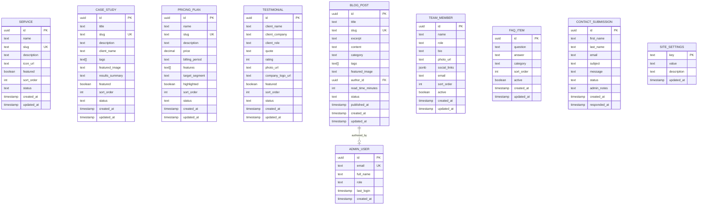

# Backend Documentation - Devmart Marko v1

## Current Status: Frontend Complete - Backend Planning Phase

**Frontend Completion Date:** 2025-11-27  
**Backend Phase:** Documentation & Planning (Current)  
**Implementation Status:** Not Started

---

## Decision: Backend CMS Architecture for v1

### ✅ **CHOSEN: Option A – Simple Admin CMS (v1 Official)**

**Decision Date:** 2025-11-28  
**Rationale:**
- Single company (Devmart) managing single project (Marko site)
- Internal use only - no external clients or multi-tenant needs
- Minimal complexity for fast implementation
- Full control over data and content
- Existing tools (Lovable Cloud/Supabase + React Admin UI)
- Scalable foundation for future needs

**Scope:**
- Single-tenant CMS
- Admin-only authentication (no public registration)
- Basic CRUD for core content entities
- Simple admin UI with protected routes
- RESTful API via Supabase auto-generation

---

## Backend/CMS Options Comparison

### Option A – Simple Admin CMS ✅ **[CHOSEN FOR V1]**

**Description:**
Lightweight admin panel for managing Devmart Marko site content. Admin users log in to edit services, blog posts, case studies, testimonials, pricing, team members, and site settings.

**Features:**
- Admin authentication (email/password, no public registration)
- CRUD interfaces for core content
- File uploads for images (team photos, blog images, case study assets)
- Contact form submission inbox
- Basic site settings (contact info, SEO defaults)

**Technology:**
- Lovable Cloud (Supabase) for backend
- React admin UI with protected routes
- PostgreSQL database with RLS policies
- Supabase Storage for file uploads

**Pros:**
- Fast to implement (1-2 weeks)
- Uses existing Lovable/Supabase tools
- No additional infrastructure costs
- Easy to maintain and extend
- Perfect fit for single-company, single-site use case

**Cons:**
- Not designed for multi-tenant scenarios
- Basic feature set (no advanced workflow, versioning, etc.)

**When to Use:**
- ✅ Single company managing single website
- ✅ Internal admin users only
- ✅ Need fast time-to-market
- ✅ Budget-conscious projects

---

### Option B – Standard Headless CMS **[NOT PLANNED - REFERENCE ONLY]**

**Description:**
Full-featured headless CMS with content modeling, media library, and API-first architecture. Suitable for multiple sites or complex content workflows.

**Features:**
- Advanced content modeling (custom fields, relationships)
- Media library with transformations
- Workflow management (draft → review → publish)
- Role-based permissions (admin, editor, contributor)
- Content versioning and rollback
- Webhooks for deployment triggers

**Technology Options:**
- Strapi (self-hosted or cloud)
- Payload CMS
- Sanity.io
- Contentful

**Pros:**
- Professional-grade CMS features
- Built-in media management
- Better for content teams
- Extensible plugin ecosystem

**Cons:**
- Overkill for single-site use case
- Additional infrastructure/hosting costs
- Steeper learning curve
- More complex to maintain

**When to Use:**
- Multiple sites or brands
- Content teams with multiple roles
- Need advanced workflows
- Frequent content updates by non-technical users

---

### Option C – Advanced Multi-Site CMS **[NOT PLANNED - REFERENCE ONLY]**

**Description:**
Enterprise-grade multi-tenant platform managing multiple client websites from single dashboard. Each client has isolated data, custom domains, and white-label branding.

**Features:**
- Multi-tenant architecture (data isolation per client)
- Client-specific admin portals
- White-label branding per tenant
- Custom domain mapping
- Advanced analytics and reporting
- SaaS billing integration

**Technology:**
- Custom-built multi-tenant platform
- Kubernetes/Docker for isolation
- Advanced RBAC and tenant management

**Pros:**
- Scale to many clients/sites
- SaaS business model ready
- Enterprise-grade features

**Cons:**
- Massive overkill for single-site
- Months to implement
- High infrastructure costs
- Complex maintenance and security

**When to Use:**
- Building a SaaS CMS product
- Managing 10+ client sites
- Need white-label capabilities
- Enterprise sales model

---

## Phase Overview

### Phase 1 (v1) - Must Have

**Priority:** Ship fast with essential features  
**Timeline:** 2-3 weeks  

| Module | Purpose | Critical? |
|--------|---------|-----------|
| Services | Manage service offerings | ✅ Yes |
| Case Studies / Projects | Portfolio showcase | ✅ Yes |
| Pricing Plans | Pricing packages | ✅ Yes |
| Testimonials | Client reviews | ✅ Yes |
| Blog Posts | Content marketing | ✅ Yes |
| Team Members | About team | ✅ Yes |
| FAQ Items | Common questions | ✅ Yes |
| Contact Submissions | Lead capture | ✅ Yes |
| Basic Site Settings | Contact, branding, SEO | ✅ Yes |

**v1 Admin Routes:**
- `/admin` - Dashboard
- `/admin/services` - Services CRUD
- `/admin/projects` - Case Studies CRUD
- `/admin/pricing` - Pricing Plans CRUD
- `/admin/testimonials` - Testimonials CRUD
- `/admin/blog` - Blog Posts CRUD
- `/admin/team` - Team Members CRUD
- `/admin/faqs` - FAQ Items CRUD
- `/admin/contacts` - Contact Submissions Inbox
- `/admin/settings` - Site Settings

---

### Phase 2+ - Nice to Have

**Priority:** Enhance after core CMS is stable  
**Timeline:** Post-launch iterations  

| Module | Purpose | Phase |
|--------|---------|-------|
| Partner Logos | Trusted by section | Phase 2 |
| Homepage Content Blocks | Dynamic hero, stats, features | Phase 2 |
| Newsletter Subscribers | Email marketing list | Phase 2 |
| Advanced SEO | OpenGraph, schema.org | Phase 2 |
| Analytics Dashboard | Traffic, conversions | Phase 3 |
| User Roles & Permissions | Granular access | Phase 3 |

---

## Database Schema (v1)

### Standardized Enums

```typescript
// Shared across multiple entities
enum ContentStatus {
  draft = "draft",
  published = "published",
  archived = "archived"
}

enum SubmissionStatus {
  new = "new",
  read = "read",
  responded = "responded",
  archived = "archived"
}
```

---

### Entity Relationship Diagram



---

### Table Definitions

#### 1. services

```sql
CREATE TABLE services (
  id UUID PRIMARY KEY DEFAULT uuid_generate_v4(),
  name TEXT NOT NULL,
  slug TEXT UNIQUE NOT NULL,
  description TEXT NOT NULL,
  icon_url TEXT,
  featured BOOLEAN DEFAULT false,
  sort_order INTEGER DEFAULT 0,
  status TEXT DEFAULT 'published' CHECK (status IN ('draft', 'published', 'archived')),
  created_at TIMESTAMP DEFAULT NOW(),
  updated_at TIMESTAMP DEFAULT NOW()
);

CREATE INDEX idx_services_status ON services(status);
CREATE INDEX idx_services_featured ON services(featured);
```

#### 2. case_studies

```sql
CREATE TABLE case_studies (
  id UUID PRIMARY KEY DEFAULT uuid_generate_v4(),
  title TEXT NOT NULL,
  slug TEXT UNIQUE NOT NULL,
  description TEXT NOT NULL,
  client_name TEXT,
  tags TEXT[] DEFAULT '{}',
  featured_image TEXT,
  results_summary TEXT,
  featured BOOLEAN DEFAULT false,
  sort_order INTEGER DEFAULT 0,
  status TEXT DEFAULT 'published' CHECK (status IN ('draft', 'published', 'archived')),
  created_at TIMESTAMP DEFAULT NOW(),
  updated_at TIMESTAMP DEFAULT NOW()
);

CREATE INDEX idx_case_studies_status ON case_studies(status);
CREATE INDEX idx_case_studies_featured ON case_studies(featured);
```

#### 3. pricing_plans

```sql
CREATE TABLE pricing_plans (
  id UUID PRIMARY KEY DEFAULT uuid_generate_v4(),
  name TEXT NOT NULL,
  slug TEXT UNIQUE NOT NULL,
  description TEXT NOT NULL,
  price DECIMAL(10,2) NOT NULL,
  billing_period TEXT DEFAULT 'month' CHECK (billing_period IN ('month', 'year', 'one-time')),
  features TEXT[] DEFAULT '{}',
  target_segment TEXT,
  highlighted BOOLEAN DEFAULT false,
  sort_order INTEGER DEFAULT 0,
  status TEXT DEFAULT 'published' CHECK (status IN ('draft', 'published', 'archived')),
  created_at TIMESTAMP DEFAULT NOW(),
  updated_at TIMESTAMP DEFAULT NOW()
);

CREATE INDEX idx_pricing_plans_status ON pricing_plans(status);
```

#### 4. testimonials

```sql
CREATE TABLE testimonials (
  id UUID PRIMARY KEY DEFAULT uuid_generate_v4(),
  client_name TEXT NOT NULL,
  client_company TEXT,
  client_role TEXT,
  quote TEXT NOT NULL,
  rating INTEGER CHECK (rating >= 1 AND rating <= 5),
  photo_url TEXT,
  company_logo_url TEXT,
  featured BOOLEAN DEFAULT false,
  sort_order INTEGER DEFAULT 0,
  status TEXT DEFAULT 'published' CHECK (status IN ('draft', 'published', 'archived')),
  created_at TIMESTAMP DEFAULT NOW(),
  updated_at TIMESTAMP DEFAULT NOW()
);

CREATE INDEX idx_testimonials_status ON testimonials(status);
CREATE INDEX idx_testimonials_featured ON testimonials(featured);
```

#### 5. blog_posts

```sql
CREATE TABLE blog_posts (
  id UUID PRIMARY KEY DEFAULT uuid_generate_v4(),
  title TEXT NOT NULL,
  slug TEXT UNIQUE NOT NULL,
  excerpt TEXT,
  content TEXT NOT NULL,
  category TEXT,
  tags TEXT[] DEFAULT '{}',
  featured_image TEXT,
  author_id UUID REFERENCES admin_users(id) ON DELETE SET NULL,
  read_time_minutes INTEGER DEFAULT 5,
  status TEXT DEFAULT 'draft' CHECK (status IN ('draft', 'published', 'archived')),
  published_at TIMESTAMP,
  created_at TIMESTAMP DEFAULT NOW(),
  updated_at TIMESTAMP DEFAULT NOW()
);

CREATE INDEX idx_blog_posts_status ON blog_posts(status);
CREATE INDEX idx_blog_posts_published_at ON blog_posts(published_at);
CREATE INDEX idx_blog_posts_category ON blog_posts(category);
```

#### 6. team_members

```sql
CREATE TABLE team_members (
  id UUID PRIMARY KEY DEFAULT uuid_generate_v4(),
  name TEXT NOT NULL,
  role TEXT NOT NULL,
  bio TEXT,
  photo_url TEXT,
  social_links JSONB DEFAULT '{}', -- {linkedin: '', twitter: '', github: ''}
  email TEXT,
  sort_order INTEGER DEFAULT 0,
  active BOOLEAN DEFAULT true,
  created_at TIMESTAMP DEFAULT NOW(),
  updated_at TIMESTAMP DEFAULT NOW()
);

CREATE INDEX idx_team_members_active ON team_members(active);
```

#### 7. faq_items

```sql
CREATE TABLE faq_items (
  id UUID PRIMARY KEY DEFAULT uuid_generate_v4(),
  question TEXT NOT NULL,
  answer TEXT NOT NULL,
  category TEXT,
  sort_order INTEGER DEFAULT 0,
  active BOOLEAN DEFAULT true,
  created_at TIMESTAMP DEFAULT NOW(),
  updated_at TIMESTAMP DEFAULT NOW()
);

CREATE INDEX idx_faq_items_active ON faq_items(active);
CREATE INDEX idx_faq_items_category ON faq_items(category);
```

#### 8. contact_submissions

```sql
CREATE TABLE contact_submissions (
  id UUID PRIMARY KEY DEFAULT uuid_generate_v4(),
  first_name TEXT NOT NULL,
  last_name TEXT NOT NULL,
  email TEXT NOT NULL,
  subject TEXT,
  message TEXT NOT NULL,
  status TEXT DEFAULT 'new' CHECK (status IN ('new', 'read', 'responded', 'archived')),
  admin_notes TEXT,
  created_at TIMESTAMP DEFAULT NOW(),
  responded_at TIMESTAMP
);

CREATE INDEX idx_contact_submissions_status ON contact_submissions(status);
CREATE INDEX idx_contact_submissions_created_at ON contact_submissions(created_at DESC);
```

**Note:** Contact form matches current `ContactPage.tsx` fields:
- first_name (text input)
- last_name (text input)
- email (email input)
- subject (text input)
- message (textarea)

No phone or company fields present in current form.

#### 9. site_settings

```sql
CREATE TABLE site_settings (
  key TEXT PRIMARY KEY,
  value TEXT NOT NULL,
  description TEXT,
  updated_at TIMESTAMP DEFAULT NOW()
);

-- Seed default settings
INSERT INTO site_settings (key, value, description) VALUES
  ('site_name', 'Devmart Suriname', 'Brand name'),
  ('contact_email', 'info@devmart.sr', 'Primary contact email'),
  ('contact_phone', '+597 854-1211', 'Primary phone number'),
  ('contact_address', 'Jagernath Lachmon straat nr. 152, Paramaribo, Suriname', 'Physical address'),
  ('facebook_url', 'https://www.facebook.com/DevmartSuriname/', 'Facebook page URL'),
  ('copyright_text', '© 2025 Devmart Suriname. All Rights Reserved.', 'Footer copyright'),
  ('seo_default_title', 'Devmart - Web Development & Digital Solutions', 'Default meta title'),
  ('seo_default_description', 'Professional web development and digital solutions in Suriname', 'Default meta description');
```

#### 10. admin_users

```sql
CREATE TABLE admin_users (
  id UUID PRIMARY KEY DEFAULT uuid_generate_v4(),
  email TEXT UNIQUE NOT NULL,
  full_name TEXT NOT NULL,
  role TEXT DEFAULT 'admin' CHECK (role IN ('admin', 'editor')),
  last_login TIMESTAMP,
  created_at TIMESTAMP DEFAULT NOW()
);

-- Note: Password authentication handled by Supabase Auth
```

---

## Authentication & Authorization

### v1 Authentication Strategy

**Admin Only - No Public Registration**

1. **Admin Login** (`/auth/login`)
   - Email/password authentication via Supabase Auth
   - Protected admin routes behind authentication check
   - Session persistence with localStorage

2. **Password Reset** (`/auth/forgot-password`)
   - Email-based password reset flow
   - Magic link sent to admin email

3. **Registration** (`/auth/register`)
   - **DISABLED in v1** - Not exposed in UI
   - Reserved for future internal use only
   - New admin users added manually via Supabase dashboard

### Row Level Security (RLS)

```sql
-- Public read access to published content
ALTER TABLE services ENABLE ROW LEVEL SECURITY;
CREATE POLICY "Public can view published services" ON services
  FOR SELECT USING (status = 'published');

CREATE POLICY "Admins can manage all services" ON services
  USING (auth.jwt()->>'role' = 'admin');

-- Similar policies for case_studies, blog_posts, testimonials, etc.

-- Admin-only access to contact submissions
ALTER TABLE contact_submissions ENABLE ROW LEVEL SECURITY;
CREATE POLICY "Only admins can view contacts" ON contact_submissions
  FOR SELECT USING (auth.jwt()->>'role' = 'admin');
```

---

## API Endpoints (Supabase Auto-Generated)

### Public Endpoints (Frontend)

```
GET  /rest/v1/services?status=eq.published&select=*
GET  /rest/v1/case_studies?status=eq.published&featured=eq.true&limit=4
GET  /rest/v1/blog_posts?status=eq.published&order=published_at.desc&limit=6
GET  /rest/v1/testimonials?status=eq.published&featured=eq.true
GET  /rest/v1/team_members?active=eq.true&order=sort_order
GET  /rest/v1/faq_items?active=eq.true&order=sort_order
POST /rest/v1/contact_submissions (insert)
```

### Admin Endpoints (Authenticated)

```
GET    /rest/v1/services (all records)
POST   /rest/v1/services (create)
PATCH  /rest/v1/services?id=eq.{uuid} (update)
DELETE /rest/v1/services?id=eq.{uuid} (delete)

GET    /rest/v1/contact_submissions?order=created_at.desc (inbox)
PATCH  /rest/v1/contact_submissions?id=eq.{uuid} (update status)

-- Similar CRUD for all entities
```

---

## File Storage

### Supabase Storage Buckets

```
devmart-marko/
├── blog-images/           # Blog post featured images
├── case-study-images/     # Project portfolio images
├── team-photos/           # Team member headshots
└── uploads/               # General file uploads
```

**Upload Configuration:**
- Max file size: 5MB for images
- Allowed types: JPG, PNG, WebP
- Public read access
- Admin-only write access

---

## Frontend Code Lock Strategy

### Protected Marketing Frontend Files

**Status:** Phase 1 frontend complete - DO NOT MODIFY without explicit approval  
**Restore Point:** `devmart-marko-frontend-v1-stable` (Git tag / Lovable history)  

#### Protected Files - Marketing Site

```
src/pages/
├── HomePage.tsx              ❌ Protected
├── AboutPage.tsx             ❌ Protected
├── ServicesPage.tsx          ❌ Protected
├── SingleServicePage.tsx     ❌ Protected
├── CaseStudiesPage.tsx       ❌ Protected
├── TeamPage.tsx              ❌ Protected
├── PartnershipPage.tsx       ❌ Protected
├── PricingPage.tsx           ❌ Protected
├── FaqPage.tsx               ❌ Protected
├── TestimonialsPage.tsx      ❌ Protected
├── BlogPage.tsx              ❌ Protected
├── SinglePostPage.tsx        ❌ Protected
├── ContactPage.tsx           ❌ Protected (UI only - handler can change)
└── NotFoundPage.tsx          ❌ Protected

src/components/layout/
├── Header.tsx                ❌ Protected
├── Footer.tsx                ❌ Protected

src/layouts/
└── MainLayout.tsx            ❌ Protected

public/marko-digital-marketing-agency-html/
└── **/*                      ❌ Protected (all template assets)
```

#### Safe for Backend Work - New Directories

```
src/pages/auth/               ✅ New - Safe to create
├── LoginPage.tsx
├── RegisterPage.tsx
└── ForgotPasswordPage.tsx

src/pages/admin/              ✅ New - Safe to create
├── DashboardPage.tsx
├── ServicesAdminPage.tsx
├── ProjectsAdminPage.tsx
└── ...

src/components/admin/         ✅ New - Safe to create
├── AdminLayout.tsx
├── AdminSidebar.tsx
├── AdminHeader.tsx
└── DataTable.tsx

src/hooks/                    ✅ Safe for new hooks
src/lib/                      ✅ Safe for utilities
src/styles/admin.css          ✅ New admin-specific styles
```

### Process Rule

> **CRITICAL:** Do not modify any protected marketing frontend files unless there is an explicit "Frontend Update" phase or ticket approved by Devmart. All backend/admin work must only touch `/auth/*`, `/admin/*`, backend-related components, hooks, and Supabase integration code.

---

## Implementation Phases

### Phase 0: Planning & Documentation ✅ **[CURRENT]**
- [x] Define CMS options
- [x] Choose Option A (Simple Admin CMS)
- [x] Create entity schemas
- [x] Document frontend code lock
- [x] Define v1 vs v2+ scope

### Phase 1: Admin Shell (UI Only) ✅ **COMPLETE**
- [x] Create auth pages (login, forgot-password, register)
- [x] Build admin layout with sidebar and header
- [x] Create placeholder pages for all v1 modules
- [x] Add theme toggle for admin area
- [x] Update routing in App.tsx

**Implementation Summary:**
All admin UI components created with placeholder data. No Supabase integration yet. Forms use client-side validation only. Theme system independent from marketing site.

**Files Created:** 25 total (admin.css, 5 admin components, 3 auth pages, 10 admin pages)

### Phase 2: Backend Integration (Next)
- [ ] Build admin layout with sidebar
- [ ] Implement theme toggle (dark/light)
- [ ] Add placeholder admin pages
- [ ] Set up admin routing structure
- [ ] **NO DATABASE OR SUPABASE YET**

### Phase 2: Backend Integration
- [ ] Enable Lovable Cloud / Supabase
- [ ] Create database tables and RLS policies
- [ ] Implement Supabase client hooks
- [ ] Wire admin UI to real data
- [ ] Implement file upload to Storage

### Phase 3: Frontend Data Integration
- [ ] Replace static data with Supabase queries
- [ ] Add loading states
- [ ] Implement contact form submission
- [ ] Test end-to-end flows

### Phase 4: Polish & Launch
- [ ] Add error handling
- [ ] Implement toast notifications
- [ ] Write admin user guide
- [ ] Final testing and QA
- [ ] Deploy to production

---

## Notes

- All backend functionality is **planned for Phase 2+** (not Phase 1A)
- Current focus: **Admin UI shell only** (no database integration yet)
- Database schemas above are **finalized for v1** based on frontend content analysis
- Technology choice: **Lovable Cloud (Supabase)** confirmed
- Frontend marketing site is **locked** and stable for production use